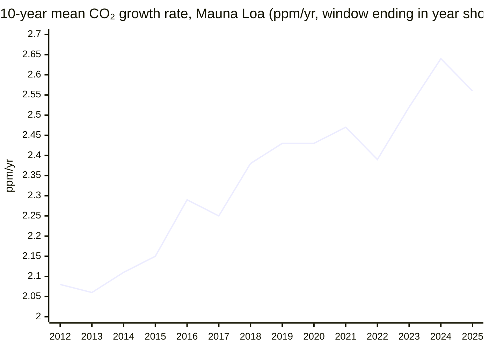

# Climate and Environment — Weekly Bulletin 2026-W38

*Period 2026-W38 (2026-09-14 to 2026-09-20) · developments published up to 2026-09-22 · latest data: NOAA Mauna Loa daily mean for 2026-09-20 (preliminary); latest monthly mean: August 2026 (2026-08).*

> *This endeavor is unlike the other four: it is about fixing the past rather than improving the future. Many historic civilizations fell to climate change, and we now have to clean up our mess if we are to survive into a better future.*

## Executive Summary

**Bottom line:** Carbon Brief *projects* that global fossil CO₂ emissions will fall by about 0.5% in 2026, driven by the Strait of Hormuz crisis[^cb-fossil-fall]. That is a shock-driven projection, not an achieved decline, and India's CO₂ grew 3.7% year on year in H1 2026[^cb-india]. "The Bend" stays 🟡 "Approaching, not achieved". No new KPI headline data arrived: the Mauna Loa headline is still the August 2026 monthly mean of 427.55 ppm[^noaa-mm] and the 10-year trend is still 2.56 ppm/yr[^noaa-gr], so the KPI stays 🔴 "Worsening". A record El Niño reading this week puts the La Niña premise of the KPI rationale in question[^cb-nino].

**The good news:**
- *Data:* IRENA reports that a record 693 GW of renewable power capacity was added worldwide in 2025[^irena].
- *Analysis:* CREA's indicators point to a broad-based decline in China's emissions in August 2026. Coal power generation was −5.2% year on year, its second consecutive monthly fall[^crea-china-aug].
- *Achieved:* Greensand entered commercial operation on 18 September 2026 as the EU's first full-scale offshore CO₂ storage site, with capacity of up to 400,000 tCO₂ per year in its first phase[^greensand].
- *Announced:* Google made its largest carbon removal purchase to date: 1 million tonnes of enhanced-rock-weathering removal from Terradot, to be delivered by 2040[^google-terradot]. ADM plans to sell removal credits from its 800,000+ tCO₂-per-year biogenic capture operation[^adm].

**The bad news:**
- *Setback:* Technology-based CO₂ removal credits contracted through long-term offtakes fell to about 6 million in January–August 2026, from 24 million a year earlier (Argus)[^argus].
- *Data:* Global energy intensity improved by only 1.7% in 2025. The goal is 4% per year, so meeting it by 2030 now requires 5.6% per year[^irena].
- *Projection:* ExxonMobil raised its 2050 projection for global energy-related CO₂ to 30 billion tonnes, up from the 27 billion tonnes it projected a year earlier[^exxon][^reuters-exxon].
- *Setback:* At the UN General Assembly, US President Trump attacked the IMO Net-Zero Framework for shipping as a "global carbon tax"[^trump-imo].
- *Data:* The daily Niño 3.4 sea-surface temperature anomaly hit an all-time record of 3.11°C on 21 September, per a Carbon Brief analysis[^cb-nino].
- *Analysis:* The Planetary Health Check 2026 finds seven of nine planetary boundaries transgressed, all with worsening trends[^pik].

---

## KPI Dashboard

**KPI:** Atmospheric CO₂ concentration (ppm) and 10-year trend (ppm/year)

| Headline | Current (obs) | Previous (obs) | Change vs previous cutoff | Year ago |
|---|---|---|---|---|
| **Mauna Loa monthly mean CO₂** (NOAA MLO) | **427.55 ppm** (2026-08; published 2026-09-07, rule-estimated; preliminary)[^noaa-mm] | 427.55 ppm (2026-08) | +0.00 — ⚠️ **not comparable**: same observation, unchanged: no new data | 425.48 ppm (2025-08), change **+2.07 ppm** |
| **10-year trend** (mean of NOAA MLO Jan→Dec growth rates, 2016–2025) | **2.56 ppm/yr** (2025; published 2026-01-10, rule-estimated)[^noaa-gr] | 2.56 ppm/yr (2025) | +0.00 — ⚠️ **not comparable**: same observation, unchanged: no new data | not provided |

Both headlines are the same observations that were current at the previous cutoff (2026-09-15), so the "change" column shows no trend.

**New this week (not a KPI headline):** NOAA MLO daily mean 426.32 ppm on 2026-09-20 (preliminary; a single daily reading, not comparable with monthly means)[^noaa-daily].

**Earlier context (not new this week):**

| Metric | Value | Obs |
|---|---|---|
| NOAA MLO monthly mean, record (seasonal peak) | 432.34 ppm, +1.83 ppm on May 2025 | May 2026[^noaa-mm] |
| NOAA MLO daily mean, record | 433.95 ppm | 1 May 2026[^noaa-daily] |
| NOAA MLO year-on-year monthly change (June 2026) | +1.82 ppm | 2026-06[^noaa-mm] |
| NOAA MLO annual mean (record) | 427.35 ppm | 2025[^noaa-ann] |
| NOAA global marine-surface annual mean (record) | 425.62 ppm | 2025[^noaa-ann-gl] |
| NOAA MLO annual growth rate (Jan 1 → Dec 31) | 2.23 ppm/yr | 2025[^noaa-gr] |
| NOAA global annual growth rate (Jan 1 → Dec 31; smallest since 2014) | 2.06 ppm/yr | 2025[^noaa-gr-gl] |
| 10-year trend, NOAA global marine-surface (2016–2025) | 2.53 ppm/yr | 2025[^noaa-gr-gl] |
| 5-year trend, NOAA MLO (2021–2025) | 2.61 ppm/yr | 2025[^noaa-gr] |

### Mauna Loa CO₂ — August monthly mean

*Data: NOAA GML, Mauna Loa monthly means[^noaa-mm]. The latest 12 months are preliminary.*

### 10-year CO₂ growth trend (Mauna Loa)

*Data: mean of the last 10 NOAA MLO Jan→Dec annual growth rates[^noaa-gr].*

**Assessment: 🔴 Worsening** (as of 2026-07-14; unchanged, no new assessment since then). The rationale on record: Mauna Loa set new records in 26H1, with a 432.34 ppm monthly mean in May 2026 and a 433.95 ppm daily mean on 1 May[^noaa-mm][^noaa-daily]. The 10-year trend dipped from 2.64 to 2.56 ppm/yr for a mechanical reason: the El Niño year 2015 left the window. Half-decade means still rose (2.51 → 2.61 ppm/yr), so there is no structural slowdown[^noaa-gr]. Year-on-year growth slowed temporarily (+1.48 to +2.26 ppm in Jan–Jun 2026)[^noaa-mm]. The direction matches the Met Office forecast of a slower 2026 rise, which it attributed to La Niña-like conditions. Growth remains far above the 1.33-1.79 ppm/yr 2020s decadal-average growth that IPCC 1.5°C pathways require (Met Office, Scripps annual-mean basis)[^metoffice].

*Tension:* the Met Office forecast cited above assumed La Niña-like conditions. This week Carbon Brief reports a record Niño 3.4 anomaly (see Beyond the Framework)[^cb-nino]. The KPI assessment has not been revisited since.

---

## Milestone Status

### 🟡 "The Bend" — Peak Global Emissions

**Status: Approaching, not achieved** (assessed as of 2026-07-14; unchanged, no new assessment since then)

*Rationale on record:* Every 2025 CO₂ estimate published in 26H1 was a new record, except GCB total CO₂, which dipped slightly due to lower land-use emissions as El Niño ended:
- GCB fossil CO₂: 38.1 GtCO₂ (+1.0%)[^gcb]
- IEA energy CO₂: 38,082 MtCO₂ (+0.4%)[^iea-ger]
- Carbon Monitor fossil+industry CO₂: 37.2 GtCO₂ (+0.7%)[^carbon-monitor]

Growth has slowed to a plateau. However, China's CO₂ rose 2% in Q1 2026[^cb-china-q1], and the IEA expects the 2026 fall in oil demand to rebound above the 2025 level in 2027[^iea-omr]. The peak is therefore not definitively behind us. *Caveat:* the milestone covers all greenhouse gases, but no global 2025 total-GHG estimate was published within 26H1, so CO₂ estimates serve as the proxy.

**New this period:**
- *Projection* (16 Sep): Carbon Brief projects that **global fossil CO₂ emissions will fall by about 0.5% in 2026**, driven by the Strait of Hormuz crisis[^cb-fossil-fall]. For context, the IEA's June Oil Market Report forecast a 1.1 mb/d fall in global oil demand in 2026, then a rise to 105.3 mb/d in 2027, above the implied 2025 level of about 104.4 mb/d[^iea-omr].
- *Data* (17 Sep): A CREA analysis for Carbon Brief finds that **India's CO₂ emissions grew 3.7% year on year in H1 2026**[^cb-india].
  - Steel and cement emissions rose 8% and are now 23% of India's CO₂.
  - Power-sector CO₂ was flat versus H1 2024, because clean energy met all of the 7% (63 TWh) growth in electricity demand over two years.
  - Oil and gas CO₂ fell 7% year on year.
- *Analysis* (17 Sep): CREA's August 2026 snapshot finds that indicators point to a **broad-based decline in China's emissions in August 2026** (year on year)[^crea-china-aug].
  - thermal power generation −4%, including coal power −5.2%, its second consecutive monthly fall;
  - cement output −12%, crude steel −4% and refinery throughput −7%.

  Against this, thermal power capacity additions reached 50.3 GW in January–July 2026. That is up 20% and the highest for that period in 15 years.

*Earlier context (published before this period):*
- Carbon Brief/CREA found that China's CO₂ fell 1% in Q2 2026 as oil use dropped 9%. That left first-half 2026 emissions "up marginally" but still below their 2023-24 peak[^cb-china-q].
- Climate TRACE estimated total greenhouse-gas emissions of 29.7 GtCO₂e in H1 2026, up 0.2% on H1 2025 (China −0.3%, US −0.4%, India +1.5%)[^ctrace].

---

### 🔴 "The Balance" — Net Zero

**Status: Distant — 53 GtCO2e/year to eliminate** (assessed as of 2026-01-03; unchanged, no new assessment since then. This assessment was migrated from the 2025 report and rests on legacy records.)

*Rationale on record:* Global GHG emissions were 53.2 GtCO2e in 2024[^edgar], and fossil CO₂ hit a record in 2025, far from net zero. Net-zero targets cover 77% of global GDP[^nzt]. However, 2025 was a year of retreat:
- the US withdrew from the Paris Agreement[^cat];
- banks exited the Net-Zero Banking Alliance[^guardian-retreat];
- companies delayed their targets[^guardian-retreat].

Most IEA net-zero pathway benchmarks are off track[^iea-nze].

**New this period:**
- *Setback* (22 Sep): In his UN General Assembly address, US President Donald Trump attacked the **IMO Net-Zero Framework** as a "global carbon tax" and vowed "there will be no global taxes" while he is president[^trump-imo]. The framework is the proposed global standard for the greenhouse-gas intensity of marine fuels, with an emissions-pricing mechanism, meant to deliver the IMO goal of net-zero international shipping emissions by or around 2050. The speech signals continued US opposition to the framework[^icn].

---

### 🟡 "The Ceiling" — Below +2°C

**Status: Under pressure** (assessed as of 2026-01-03; unchanged, no new assessment since then. This assessment was migrated from the 2025 report and rests on legacy records.)

*Rationale on record:*
- 2024 was the first calendar year to exceed 1.5°C above pre-industrial (WMO 1.55°C)[^wmo].
- The long-term Paris metric remains ~1.3-1.4°C[^wmo-sotgc].
- WMO gives 70% odds that the 2025-2029 average also exceeds 1.5°C[^wmo].
- The 1.5°C carbon budget is virtually exhausted[^gcb-2025-news].

**New this period:** No new events are tagged to this milestone. See the record Niño 3.4 reading under Beyond the Framework[^cb-nino].

*Earlier context (published after this assessment was made, before this period):* The Global Carbon Budget 2025 final paper (13 May 2026) put the remaining carbon budget for a 50% chance of limiting warming to 1.5°C at 170 GtCO2 from the start of 2026. That is about 4 years at 2025 emission levels[^gcb].

---

## Open Challenges

### Net-Zero Transition

- *Data* (21 Sep): IRENA's third UAE Consensus tracking report (with the COP31 Presidency and the Global Renewables Alliance) finds that a **record 693 GW** of renewable power capacity was added worldwide in 2025[^irena][^reuters-irena].
  - The additions were 513 GW of solar PV and 158 GW of wind.
  - Total installed renewable capacity is now about 5.15 TW.
  - Tripling to about 11.2 TW by 2030 now requires average net additions of about 1.2 TW per year in 2026-2030.
  - At the 2025 growth rate, 2030 would fall short by about 0.6 TW, down from 0.9 TW in the previous edition.
- *Data* (21 Sep): The same IRENA report finds that **global energy intensity improved by only 1.7% in 2025**, after 1.1% in both 2023 and 2024[^irena].
  - This is well below the goal of doubling efficiency at 4% per year; meeting the 2030 goal now requires 5.6% per year.
  - Grid and flexibility investment of up to about $1 trillion per year is needed in 2026-2030, versus $525 billion in 2025.
- *Analysis* (22 Sep): The IEA's Electrification special report was requested by COP31 hosts Türkiye and Australia[^iea-elec].
  - Electricity supplied about 23% of global final energy consumption in 2025, up from 17% in 2000.
  - Fully exploiting today's cost-competitive electrification potential would raise the share to about 33%.
  - Under today's policy settings, the share rises to slightly less than 30% by 2035.
  - The COP31 presidency's goal of 35% by 2035 (reached in the IEA's High Electrification Scenario) requires going beyond today's policies.
- *Projection* (17 Sep): ExxonMobil's 2026 Global Outlook projects that global energy-related CO₂ emissions will fall about 20%, from 36 billion tonnes in 2025 to 30 billion tonnes in 2050[^exxon][^reuters-exxon].
  - A year earlier, it projected 27 billion tonnes for 2050.
  - The projection is far above the roughly 11 billion tonnes in IPCC "likely below 2°C" scenarios.
  - Coal is still 15% of the 2050 energy mix.
  - Carbon capture and storage reaches 2 billion tonnes per year, down from its prior 3.1 billion.

### Permanent Removal

- *Achieved* (18 Sep): **Greensand entered commercial operation** as the EU's first full-scale offshore CO₂ storage site[^greensand].
  - It is led by INEOS Energy with Harbour Energy and Nordsøfonden.
  - It injects CO₂, sourced primarily from Danish biomethane plants, into the depleted Nini West field about 1,800 m beneath the Danish North Sea.
  - Capacity is up to 400,000 tCO₂ per year in its first phase, with potential expansion to 4-8 MtCO₂ per year.
- *Setback* (16 Sep): Argus data show that **tech-based CO₂ removal offtakes shrank sharply**[^argus]. Credits contracted through long-term offtake agreements fell to about 6 million in January–August 2026, from 24 million a year earlier:
  - BECCS credits fell to 2 million from 17 million.
  - Microsoft's disclosed buying fell to just over 2 million from 16.5 million.
  - Biochar offtakes rose to nearly 3 million from 1.5 million.
- *Analysis* (16 Sep): ClimeFi published its first quarterly CDR Price Benchmark, based on indicative supplier offers (not transacted prices) from more than 300 projects[^climefi].
  - DACCS offer prices for 2030-vintage delivery are 43% below 2026-vintage offers, from an average of about $800 to about $450 per tonne, per Carbon Pulse[^carbonpulse].
  - Offer prices for BECCS, other biomass removal, enhanced weathering and ex-situ mineralisation rise between the 2026 and 2030 vintages.
- *Announced* (16 Sep): In its largest carbon removal purchase to date, **Google agreed to buy 1 million tonnes of permanent CO₂ removal from Terradot**[^google-terradot].
  - The removal uses enhanced rock weathering and is to be delivered by 2040.
  - The deal adds 1 MtCO₂e (GWP20) of methane elimination by 2030.
  - The work spans more than 200,000 hectares of rice farms in southern Brazil.
- *Announced* (21 Sep): **ADM plans to enter the voluntary carbon removal market**[^adm].
  - The credits come from the 800,000+ tCO₂-per-year biogenic (ethanol fermentation) carbon capture operation at its Columbus, Nebraska complex.
  - The CO₂ is stored permanently in Tallgrass's Eastern Wyoming Sequestration Hub.
  - The credits are undergoing Puro.earth certification, with initial issuance expected by the end of 2026 and a 15-year crediting period.
- *Announced* (18 Sep): Japan Airlines and Climeworks Solutions signed what they describe as the first CORSIA-compliant carbon removal purchase agreement[^jal-climeworks][^carboncredits].
  - It covers a portfolio of CORSIA-eligible removal credits (such as soil carbon and biochar), plus separately purchased Climeworks direct air capture credits.
  - Volumes and prices were not disclosed.
- *Analysis* (16 Sep): The US National Academies' 2026 update on marine CDR finds that the field has advanced through field trials and private credit sales[^nasem][^sabin].
  - Major questions remain over whether it can remove CO₂ at meaningful scale, how net removal can be measured and verified, and its long-term environmental effects.
  - Governance gaps "directly constrain the near-term scalability" of ocean alkalinity enhancement.
- *Analysis* (16 Sep): The UK Climate Change Committee advises that Heathrow expansion can be consistent with UK carbon budgets and Net Zero only under one condition[^ccc]. The government must legislate for the aviation industry to reach zero emissions by 2050 on a "polluter pays" basis. In the CCC pathway, the 2050 aviation emissions reduction splits as follows:
  - engineered removals purchased by industry: 36%;
  - lower demand growth: 24%;
  - efficiency: 20%;
  - SAF: 20%.

### Sunlight Management

- *Analysis, not yet peer reviewed* (16 Sep): Tjiputra et al. posted an Earth-system-model study for discussion on EGUsphere[^tjiputra].
  - Stratospheric aerosol injection kept simulated overshoot warming below 2°C in all three deployments tested: tropical, Northern-Hemisphere mid-latitude and Southern-Hemisphere mid-latitude.
  - Deployment location strongly shapes side effects via the AMOC.
  - Legacy effects on sea-level rise and permafrost persist for centuries after SAI ends.

---

## Beyond the Framework

- **Planetary Health Check 2026** (*analysis*, 21 Sep, PIK-led): Seven of the nine planetary boundaries are transgressed, and all seven show worsening trends. They are climate change, biosphere integrity, land-system change, freshwater change, biogeochemical flows, novel entities and ocean acidification. Atmospheric aerosol loading (improving) and stratospheric ozone (stable) remain within the safe operating space[^pik][^pik-news].
- **Record "super El Niño" reading** (*data*, 21 Sep): A Carbon Brief analysis finds that the daily Niño 3.4 sea-surface temperature anomaly reached 3.11°C on 21 September 2026 (NOAA ONI convention). That surpasses the previous daily record of 3.08°C, set on 18 November 2015. The August 2026 monthly anomaly (about 2.45°C) is already above the peak of every prior El Niño on record except 2015-16 (2.75°C) and 1877-78 (about 2.7°C, reconstructed)[^cb-nino].
- **Himalaya flood attribution** (*analysis*, 17 Sep): World Weather Attribution studied the 26 August 2026 Rasuwa rock-ice avalanche and flood on the Nepal-China border. It caused over 1,300 confirmed deaths, with over 5,000 missing in Nepal. The study finds that human-caused warming at the site likely weakened the slope through permafrost degradation and glacier thinning. The warming was about 1.5°C in July–August temperatures and about 2°C annually. The study does not attribute the specific collapse, and it concludes that the event exceeded the limits of adaptation[^wwa][^guardian-wwa].
- **EU Climate Insurance Alliance** (*policy, announced*, 16 Sep): In her State of the Union address, Ursula von der Leyen announced an EU "Climate Insurance Alliance" to close the climate-catastrophe insurance gap. She noted that only around 25% of catastrophe losses in Europe are covered by private insurance. She also said imported fossil fuels had cost the EU an additional €90 billion since the start of the Hormuz conflict[^eu-sotu][^reuters-eu].

---

## Reference Data

| Dataset | Link |
|---|---|
| NOAA GML Mauna Loa monthly mean CO₂ | [co2_mm_mlo.txt](https://gml.noaa.gov/webdata/ccgg/trends/co2/co2_mm_mlo.txt) |
| NOAA GML Mauna Loa daily mean CO₂ | [co2_daily_mlo.txt](https://gml.noaa.gov/webdata/ccgg/trends/co2/co2_daily_mlo.txt) |
| NOAA GML Mauna Loa annual growth rates | [co2_gr_mlo.txt](https://gml.noaa.gov/webdata/ccgg/trends/co2/co2_gr_mlo.txt) |
| NOAA GML Mauna Loa annual means | [co2_annmean_mlo.txt](https://gml.noaa.gov/webdata/ccgg/trends/co2/co2_annmean_mlo.txt) |
| NOAA GML global marine-surface monthly means | [co2_mm_gl.txt](https://gml.noaa.gov/webdata/ccgg/trends/co2/co2_mm_gl.txt) |
| NOAA GML global marine-surface annual means | [co2_annmean_gl.txt](https://gml.noaa.gov/webdata/ccgg/trends/co2/co2_annmean_gl.txt) |
| NOAA GML global annual growth rates | [co2_gr_gl.txt](https://gml.noaa.gov/webdata/ccgg/trends/co2/co2_gr_gl.txt) |
| NOAA GML global CO₂ trends page | [global.html](https://gml.noaa.gov/ccgg/trends/global.html) |
| Global Carbon Budget 2025 (ESSD) | [essd.copernicus.org](https://essd.copernicus.org/articles/18/3211/2026/) |
| IEA Global Energy Review 2026 | [PDF](https://iea.blob.core.windows.net/assets/df903e1c-49c6-4757-8cbf-6fbcfe7611a0/GlobalEnergyReview2026.pdf) |
| Carbon Monitor 2025 (Nat Rev Earth Environ) | [nature.com](https://www.nature.com/articles/s43017-026-00780-4) |
| Met Office CO₂ forecast | [metoffice.gov.uk](https://www.metoffice.gov.uk/research/climate/seasonal-to-decadal/seasonal-forecast/forecasts/co2-forecast) |
| IRENA UAE Consensus tracking report 2026 | [PDF](https://www.irena.org/-/media/Files/IRENA/Agency/Publication/2026/Sep/IRENA_OUT_Tracking_the_UAE_Consensus_2026.pdf) |
| Climate TRACE | [climatetrace.org](https://climatetrace.org/news/climate-trace-data-show-marginal-increase-in-global-emissions-in-the-first-half-of-2026) |

---

## Footnotes

[^noaa-mm]: [NOAA GML: Mauna Loa monthly mean CO₂ (co2_mm_mlo.txt)](https://gml.noaa.gov/webdata/ccgg/trends/co2/co2_mm_mlo.txt)
[^noaa-daily]: [NOAA GML: Mauna Loa daily mean CO₂ (co2_daily_mlo.txt)](https://gml.noaa.gov/webdata/ccgg/trends/co2/co2_daily_mlo.txt)
[^noaa-gr]: [NOAA GML: Mauna Loa annual CO₂ growth rates (co2_gr_mlo.txt)](https://gml.noaa.gov/webdata/ccgg/trends/co2/co2_gr_mlo.txt)
[^noaa-gr-gl]: [NOAA GML: global marine-surface annual CO₂ growth rates (co2_gr_gl.txt)](https://gml.noaa.gov/webdata/ccgg/trends/co2/co2_gr_gl.txt)
[^noaa-ann]: [NOAA GML: Mauna Loa annual mean CO₂ (co2_annmean_mlo.txt)](https://gml.noaa.gov/webdata/ccgg/trends/co2/co2_annmean_mlo.txt)
[^noaa-ann-gl]: [NOAA GML: global marine-surface annual mean CO₂ (co2_annmean_gl.txt)](https://gml.noaa.gov/webdata/ccgg/trends/co2/co2_annmean_gl.txt)
[^metoffice]: [Met Office: CO₂ forecast](https://www.metoffice.gov.uk/research/climate/seasonal-to-decadal/seasonal-forecast/forecasts/co2-forecast)
[^cb-fossil-fall]: [Carbon Brief: global fossil-fuel emissions set to fall in 2026 amid Hormuz crisis](https://www.carbonbrief.org/analysis-global-fossil-fuel-emissions-set-to-fall-in-2026-amid-hormuz-crisis)
[^iea-omr]: [IEA: Oil Market Report, June 2026](https://www.iea.org/reports/oil-market-report-june-2026)
[^cb-india]: [Carbon Brief: India's power-sector emissions flat for two years due to clean-energy surge](https://www.carbonbrief.org/analysis-indias-power-sector-emissions-flat-for-two-years-due-to-clean-energy-surge)
[^crea-china-aug]: [CREA: China Energy and Emissions Trends – August 2026 snapshot](https://energyandcleanair.org/china-energy-and-emissions-trends-august-2026-snapshot/)
[^cb-china-q]: [Carbon Brief: China's CO2 emissions fall in Q2 2026 due to plummeting oil use](https://www.carbonbrief.org/analysis-chinas-co2-emissions-fall-in-q2-2026-due-to-plummeting-oil-use)
[^ctrace]: [Climate TRACE: marginal increase in global emissions in the first half of 2026](https://climatetrace.org/news/climate-trace-data-show-marginal-increase-in-global-emissions-in-the-first-half-of-2026)
[^gcb]: [Global Carbon Budget 2025 (ESSD)](https://essd.copernicus.org/articles/18/3211/2026/)
[^iea-ger]: [IEA Global Energy Review 2026](https://iea.blob.core.windows.net/assets/df903e1c-49c6-4757-8cbf-6fbcfe7611a0/GlobalEnergyReview2026.pdf)
[^carbon-monitor]: [Carbon Monitor, Nature Reviews Earth & Environment](https://www.nature.com/articles/s43017-026-00780-4)
[^edgar]: [EDGAR 2025 report](https://edgar.jrc.ec.europa.eu/report_2025) (legacy record)
[^nzt]: [Net Zero Stocktake 2025](https://zerotracker.net/analysis/net-zero-stocktake-2025) (legacy record)
[^wmo]: [WMO: 2024 warmest year on record, about 1.55°C above pre-industrial](https://wmo.int/news/media-centre/wmo-confirms-2024-warmest-year-record-about-155degc-above-pre-industrial-level) (legacy record)
[^trump-imo]: [American Presidency Project: Remarks to the UN General Assembly, 22 September 2026](https://www.presidency.ucsb.edu/documents/remarks-the-united-nations-general-assembly-new-york-city-21)
[^icn]: [Inside Climate News: Competing Climate Visions Clash at UN General Assembly](https://insideclimatenews.org/news/22092026/un-general-assembly-opens-with-clashing-climate-views/)
[^cb-china-q1]: [Carbon Brief/CREA: China's CO2 climbs 2% in early 2026 due to wasted wind and solar](https://www.carbonbrief.org/analysis-chinas-co2-climbs-2-in-early-2026-due-to-wasted-wind-and-solar)
[^cat]: [Climate Action Tracker: net-zero target evaluations](https://climateactiontracker.org/global/cat-net-zero-target-evaluations/) (legacy record)
[^guardian-retreat]: [Guardian: Was 2025 the year that business retreated from net zero?](https://www.theguardian.com/environment/2025/dec/20/was-2025-the-year-that-business-retreated-from-net-zero)
[^iea-nze]: [IEA: Net Zero Roadmap](https://www.iea.org/reports/net-zero-roadmap-a-global-pathway-to-keep-the-15-c-goal-in-reach) (legacy record)
[^wmo-sotgc]: [WMO: State of the Global Climate 2024](https://wmo.int/publication-series/state-of-global-climate-2024) (legacy record)
[^gcb-2025-news]: [Global Carbon Budget 2025: fossil fuel CO2 emissions hit record high in 2025](https://globalcarbonbudget.org/fossil-fuel-co2-emissions-hit-record-high-in-2025/) (legacy record)
[^irena]: [IRENA et al.: Delivering on the UAE Consensus (2026)](https://www.irena.org/-/media/Files/IRENA/Agency/Publication/2026/Sep/IRENA_OUT_Tracking_the_UAE_Consensus_2026.pdf)
[^reuters-irena]: [Reuters: Global renewable deployment must double to hit 2030 climate target](https://www.reuters.com/sustainability/cop/global-renewable-deployment-must-double-hit-2030-climate-target-report-says-2026-09-21/)
[^iea-elec]: [IEA: Electrification – Special report](https://www.iea.org/reports/electrification)
[^exxon]: [ExxonMobil 2026 Global Outlook – Executive summary](https://corporate.exxonmobil.com/-/media/global/files/global-outlook/2026-global-outlook-executive-summary.pdf)
[^reuters-exxon]: [Reuters: Exxon raises 2050 global emissions forecast, sees slower coal decline](https://www.reuters.com/business/energy/exxon-raises-2050-global-emissions-forecast-sees-slower-coal-decline-2026-09-17/)
[^greensand]: [INEOS: INEOS opens the first full-scale CO2 storage site in the EU](https://www.ineos.com/news/shared-news/ineos-opens-the-first-full-scale-co%E2%82%82-storage-site-in-the-eu/)
[^argus]: [Argus: Tech CDR market contracts in Jan-Aug](https://www.argusmedia.com/en/news-and-insights/market-opinion-and-analysis-blog/tech-cdr-market-contracts-jan-aug-beccs-biochar)
[^climefi]: [ClimeFi: The CDR Price Benchmark](https://www.climefi.com/blog-posts/the-cdr-price-benchmark-a-new-quarterly-series-from-climefi)
[^carbonpulse]: [Carbon Pulse: DACCS carbon removal price could come down by over 40% by 2030](https://carbon-pulse.com/551226/)
[^google-terradot]: [Google: We're catalyzing megaton-scale climate impact in Brazil](https://blog.google/company-news/outreach-and-initiatives/sustainability/terradot-superpollutants-carbon-removal/)
[^adm]: [ADM: ADM Plans Entry into Voluntary Carbon Market](https://investors.adm.com/news/news-details/2026/ADM-Plans-Entry-into-Voluntary-Carbon-Market-with-Over-800000-Tons-of-Annual-Removal-Capacity/default.aspx)
[^jal-climeworks]: [Climeworks: Japan Airlines and Climeworks Solutions sign first CDR CORSIA deal](https://climeworks.com/news/japan-airlines-and-climeworks-solutions-sign-first-cdr-corsia-deal)
[^carboncredits]: [CarbonCredits.com: Climeworks, JAL sign 'first' CORSIA-compliant carbon removal deal](https://carboncredits.com/climeworks-jal-corsia-carbon-removal-deal/)
[^nasem]: [National Academies: Ocean-based CO2 removal research strategy, 2026 update](https://nap.nationalacademies.org/pubs/29342/)
[^sabin]: [Sabin Center: National Academies report highlights governance barriers for marine CDR](https://climate.law.columbia.edu/news/new-national-academies-report-highlights-governance-barriers-marine-carbon-dioxide-removal)
[^ccc]: [Climate Change Committee: Government cannot expand Heathrow without requiring aviation industry to clean up its emissions](https://www.theccc.org.uk/2026/09/16/government-cannot-expand-heathrow-without-requiring-aviation-industry-to-clean-up-its-emissions/)
[^tjiputra]: [EGUsphere preprint: Impacts and limitations of avoiding temperature overshoot with stratospheric aerosol injections](https://egusphere.copernicus.org/preprints/2026/egusphere-2026-5188/)
[^pik]: [PIK: Planetary Health Check 2026 (full report)](https://publications.pik-potsdam.de/pubman/item/item_35009/component/file_35022/PlanetaryHealthCheck2026.pdf)
[^pik-news]: [PIK: Planetary Health Check 2026 finds mounting pressures](https://www.pik-potsdam.de/en/news/latest-news/planetary-health-check-2026-finds-mounting-pressures-across-earth2019s-life-support-systems)
[^cb-nino]: [Carbon Brief: 'Super El Niño' breaks 'remarkable' all-time record](https://www.carbonbrief.org/analysis-super-el-nino-reaches-remarkable-all-time-record)
[^wwa]: [World Weather Attribution: Rapid Warming in the Himalaya Exacerbates Geohazard Cascades Beyond Adaptation Limits](https://www.worldweatherattribution.org/rapid-warming-in-the-himalaya-exacerbates-geohazard-cascades-beyond-adaptation-limits/)
[^guardian-wwa]: [Guardian: Climate crisis probably weakened glacier that caused Nepal-Tibet floods](https://www.theguardian.com/science/2026/sep/17/climate-crisis-likely-behind-deadly-nepal-tibet-floods)
[^eu-sotu]: [European Commission: 2026 State of the Union Address](https://ec.europa.eu/commission/presscorner/detail/ov/speech_26_1868)
[^reuters-eu]: [Reuters: EU to launch climate insurance scheme after summer of extreme weather](https://reuters.com/world/eu-launch-climate-insurance-scheme-after-summer-extreme-weather-2026-09-16/)
