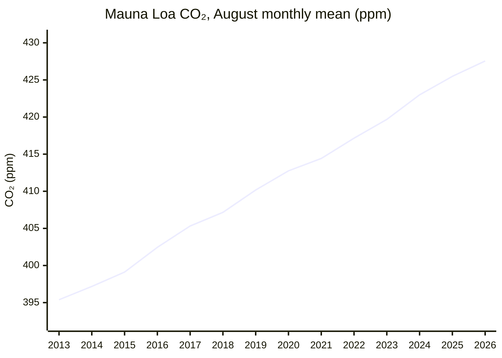
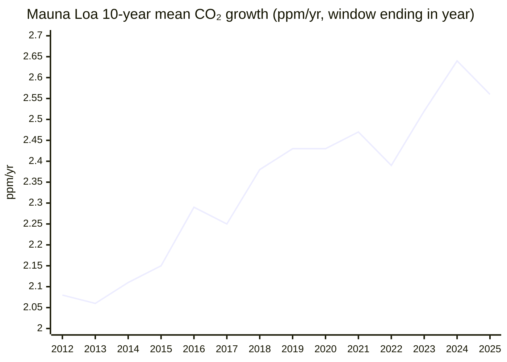

# Climate and Environment — 2026-W38 Bulletin

*Period: 2026-W38 (14–20 September 2026). "New" items are those published 16–22 September 2026 (the cutoff is 2026-09-22). Latest data: NOAA Mauna Loa monthly mean for August 2026 (published 2026-09-07, estimated release date, preliminary) and NOAA Mauna Loa daily mean for 2026-09-20 (published 2026-09-22, estimated release date, preliminary).*

> *This endeavor is unlike the other four: it is about fixing the past rather than improving the future. Many historic civilizations fell to climate change, and we now have to clean up our mess if we are to survive into a better future.*

## Executive Summary

**Bottom line: global fossil CO₂ is *projected* to fall by about 0.5% in 2026 (Carbon Brief), but the driver is the Strait of Hormuz crisis, and the IEA already expects the shock-driven fall in oil demand to rebound above the 2025 level in 2027[^iea-omr]. "The Bend" therefore stays 🟡 (assessed 2026-07-14, not re-assessed this week). A record daily El Niño reading this week also puts the CO₂ KPI assessment under question. That assessment's expectation of slower growth in 2026 rests on a Met Office forecast premised on La Niña-like conditions[^metoffice]. There is no new monthly CO₂ reading: the latest is still August 2026 at 427.55 ppm, +2.07 ppm on August 2025.**

**The good news**
- **Emissions may fall in 2026 (*projection*).** A Carbon Brief analysis projects global fossil CO₂ emissions to fall by about 0.5% in 2026, driven by the Strait of Hormuz crisis[^cb-fossil-2026].
- **China's August indicators point down.** CREA says indicators point to a broad-based decline in China's emissions in August 2026: thermal power -4% (coal power -5.2%, a second consecutive monthly fall), cement -12%, crude steel -4% and refinery throughput -7% year on year. At the same time, thermal power capacity additions in January–July were the highest for that period in 15 years[^crea-china-aug].
- **A record renewables year (achieved).** IRENA counts a record 693 GW of renewable capacity added worldwide in 2025 (513 GW solar PV, 158 GW wind), bringing the total to about 5.15 TW[^irena].
- **CO₂ storage in the EU (achieved).** Greensand entered commercial operation on 18 September 2026 as the EU's first full-scale offshore CO₂ storage site, with up to 400,000 tCO₂ per year in its first phase[^greensand].
- **Carbon removal deals (announced).** Google agreed to its largest carbon removal purchase to date: 1 million tonnes of enhanced rock weathering removal from Terradot, to be delivered by 2040[^google-terradot]. ADM plans to sell removal credits from its 800,000+ tCO₂-per-year biogenic capture operation[^adm]. Both deals were announced as the market for long-term tech-CDR offtakes shrank (see below).

**The bad news**
- **Record El Niño.** The daily Niño 3.4 anomaly (NOAA ONI convention) reached an all-time record of 3.11°C on 21 September 2026, beating the 3.08°C set on 18 November 2015[^cb-elnino].
- **India's CO₂ rose 3.7% year on year in H1 2026**, driven by an 8% rise in steel and cement emissions, even though its power-sector CO₂ stayed flat[^cb-india].
- **The tech-CDR offtake market shrank.** Argus data show technology-based removal credits contracted through long-term offtakes fell to about 6 million in January–August 2026, from 24 million a year earlier[^argus].
- **Efficiency is far off track.** Global energy intensity improved by only 1.7% in 2025, against the 4% per year goal. Meeting the 2030 goal now requires 5.6% per year[^irena].
- **Renewables are still short of tripling.** Tripling to about 11.2 TW by 2030 now requires about 1.2 TW of net additions per year in 2026–2030. Sustaining the 2025 growth rate would leave a shortfall of about 0.6 TW in 2030, although that is down from 0.9 TW in the previous edition[^irena].
- **Shipping's net-zero plan is under US attack.** At the UN General Assembly, President Trump called the IMO Net-Zero Framework a "global carbon tax"[^trump-unga].
- **Planetary boundaries.** The Planetary Health Check 2026 finds seven of nine planetary boundaries transgressed, all with worsening trends[^phc].

---

## KPI Dashboard

**KPI:** Atmospheric CO₂ concentration (ppm) and 10-year trend (ppm/year)

| Headline | Current | Previous (as of 2026-09-15) | Change | Year ago |
|---|---|---|---|---|
| **MLO monthly mean CO₂** (NOAA series) | **427.55 ppm** (August 2026; published 2026-09-07, rule-based date; preliminary)[^noaa-mm-mlo] | 427.55 ppm (August 2026, the same observation)[^noaa-mm-mlo] | — (no new release) | 425.48 ppm (August 2025): **+2.07 ppm** |
| **10-year trend, MLO** (mean of NOAA Jan→Dec growth rates, 2016–2025) | **2.56 ppm/yr** (obs 2025; published 2026-01-10)[^noaa-gr-mlo] | 2.56 ppm/yr (obs 2025, the same observation)[^noaa-gr-mlo] | — (no new release) | n/a |

Neither KPI headline moved this week, because no new monthly or annual NOAA value was published. The next monthly mean (September 2026) and the next 10-year trend (which needs NOAA's 2026 annual growth rate) are both still pending. The "year ago" change compares the same calendar month, so the seasonal cycle does not distort it.

**Supporting data**

| Metric | Value | Note |
|---|---|---|
| NOAA MLO daily mean | 426.32 ppm on 2026-09-20 (published 2026-09-22)[^noaa-daily] | new this period, preliminary. A single daily value, **not comparable** with the monthly-mean KPI, and not a trend |
| NOAA MLO monthly mean, May 2026 (seasonal peak) | 432.34 ppm, the highest monthly value on record[^noaa-mm-mlo] | earlier context (published 2026-06-07) |
| NOAA global marine-surface monthly mean | 427.62 ppm (June 2026)[^noaa-mm-gl] | earlier context (published 2026-07-07), preliminary |
| MLO annual mean 2025 | 427.35 ppm, a record[^noaa-ann-mlo] | earlier context (published 2026-01-10) |
| 10-year trend, NOAA global mean (2016–2025) | 2.53 ppm/yr[^noaa-gr-gl] | earlier context (published 2026-01-10) |

### Mauna Loa CO₂: August monthly mean

*Data: NOAA GML co2_mm_mlo.txt[^noaa-mm-mlo]. The 2026 value is preliminary.*

### 10-year CO₂ growth trend (Mauna Loa)

*Data: NOAA GML co2_gr_mlo.txt[^noaa-gr-mlo]*

Earlier context (NOAA data published 2026-01-10): the dip from 2.64 ppm/yr (2015–2024) to 2.56 ppm/yr (2016–2025) is mechanical. The El Niño year 2015 (+2.95 ppm) left the window, and 2025 (+2.23 ppm) entered it. Half-decade means still rose, from 2.51 to 2.61 ppm/yr at MLO[^noaa-gr-mlo].

### KPI assessment: 🔴 Worsening (unchanged; assessed 2026-07-14)

**Rationale (from the 2026-07-14 assessment):** The Mauna Loa CO₂ concentration hit new records in 26H1: a 432.34 ppm monthly mean in May 2026 (+1.83 ppm on May 2025) and a 433.95 ppm daily mean on 1 May[^noaa-mm-mlo][^noaa-daily]. The 10-year trend is 2.56 ppm/yr at MLO (2.53 global), and its dip from 2.64 is mechanical[^noaa-gr-mlo]. Year-on-year growth temporarily slowed (+1.48 to +2.26 ppm in Jan–Jun 2026). In direction, this matches the Met Office forecast of a slower 2026 annual-mean rise, which it attributes to La Niña-like conditions. Growth nonetheless remains far above the 1.33-1.79 ppm/yr that IPCC 1.5°C pathways require[^metoffice].

**What changed:** nothing since the last bulletin, and no new KPI data arrived this week beyond the preliminary daily reading above. The assessment is getting old, though. It was made before the July and August monthly means were published and before this week's record Niño 3.4 reading (see Beyond the Framework). The Met Office forecast it cites puts the slower 2026 rise down to La Niña-like conditions[^metoffice]. A re-assessment is due.

---

## Milestone Status

### 🟡 "The Bend": Peak Global Emissions

**Status: Approaching, not achieved** (assessed 2026-07-14; unchanged since the previous bulletin)

**Rationale (from the 2026-07-14 assessment):** Every 2025 estimate published in 26H1 is a new record: GCB fossil CO₂ 38.1 GtCO₂ (+1.0%)[^gcb-essd], IEA energy CO₂ 38,082 MtCO₂ (+0.4%)[^iea-ger] and Carbon Monitor fossil + industry CO₂ 37.2 GtCO₂ (+0.7%)[^carbon-monitor]. Only GCB total CO₂ dipped slightly, due to lower land-use emissions as El Niño ended[^gcb-essd]. Growth has slowed to a plateau, but China's CO₂ rose 2% in Q1 2026[^cb-china-q1], and the IEA expects the shock-driven 2026 oil-demand fall to rebound above the 2025 level in 2027[^iea-omr]. The peak is therefore not definitively behind us. *Caveat:* the milestone covers all greenhouse gases, but no global 2025 total-GHG estimate was published within 26H1, so CO₂ estimates serve as the proxy.

**What changed:** the status is unchanged and was not re-assessed. This week's evidence points both ways. The projected 2026 fall is shock-driven, and the rationale already anticipates a rebound through the IEA's expected 2027 oil-demand recovery. India's CO₂ rose 3.7% in H1 2026. China's August indicators fell, but its thermal capacity additions hit a 15-year high for January–July.

#### New this week

| Date | Event | Source |
|---|---|---|
| **Sep 16** | 🟡 **Carbon Brief (*projection*):** global fossil CO₂ emissions are set to fall by about 0.5% in 2026, driven by the Strait of Hormuz crisis. | [^cb-fossil-2026] |
| **Sep 17** | 🔴 **CREA for Carbon Brief (data):** India's CO₂ emissions grew 3.7% year on year in H1 2026, driven by an 8% rise in steel and cement emissions (now 23% of India's CO₂). India's power-sector CO₂ was flat versus H1 2024, as clean energy met all of the 7% (63 TWh) electricity-demand growth over two years, and oil and gas CO₂ fell 7% year on year. | [^cb-india] |
| **Sep 17** | 🟡 **CREA China snapshot (analysis):** indicators point to a broad-based decline in China's emissions in August 2026: thermal power generation -4% (coal power -5.2%, a second consecutive monthly fall), cement -12%, crude steel -4% and refinery throughput -7% year on year. However, thermal power capacity additions reached 50.3 GW in January–July 2026, up 20% and the highest for that period in 15 years. | [^crea-china-aug] |

**Earlier context (published before this period):**
- On the Hormuz shock, the IEA's June Oil Market Report (17 June 2026) said Q2 2026 oil deliveries plunged 5 mb/d year on year. It forecast a 1.1 mb/d fall in global oil demand in 2026, then a rise to 105.3 mb/d in 2027, above the implied 2025 level of about 104.4 mb/d[^iea-omr].
- For India, the IEA had estimated 2025 energy-related CO₂ at 3,114 MtCO₂ (-0.1%), "largely due to cyclical factors resulting from the strong monsoon"[^iea-ger]. The new H1 2026 figure comes from a different source and covers a different period.
- For China, a Carbon Brief/CREA analysis (3 September 2026) found that CO₂ fell 1% in Q2 2026 as oil use dropped 9%. That left first-half 2026 emissions "up marginally" but still below their 2023-24 peak[^cb-china-q2].
- On the all-GHG basis that the milestone actually tracks, Climate TRACE (27 August 2026) estimated 29.7 GtCO₂e in H1 2026, up 0.2% on H1 2025 (China -0.3%, India +1.5%)[^climate-trace]. This all-GHG estimate for India is not directly comparable with CREA's +3.7% for India's CO₂.

---

### 🔴 "The Balance": Net Zero

**Status: Distant — 53 GtCO2e/year to eliminate** (assessed 2026-01-03; unchanged since the previous bulletin)

**Rationale (assessed 2026-01-03 from sources carried over from the 2025 report):** Global GHG emissions were 53.2 GtCO₂e in 2024[^edgar], and fossil CO₂ hit a record in 2025, far from net zero. Net-zero targets cover 77% of global GDP[^nzt-stocktake], but 2025 was a year of retreat (US Paris withdrawal[^cat-us], banks exiting the NZBA[^guardian-retreat], delayed corporate targets), and most IEA net-zero pathway benchmarks are off track.

**What changed:** the status is unchanged and was not re-assessed. New this week:
- 🔴 **Sep 22 (setback):** in his UN General Assembly address, US President Donald Trump attacked the IMO Net-Zero Framework as a "global carbon tax" and vowed "there will be no global taxes" while he is president. The framework is the proposed global marine-fuel GHG-intensity standard and emissions-pricing mechanism meant to deliver net-zero international shipping emissions by or around 2050. The speech signals continued US opposition to it[^trump-unga].
- **Sep 21 (data):** IRENA's tracking report supports the rationale that key benchmarks are off track. Energy intensity improved 1.7% in 2025 against the 4% per year goal, and renewables are heading for a shortfall of about 0.6 TW against the tripling goal (see Open Challenges)[^irena].

---

### 🟡 "The Ceiling": Below +2°C

**Status: Under pressure** (assessed 2026-01-03; unchanged since the previous bulletin)

**Rationale (assessed 2026-01-03 from sources carried over from the 2025 report):** 2024 was the first calendar year to exceed 1.5°C above pre-industrial (WMO 1.55°C)[^wmo-2024], though the long-term Paris metric remains ~1.3-1.4°C[^wmo-soc]. WMO gives 70% odds that the 2025–2029 average also exceeds 1.5°C[^wmo-2024], and the 1.5°C carbon budget is virtually exhausted[^gcb-2025-release]. Earlier context: the GCB's May 2026 final paper put the remaining 1.5°C budget (50% chance) at 170 GtCO₂ from the start of 2026, about 4 years at 2025 emission levels[^gcb-essd].

**What changed:** the status is unchanged but dated. It was assessed on 3 January from 2024–25 sources, and no new global temperature data has been recorded for this milestone since. This week's record Niño 3.4 anomaly, the Planetary Health Check and the Himalaya attribution study are not global-mean temperature data, and they are listed under Beyond the Framework. A re-assessment is due once current global temperature data is in the ledger.

---

## Open Challenges

### Net-Zero Transition (not yet rated)

- **Record renewables, still short of tripling (data):** according to IRENA's third UAE Consensus tracking report (21 September 2026, with the COP31 Presidency and the Global Renewables Alliance), a record 693 GW of renewable capacity was added in 2025 (513 GW solar PV, 158 GW wind), bringing the total to about 5.15 TW. Tripling to about 11.2 TW by 2030 now requires average net additions of about 1.2 TW per year in 2026–2030. Sustaining the 2025 growth rate would leave a shortfall of about 0.6 TW in 2030, down from 0.9 TW in the previous edition[^irena].
- **Efficiency lagging (data):** global energy intensity improved by only 1.7% in 2025, after 1.1% in both 2023 and 2024, well below the 4% per year doubling goal. Meeting the 2030 goal now requires 5.6% per year. Grid and flexibility investment of up to about $1 trillion per year is needed in 2026–2030, versus $525 billion in 2025[^irena].
- **Electrification (analysis):** the IEA's Electrification special report (22 September 2026) found that electricity supplied about 23% of global final energy consumption in 2025, up from 17% in 2000. Fully exploiting today's cost-competitive electrification potential would raise this to about 33%. The COP31 presidency's goal of 35% by 2035 is reached in the IEA's High Electrification Scenario but requires going beyond today's policy settings, under which the share rises to slightly less than 30% by 2035[^iea-electrification].
- **ExxonMobil's outlook (*projection*):** the company's 2026 Global Outlook projects global energy-related CO₂ emissions to fall about 20%, from 36 billion tonnes in 2025 to 30 billion tonnes in 2050. That is up from the 27 billion tonnes it projected for 2050 a year earlier, and far above the roughly 11 billion tonnes in IPCC "likely below 2°C" scenarios. It sees coal still at 15% of the 2050 energy mix and carbon capture and storage reaching 2 billion tonnes per year, down from its prior 3.1 billion[^exxon].
- Greensand's CO₂ storage start is covered under Permanent Removal, and the US attack on the IMO shipping framework under "The Balance".

Biological carbon uptake (land sink): no significant developments this period.

### Permanent Removal (not yet rated)

- 🟢 **Greensand is operating (achieved, 18 September 2026):** led by INEOS Energy with Harbour Energy and Nordsøfonden, Greensand is the EU's first full-scale offshore CO₂ storage site. It injects CO₂ sourced primarily from Danish biomethane plants into the depleted Nini West field, about 1,800 m beneath the Danish North Sea. First-phase capacity is up to 400,000 tCO₂ per year, with potential expansion to 4-8 MtCO₂ per year[^greensand].
- 🔴 **Tech-CDR offtakes fell (setback):** Argus data (16 September 2026) show that technology-based CO₂ removal credits contracted through long-term offtake agreements fell to about 6 million in January–August 2026, from 24 million a year earlier. BECCS credits fell to 2 million from 17 million, and Microsoft's disclosed buying fell to just over 2 million from 16.5 million. Biochar offtakes rose to nearly 3 million from 1.5 million[^argus].
- **Google–Terradot (announced):** Google's largest carbon removal purchase to date is 1 million tonnes of permanent CO₂ removal via enhanced rock weathering, to be delivered by 2040, plus 1 MtCO2e (GWP20) of methane elimination by 2030. The project covers more than 200,000 hectares of rice farms in southern Brazil[^google-terradot].
- **ADM enters the removal market (announced, 21 September 2026):** ADM plans to sell credits from the 800,000+ tCO₂-per-year biogenic (ethanol fermentation) capture operation at its Columbus, Nebraska complex, where the CO₂ is stored permanently in Tallgrass's Eastern Wyoming Sequestration Hub. The credits are undergoing Puro.earth certification, with initial issuance expected by the end of 2026 and a 15-year crediting period[^adm].
- **JAL–Climeworks (announced, 18 September 2026):** the companies describe this as the first CORSIA-compliant carbon removal purchase agreement. It covers a portfolio of CORSIA-eligible removal credits (such as soil carbon and biochar) plus separately purchased Climeworks direct air capture credits. Volumes and prices were not disclosed[^jal-climeworks].
- **DACCS offer prices (analysis):** ClimeFi's first quarterly CDR Price Benchmark uses indicative supplier offers from more than 300 projects, *not transacted prices*. It found DACCS offers for 2030-vintage delivery 43% below 2026-vintage offers: from an average of about $800 to about $450 per tonne, per Carbon Pulse. Offer prices for BECCS, other biomass removal, enhanced weathering and ex-situ mineralisation rise between the 2026 and 2030 vintages[^climefi].
- **Marine CDR (analysis):** the US National Academies' 2026 update found that marine CDR has advanced through field trials and private credit sales. Major questions remain over whether it can remove CO₂ at meaningful scale, how net removal can be measured and verified, and what its long-term environmental effects are. Governance gaps "directly constrain the near-term scalability" of ocean alkalinity enhancement[^nasem].
- **Removals in UK aviation policy (analysis):** the UK Climate Change Committee advised that Heathrow expansion can be consistent with UK carbon budgets and Net Zero only if the government legislates for aviation to reach zero emissions by 2050 on a "polluter pays" basis. In the CCC's pathway, industry-purchased engineered removals deliver 36% of the 2050 aviation emissions reduction (lower demand growth 24%, efficiency 20%, SAF 20%)[^ccc-heathrow].

### Sunlight Management (not yet rated)

- **Stratospheric aerosol modelling (analysis, preprint, not yet peer reviewed):** an Earth-system-model study by Tjiputra et al., posted for discussion on EGUsphere on 16 September 2026, found that tropical, Northern-Hemisphere and Southern-Hemisphere mid-latitude stratospheric aerosol injection all kept *simulated* overshoot warming below 2°C. Deployment location strongly shapes side effects via the AMOC, and legacy effects on sea-level rise and permafrost persist for centuries after SAI ends[^tjiputra].

---

## Beyond the Framework

- **"Super El Niño" record (data):** a Carbon Brief analysis found that the daily Niño 3.4 sea-surface temperature anomaly (NOAA ONI convention) reached 3.11°C on 21 September 2026, surpassing the previous daily record of 3.08°C set on 18 November 2015. The August 2026 monthly anomaly (about 2.45°C) is already above the peak of every prior El Niño on record except 2015-16 (2.75°C) and 1877-78 (about 2.7°C, reconstructed)[^cb-elnino].
- **Planetary Health Check 2026 (analysis):** the PIK-led report finds seven of the nine planetary boundaries transgressed, all with worsening trends: climate change, biosphere integrity, land-system change, freshwater change, biogeochemical flows, novel entities and ocean acidification. Atmospheric aerosol loading (improving) and stratospheric ozone (stable) remain within the safe operating space[^phc].
- **Himalaya disaster attribution (analysis):** a World Weather Attribution study of the 26 August 2026 Rasuwa rock-ice avalanche and flood on the Nepal-China border (over 1,300 confirmed deaths and over 5,000 missing in Nepal) found that human-caused warming at the site likely weakened the slope through permafrost degradation and glacier thinning. The local warming was about 1.5°C in July–August temperatures (about 2°C annually), a site-specific figure, not global-mean warming. The study did not attribute the specific collapse, and it concluded the event exceeded the limits of adaptation[^wwa].
- **EU Climate Insurance Alliance (announced):** in her 16 September 2026 State of the Union address, Commission President Ursula von der Leyen announced an EU "Climate Insurance Alliance" to close the climate-catastrophe insurance gap. She noted that only around 25% of catastrophe losses in Europe are covered by private insurance, and that imported fossil fuels had cost the EU an additional €90 billion since the start of the Hormuz conflict[^eu-sotu].

---

## Reference Data

| Dataset | Link |
|---|---|
| NOAA GML Mauna Loa monthly mean CO₂ | [co2_mm_mlo.txt](https://gml.noaa.gov/webdata/ccgg/trends/co2/co2_mm_mlo.txt) |
| NOAA GML Mauna Loa daily mean CO₂ | [co2_daily_mlo.txt](https://gml.noaa.gov/webdata/ccgg/trends/co2/co2_daily_mlo.txt) |
| NOAA GML global marine-surface monthly mean CO₂ | [co2_mm_gl.txt](https://gml.noaa.gov/webdata/ccgg/trends/co2/co2_mm_gl.txt) |
| NOAA GML annual growth rates (MLO / global) | [co2_gr_mlo.txt](https://gml.noaa.gov/webdata/ccgg/trends/co2/co2_gr_mlo.txt) / [co2_gr_gl.txt](https://gml.noaa.gov/webdata/ccgg/trends/co2/co2_gr_gl.txt) |
| NOAA GML annual means (MLO / global) | [co2_annmean_mlo.txt](https://gml.noaa.gov/webdata/ccgg/trends/co2/co2_annmean_mlo.txt) / [co2_annmean_gl.txt](https://gml.noaa.gov/webdata/ccgg/trends/co2/co2_annmean_gl.txt) |
| Global Carbon Budget 2025 (ESSD) | [essd.copernicus.org](https://essd.copernicus.org/articles/18/3211/2026/) |
| IRENA: Tracking the UAE Consensus 2026 | [PDF](https://www.irena.org/-/media/Files/IRENA/Agency/Publication/2026/Sep/IRENA_OUT_Tracking_the_UAE_Consensus_2026.pdf) |
| IEA Electrification special report | [PDF](https://iea.blob.core.windows.net/assets/1c696cc3-e251-46a9-8d4d-9edb2a4e806a/Electrification.pdf) |
| Planetary Health Check 2026 (PIK) | [PDF](https://publications.pik-potsdam.de/pubman/item/item_35009/component/file_35022/PlanetaryHealthCheck2026.pdf) |

---

## Footnotes

[^noaa-mm-mlo]: [NOAA GML: Mauna Loa monthly mean CO2 (co2_mm_mlo.txt)](https://gml.noaa.gov/webdata/ccgg/trends/co2/co2_mm_mlo.txt)
[^noaa-mm-gl]: [NOAA GML: global marine-surface monthly mean CO2 (co2_mm_gl.txt)](https://gml.noaa.gov/webdata/ccgg/trends/co2/co2_mm_gl.txt)
[^noaa-daily]: [NOAA GML: Mauna Loa daily mean CO2 (co2_daily_mlo.txt)](https://gml.noaa.gov/webdata/ccgg/trends/co2/co2_daily_mlo.txt)
[^noaa-gr-mlo]: [NOAA GML: Mauna Loa annual growth rates (co2_gr_mlo.txt)](https://gml.noaa.gov/webdata/ccgg/trends/co2/co2_gr_mlo.txt)
[^noaa-gr-gl]: [NOAA GML: global annual growth rates (co2_gr_gl.txt)](https://gml.noaa.gov/webdata/ccgg/trends/co2/co2_gr_gl.txt)
[^noaa-ann-mlo]: [NOAA GML: Mauna Loa annual mean CO2 (co2_annmean_mlo.txt)](https://gml.noaa.gov/webdata/ccgg/trends/co2/co2_annmean_mlo.txt)
[^metoffice]: [UK Met Office: Mauna Loa CO2 forecast (published 4 Feb 2026)](https://www.metoffice.gov.uk/research/climate/seasonal-to-decadal/seasonal-forecast/forecasts/co2-forecast)
[^cb-fossil-2026]: [Carbon Brief: Global fossil-fuel emissions set to fall in 2026 amid Hormuz crisis (16 Sep 2026)](https://www.carbonbrief.org/analysis-global-fossil-fuel-emissions-set-to-fall-in-2026-amid-hormuz-crisis)
[^cb-india]: [Carbon Brief: India's power-sector emissions flat for two years due to clean-energy surge (17 Sep 2026)](https://www.carbonbrief.org/analysis-indias-power-sector-emissions-flat-for-two-years-due-to-clean-energy-surge)
[^crea-china-aug]: [CREA: China Energy and Emissions Trends, August 2026 snapshot (17 Sep 2026)](https://energyandcleanair.org/china-energy-and-emissions-trends-august-2026-snapshot/)
[^cb-china-q2]: [Carbon Brief/CREA: China's CO2 emissions fall in Q2 2026 due to plummeting oil use (3 Sep 2026)](https://www.carbonbrief.org/analysis-chinas-co2-emissions-fall-in-q2-2026-due-to-plummeting-oil-use)
[^climate-trace]: [Climate TRACE: marginal increase in global emissions in the first half of 2026 (27 Aug 2026)](https://climatetrace.org/news/climate-trace-data-show-marginal-increase-in-global-emissions-in-the-first-half-of-2026)
[^cb-china-q1]: [Carbon Brief/CREA: China's CO2 climbs 2% in early 2026 due to wasted wind and solar](https://www.carbonbrief.org/analysis-chinas-co2-climbs-2-in-early-2026-due-to-wasted-wind-and-solar)
[^iea-omr]: [IEA Oil Market Report, June 2026](https://www.iea.org/reports/oil-market-report-june-2026)
[^gcb-essd]: [Global Carbon Budget 2025, ESSD (13 May 2026)](https://essd.copernicus.org/articles/18/3211/2026/)
[^iea-ger]: [IEA Global Energy Review 2026 (PDF)](https://iea.blob.core.windows.net/assets/df903e1c-49c6-4757-8cbf-6fbcfe7611a0/GlobalEnergyReview2026.pdf)
[^carbon-monitor]: [Carbon Monitor, Nature Reviews Earth & Environment (14 Apr 2026)](https://www.nature.com/articles/s43017-026-00780-4)
[^trump-unga]: [American Presidency Project: Remarks to the United Nations General Assembly, September 22, 2026](https://www.presidency.ucsb.edu/documents/remarks-the-united-nations-general-assembly-new-york-city-21); [Inside Climate News: Competing climate visions clash at UN General Assembly (22 Sep 2026)](https://insideclimatenews.org/news/22092026/un-general-assembly-opens-with-clashing-climate-views/)
[^irena]: [IRENA et al. (2026): Delivering on the UAE Consensus, tracking report (PDF)](https://www.irena.org/-/media/Files/IRENA/Agency/Publication/2026/Sep/IRENA_OUT_Tracking_the_UAE_Consensus_2026.pdf); [Reuters (21 Sep 2026)](https://www.reuters.com/sustainability/cop/global-renewable-deployment-must-double-hit-2030-climate-target-report-says-2026-09-21/)
[^iea-electrification]: [IEA: Electrification, special report (22 Sep 2026)](https://www.iea.org/reports/electrification)
[^exxon]: [ExxonMobil 2026 Global Outlook, executive summary (PDF)](https://corporate.exxonmobil.com/-/media/global/files/global-outlook/2026-global-outlook-executive-summary.pdf); [Reuters: Exxon raises 2050 global emissions forecast (17 Sep 2026)](https://www.reuters.com/business/energy/exxon-raises-2050-global-emissions-forecast-sees-slower-coal-decline-2026-09-17/)
[^greensand]: [INEOS: INEOS opens the first full-scale CO₂ storage site in the EU (18 Sep 2026)](https://www.ineos.com/news/shared-news/ineos-opens-the-first-full-scale-co%E2%82%82-storage-site-in-the-eu/)
[^argus]: [Argus Media: Tech CDR market contracts in Jan-Aug (16 Sep 2026)](https://www.argusmedia.com/en/news-and-insights/market-opinion-and-analysis-blog/tech-cdr-market-contracts-jan-aug-beccs-biochar)
[^google-terradot]: [Google: We're catalyzing megaton-scale climate impact in Brazil (16 Sep 2026)](https://blog.google/company-news/outreach-and-initiatives/sustainability/terradot-superpollutants-carbon-removal/)
[^adm]: [ADM: ADM plans entry into voluntary carbon market (21 Sep 2026)](https://investors.adm.com/news/news-details/2026/ADM-Plans-Entry-into-Voluntary-Carbon-Market-with-Over-800000-Tons-of-Annual-Removal-Capacity/default.aspx)
[^jal-climeworks]: [Climeworks: Japan Airlines and Climeworks Solutions sign first CDR CORSIA deal (18 Sep 2026)](https://climeworks.com/news/japan-airlines-and-climeworks-solutions-sign-first-cdr-corsia-deal); [CarbonCredits.com](https://carboncredits.com/climeworks-jal-corsia-carbon-removal-deal/)
[^climefi]: [ClimeFi: The CDR Price Benchmark (16 Sep 2026)](https://www.climefi.com/blog-posts/the-cdr-price-benchmark-a-new-quarterly-series-from-climefi); [Carbon Pulse](https://carbon-pulse.com/551226/)
[^nasem]: [National Academies: A Research Strategy for Ocean-based Carbon Dioxide Removal and Sequestration, 2026 update](https://nap.nationalacademies.org/pubs/29342/); [Sabin Center, Columbia (16 Sep 2026)](https://climate.law.columbia.edu/news/new-national-academies-report-highlights-governance-barriers-marine-carbon-dioxide-removal)
[^ccc-heathrow]: [Climate Change Committee: Government cannot expand Heathrow without requiring aviation industry to clean up its emissions (16 Sep 2026)](https://www.theccc.org.uk/2026/09/16/government-cannot-expand-heathrow-without-requiring-aviation-industry-to-clean-up-its-emissions/)
[^tjiputra]: [EGUsphere preprint egusphere-2026-5188: Impacts and limitations of avoiding temperature overshoot with stratospheric aerosol injections](https://egusphere.copernicus.org/preprints/2026/egusphere-2026-5188/)
[^cb-elnino]: [Carbon Brief: 'Super El Niño' breaks 'remarkable' all-time record (21 Sep 2026)](https://www.carbonbrief.org/analysis-super-el-nino-reaches-remarkable-all-time-record)
[^phc]: [PIK: Planetary Health Check 2026 (full report PDF)](https://publications.pik-potsdam.de/pubman/item/item_35009/component/file_35022/PlanetaryHealthCheck2026.pdf); [PIK news (21 Sep 2026)](https://www.pik-potsdam.de/en/news/latest-news/planetary-health-check-2026-finds-mounting-pressures-across-earth2019s-life-support-systems)
[^wwa]: [World Weather Attribution: Rapid warming in the Himalaya exacerbates geohazard cascades beyond adaptation limits (17 Sep 2026)](https://www.worldweatherattribution.org/rapid-warming-in-the-himalaya-exacerbates-geohazard-cascades-beyond-adaptation-limits/)
[^eu-sotu]: [European Commission: 2026 State of the Union Address (16 Sep 2026)](https://ec.europa.eu/commission/presscorner/detail/ov/speech_26_1868)
[^edgar]: [EDGAR 2025 Report](https://edgar.jrc.ec.europa.eu/report_2025) (carried over from the 2025 report; not re-verified)
[^nzt-stocktake]: [Net Zero Stocktake 2025](https://zerotracker.net/analysis/net-zero-stocktake-2025) (carried over from the 2025 report; not re-verified)
[^cat-us]: [Climate Action Tracker: net zero target evaluations](https://climateactiontracker.org/global/cat-net-zero-target-evaluations/) (carried over from the 2025 report; not re-verified)
[^guardian-retreat]: [Guardian: Was 2025 the year business retreated from net zero?](https://www.theguardian.com/environment/2025/dec/20/was-2025-the-year-that-business-retreated-from-net-zero) (carried over from the 2025 report; not re-verified)
[^wmo-2024]: [WMO confirms 2024 as warmest year on record](https://wmo.int/news/media-centre/wmo-confirms-2024-warmest-year-record-about-155degc-above-pre-industrial-level) (carried over from the 2025 report; not re-verified)
[^wmo-soc]: [WMO State of the Global Climate 2024](https://wmo.int/publication-series/state-of-global-climate-2024) (carried over from the 2025 report; not re-verified)
[^gcb-2025-release]: [Global Carbon Budget 2025 release (13 Nov 2025)](https://globalcarbonbudget.org/fossil-fuel-co2-emissions-hit-record-high-in-2025/) (carried over from the 2025 report; not re-verified)
