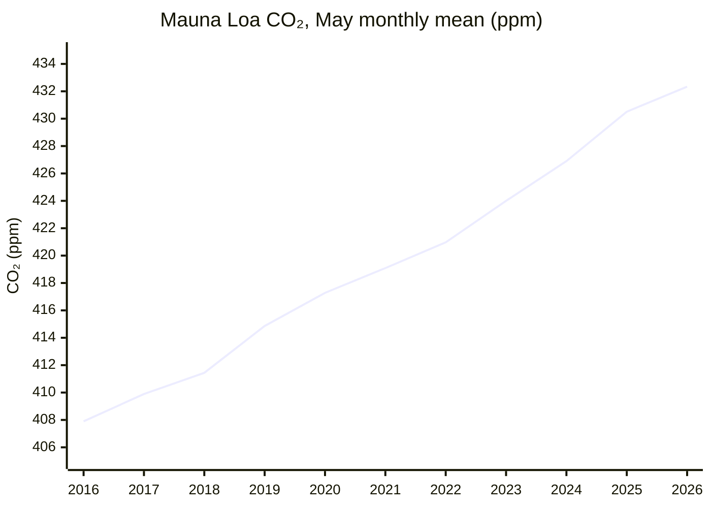
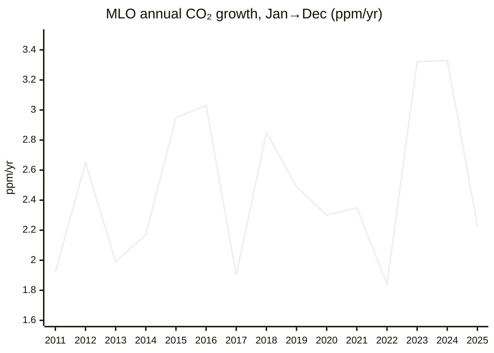
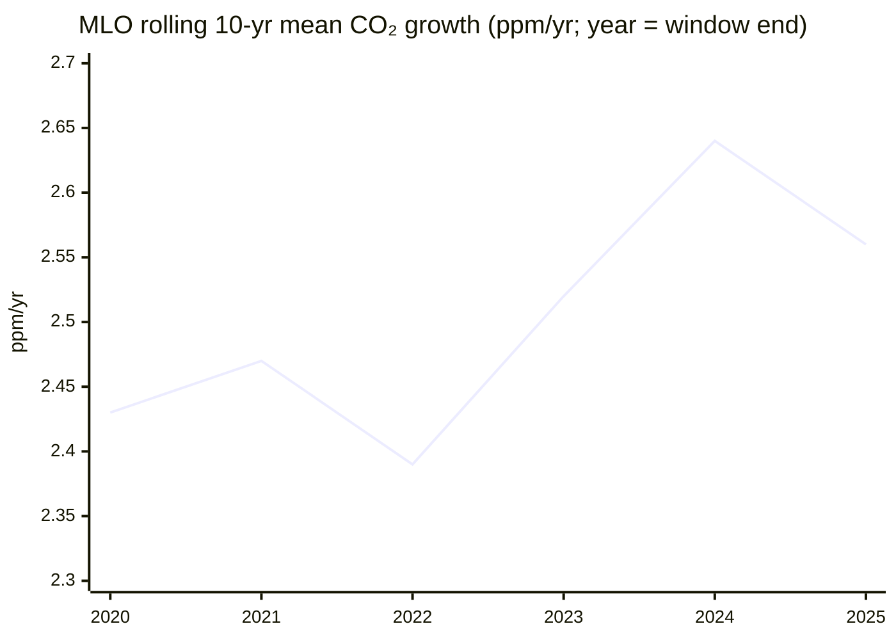

# Climate and Environment — 26H1 Report

*Period: 26H1 (Jan–Jun 2026), as of 30 June 2026. **Narrowed scope:** only the KPI (atmospheric CO₂ concentration and its 10-year ppm/yr trend) and the milestone "The Bend". "The Balance", "The Ceiling" and all Open Challenges are skipped. NOAA data files were retrieved in Sep 2026 and recent values are preliminary. Items published after 30 June are labelled as such.*

> *This endeavor is unlike the other four: it is about fixing the past rather than improving the future. Many historic civilizations fell to climate change, and we now have to clean up our mess if we are to survive into a better future.*

## Executive Summary

**KPI: 🔴 CO₂ concentration hit a new record, and its 10-year growth trend is 2.56 ppm/yr.**
- The Mauna Loa (MLO) monthly mean reached **432.34 ppm in May 2026**. This is the seasonal peak and the highest monthly value on record[^noaa-mm-mlo].
- The **10-year average growth rate for 2016–2025 is 2.56 ppm/yr** at MLO and 2.53 ppm/yr for the NOAA global mean[^noaa-gr-mlo][^noaa-gr-gl].
- **The annual concentration growth rate slowed:** MLO rose +2.23 ppm in 2025 (Jan→Dec), down from +3.33 ppm in 2024[^noaa-gr-mlo]. The Met Office links the slower rise to La Niña-like conditions that temporarily strengthened natural carbon sinks. It says the rise is still "too fast to track IPCC 1.5°C scenarios"[^metoffice].

**The Bend: 🟡 Approaching, not yet achieved.**
- **Fossil CO₂ emissions set a record of 38.1 GtCO₂ in 2025** (+1.0%, GCB)[^gcb]. The IEA's energy CO₂ and Carbon Monitor's fossil+industry CO₂ also set records in 2025.
- **GCB total CO₂ was slightly lower in 2025** (fossil plus land-use change; 42.2 vs 42.4 GtCO₂). GCB attributes this to lower land-use emissions at the end of El Niño, not to a fall in fossil CO₂[^gcb].
- **Energy CO₂ growth slowed to about +0.4%, the slowest since 2021 (IEA)**[^iea-ger]. This looks like a plateau, but a fragile one: China's CO₂ rose 2% in Q1 2026[^cb-china-q1]. Any 2026 dip would be driven by the Hormuz oil shock, and the IEA expects oil demand to rebound in 2027[^iea-omr].

**Bottom line: CO₂ concentration is at a record and has risen by about 2.5 ppm/yr over the past decade. Fossil CO₂ emissions reached a record in 2025, while energy CO₂ growth slowed to its lowest rate since 2021. The emissions peak is not yet definitively behind us.**

---

## KPI Dashboard

**KPI (per README):** Atmospheric CO₂ concentration (ppm) **and** 10-year trend (ppm/year).

*Basis notes:*
- **Two stations, not mixed.** MLO is a single Northern Hemisphere site, so it reads higher and has a larger seasonal cycle. The NOAA global mean is averaged over marine surface sites.
- **"Growth" means NOAA's Jan 1→Dec 31 change** (written "Jan→Dec"). The 10-year trend is the mean of the last 10 of these annual growth rates.

| Metric | Value | Source |
|--------|-------|--------|
| **Concentration: MLO monthly mean, May 2026** (latest month published by 30 June) | **432.34 ppm**, an all-time monthly record. This is +1.83 ppm on May 2025 (430.51 ppm). | NOAA GML[^noaa-mm-mlo] |
| Concentration: MLO monthly mean, June 2026 (published early July) | 431.43 ppm, +1.82 ppm on June 2025 | NOAA GML[^noaa-mm-mlo] |
| Concentration: record MLO daily mean | 433.95 ppm (1 May 2026) | NOAA GML[^noaa-daily-mlo] |
| Concentration: NOAA global mean, May / Jun 2026 | 428.59 / 427.62 ppm | NOAA GML[^noaa-mm-gl] |
| Concentration: 2025 annual mean | 427.35 ppm (MLO) / 425.62 ppm (global); both are records | NOAA GML[^noaa-ann-mlo][^noaa-ann-gl] |
| **10-year trend, 2016–2025, MLO** | **2.56 ppm/yr** (Jan→Dec) | NOAA GML[^noaa-gr-mlo] |
| 10-year trend, 2016–2025, global | 2.53 ppm/yr (Jan→Dec) | NOAA GML[^noaa-gr-gl] |
| Trend by half-decade, MLO (Jan→Dec) | 2.51 ppm/yr (2016–20) → 2.61 ppm/yr (2021–25) | NOAA GML[^noaa-gr-mlo] |
| Latest annual growth rate, 2025 (Jan→Dec) | +2.23 ppm (MLO) / +2.06 ppm (global, the smallest since 2014). In 2024 the rates were +3.33 ppm (MLO) and +3.76 ppm (global); both were records. | NOAA GML[^noaa-gr-mlo][^noaa-gr-gl] |
| *Forecast, not observed:* 2026 MLO annual mean (Scripps basis) | 429.4 ± 0.6 ppm, a rise of +2.37 ± 0.55 ppm (2.56 ppm without La Niña). This uses Scripps data, so it cannot be compared directly with NOAA's 427.35 ppm. | UK Met Office (4 Feb 2026)[^metoffice] |
| *The Bend tracker (emissions, not the KPI):* fossil CO₂, 2025 | **38.1 GtCO₂**, +1.0% (range 0.2% to 1.7%) on 2024; a record | GCB 2025, ESSD[^gcb] |

**Change since the previous report (pilot-2025):**
- **Concentration.** Pilot-2025 reported 426.5 ppm for November 2025. This report's figure is 432.34 ppm for May 2026, a raw difference of +5.84 ppm.
  - The two readings are from different calendar months, so the seasonal cycle has not been removed. The difference is not a growth rate.
  - The comparable change is **May 2025 → May 2026: +1.83 ppm**.
- **10-year trend.** This metric had no previous headline. Pilot-2025 cited WMO's +2.4 ppm/yr for 2011–2020, which uses a different basis (annual means), so it is not compared here.
- **Fossil CO₂.** This metric had no previous headline. Pilot-2025 cited GCB's November 2025 projection of 38.1 GtCO₂ (+1.1%). The final paper keeps 38.1 GtCO₂ and gives growth of +1.0%[^gcb].

### Concentration: May seasonal peak at Mauna Loa

*Data: NOAA GML MLO monthly means[^noaa-mm-mlo]. The chart uses May, the annual peak, so that 2026 can be included. The 2026 value is preliminary.*

### Trend: annual growth and the rolling 10-year mean

*Data: NOAA GML MLO growth rates[^noaa-gr-mlo]. The 2025 value is preliminary. GCB attributes the record 2024 growth mainly to the 2023/24 El Niño[^gcb].*

*Data: calculated from NOAA GML MLO growth rates[^noaa-gr-mlo]. Each point is the mean of the 10 years ending in that year.*

**Assessment: 🔴 Worsening. The concentration is at a record and is still rising at about 2.5 ppm/yr.**
- The rolling 10-year mean eased from 2.64 to 2.56 ppm/yr. The strong El Niño year 2015 (+2.95) left the window and the slower 2025 (+2.23) entered it[^noaa-gr-mlo]. This is not a structural slowdown: half-decade means still rose, and the rolling mean remains above its 2011–20 level of 2.43 ppm/yr.
- IPCC C1 (1.5°C) scenarios need a 2020s decadal average of 1.33–1.79 ppm/yr. The Met Office reports 2.61 ppm/yr observed for 2020–2025, on the Scripps annual-mean basis[^metoffice].
- *Scope note:* natural sinks and ENSO strongly affect year-to-year concentration growth. This report therefore draws no conclusion about emissions from it. The Bend is judged below from emissions inventories only.

---

## Milestone Status

### 🟡 "The Bend": Peak Global Greenhouse-Gas Emissions

**Status: Approaching, not yet achieved.** Fossil CO₂ set a record in 2025, while energy CO₂ growth slowed to its lowest rate since 2021 (IEA). The peak year is not definitively behind us.

*Metric caveat:* the milestone refers to all greenhouse gases. None of the sources tracked here published a global total-GHG (CO₂e) estimate for 2025 within 26H1, so CO₂ estimates are the evidence. Each figure below applies only to its own measure, and all are preliminary.

| Estimate (published in 26H1) | Measure | 2025 | Change vs 2024 | Source |
|---|---|---|---|---|
| GCB 2025 final paper (13 May 2026) | Fossil CO₂ (fossil fuels + cement, net of carbonation) | **38.1 GtCO₂**, "an historical record high" | **+1.0%** (0.2% to 1.7%) | ESSD[^gcb] |
| IEA Global Energy Review 2026 (Apr 2026) | Energy CO₂ (combustion + industrial processes) | **38,082 Mt**, a record | About **+0.4%**, the slowest growth since 2021 | IEA PDF[^iea-ger] |
| Carbon Monitor (14 Apr 2026) | Fossil + industry CO₂ | **37.2 Gt**, a record | **+0.7%** | Nat. Rev. Earth Environ.[^carbon-monitor] |
| GCB 2025 final paper | Total CO₂ (fossil + land-use change) | 42.2 GtCO₂ | **Slightly lower** than 2024 (42.4), because land-use emissions fell at the end of El Niño | ESSD[^gcb] |

**Signs of a plateau:**
- **Total CO₂ growth has slowed.** On GCB's measure it grew 0.3%/yr over 2015–2024, down from 1.9%/yr over 2005–2014[^gcb].
- **Fossil power generation fell 0.2% in 2025**, the first time since 2020 that it did not rise. Clean power (+887 TWh) grew by more than demand (+849 TWh)[^ember-ger].
- **China and India flattened on energy CO₂:** China −0.5% and India −0.1% (IEA). The IEA says India's fall was "largely due to cyclical factors resulting from the strong monsoon"[^iea-ger]. CREA finds China's CO₂ "flat or falling" for 21 months, and −0.3% in 2025[^cb-china-21m].

**Why the peak is not yet definitively behind us:**
- **2025 set a record on every fossil and energy CO₂ measure above.** US energy CO₂ rose 2.2%[^iea-ger].
- **China is on a plateau, not in a confirmed decline.**
  - GCB puts China's 2025 fossil CO₂ at +0.4% (range −0.1% to +0.9%)[^gcb].
  - China's CO₂ **rose 2% year on year in Q1 2026**, though it stayed below the March 2024 peak[^cb-china-q1].
  - A retroactive change to China's official carbon-intensity metric leaves a gap of about 700–730 MtCO₂/yr compared with the previous statistics[^cb-china-metric].
- **A 2026 dip would be driven by a shock.**
  - The IEA forecasts 2026 oil demand to fall by 1.1 mb/d after the Hormuz supply shock. It then expects a rebound of 2 mb/d, to 105.3 mb/d, in 2027[^iea-omr].
  - The "return to coal" is capped: global coal power rises no more than 1.8% in 2026, even in the worst case[^cb-coal].
- **Expert view (5 Jan 2026):** "global emissions have yet to decline (even if they have plateaued)"[^hausfather].

**Why it matters:** GCB puts the remaining 1.5°C (50%) budget from the start of 2026 at **170 GtCO₂**. That is about **4 years** at 2025 emission levels[^gcb].

*Published after 30 June 2026 (context only; not used for the status):*
- EDGAR: total GHG excluding LULUCF was 54.1 GtCO₂e in 2025, +0.7%[^edgar].
- Climate TRACE: total GHG in H1 2026 was +0.2% on H1 2025[^climate-trace].
- Carbon Brief: fossil CO₂ is set to fall about 0.5% in 2026 because of the Hormuz crisis[^cb-2026-fall]. That fall would be the shock-driven dip described above.

---

## Beyond the Framework

- **Renewables overtook coal in global electricity in 2025**, with a 33.8% share against 33.0% for coal[^ember-ger].

---

## Reference Data

**MLO monthly means, 2026 (preliminary)**[^noaa-mm-mlo]:

| | Jan | Feb | Mar | Apr | May | Jun* |
|---|---|---|---|---|---|---|
| Monthly mean (ppm) | 428.62 | 429.35 | 430.15 | 431.12 | **432.34** | 431.43 |
| Change on same month of 2025 (ppm) | +1.97 | +2.26 | +2.00 | +1.48 | +1.83 | +1.82 |

\*June was published in early July 2026.

| Dataset | Link |
|---|---|
| NOAA MLO monthly / daily means | [co2_mm_mlo.txt](https://gml.noaa.gov/webdata/ccgg/trends/co2/co2_mm_mlo.txt) · [co2_daily_mlo.txt](https://gml.noaa.gov/webdata/ccgg/trends/co2/co2_daily_mlo.txt) |
| NOAA global monthly means | [co2_mm_gl.txt](https://gml.noaa.gov/webdata/ccgg/trends/co2/co2_mm_gl.txt) |
| NOAA annual growth rates (MLO / global) | [co2_gr_mlo.txt](https://gml.noaa.gov/webdata/ccgg/trends/co2/co2_gr_mlo.txt) · [co2_gr_gl.txt](https://gml.noaa.gov/webdata/ccgg/trends/co2/co2_gr_gl.txt) |

---

## Footnotes

[^noaa-mm-mlo]: [NOAA GML: Mauna Loa monthly mean CO₂ (co2_mm_mlo.txt)](https://gml.noaa.gov/webdata/ccgg/trends/co2/co2_mm_mlo.txt)
[^noaa-daily-mlo]: [NOAA GML: Mauna Loa daily mean CO₂ (co2_daily_mlo.txt)](https://gml.noaa.gov/webdata/ccgg/trends/co2/co2_daily_mlo.txt)
[^noaa-mm-gl]: [NOAA GML: global monthly mean CO₂ (co2_mm_gl.txt)](https://gml.noaa.gov/webdata/ccgg/trends/co2/co2_mm_gl.txt)
[^noaa-ann-mlo]: [NOAA GML: Mauna Loa annual mean CO₂ (co2_annmean_mlo.txt)](https://gml.noaa.gov/webdata/ccgg/trends/co2/co2_annmean_mlo.txt)
[^noaa-ann-gl]: [NOAA GML: global annual mean CO₂ (co2_annmean_gl.txt)](https://gml.noaa.gov/webdata/ccgg/trends/co2/co2_annmean_gl.txt)
[^noaa-gr-mlo]: [NOAA GML: Mauna Loa annual CO₂ growth rates (co2_gr_mlo.txt)](https://gml.noaa.gov/webdata/ccgg/trends/co2/co2_gr_mlo.txt). The 10-year, rolling and half-decade means are calculated from this file.
[^noaa-gr-gl]: [NOAA GML: global annual CO₂ growth rates (co2_gr_gl.txt)](https://gml.noaa.gov/webdata/ccgg/trends/co2/co2_gr_gl.txt). The 10-year mean is calculated from this file.
[^metoffice]: [UK Met Office: Mauna Loa CO₂ forecast for 2026 (4 Feb 2026)](https://www.metoffice.gov.uk/research/climate/seasonal-to-decadal/seasonal-forecast/forecasts/co2-forecast)
[^gcb]: [Global Carbon Budget 2025, ESSD 18, 3211 (13 May 2026)](https://essd.copernicus.org/articles/18/3211/2026/)
[^iea-ger]: [IEA Global Energy Review 2026 (PDF), pp. 13, 36, 45](https://iea.blob.core.windows.net/assets/df903e1c-49c6-4757-8cbf-6fbcfe7611a0/GlobalEnergyReview2026.pdf)
[^carbon-monitor]: [Carbon Monitor, Nature Reviews Earth & Environment (14 Apr 2026)](https://www.nature.com/articles/s43017-026-00780-4)
[^ember-ger]: [Ember Global Electricity Review 2026 (21 Apr 2026)](https://ember-energy.org/latest-insights/global-electricity-review-2026/)
[^cb-china-21m]: [Carbon Brief/CREA: China's CO₂ flat or falling for 21 months (12 Feb 2026)](https://www.carbonbrief.org/analysis-chinas-co2-emissions-have-now-been-flat-or-falling-for-21-months)
[^cb-china-q1]: [Carbon Brief/CREA: China's CO₂ climbs 2% in early 2026 (4 Jun 2026)](https://www.carbonbrief.org/analysis-chinas-co2-climbs-2-in-early-2026-due-to-wasted-wind-and-solar)
[^cb-china-metric]: [Carbon Brief: China's new carbon metric leaves Germany-sized gap (26 May 2026)](https://www.carbonbrief.org/analysis-chinas-new-carbon-metric-leaves-germany-sized-gap-in-its-emissions)
[^iea-omr]: [IEA Oil Market Report, June 2026 (17 Jun 2026)](https://www.iea.org/reports/oil-market-report-june-2026)
[^cb-coal]: [Carbon Brief/Ember: No significant return to coal in 2026 despite Iran crisis (28 Apr 2026)](https://www.carbonbrief.org/world-will-not-see-significant-return-to-coal-in-2026-despite-iran-crisis/)
[^hausfather]: [Z. Hausfather, The Climate Brink: "Keep it in the ground" (5 Jan 2026)](https://www.theclimatebrink.com/p/keep-it-in-the-ground)
[^edgar]: [EDGAR 2026 report: GHG emissions of all world countries (PDF, Sep 2026)](https://edgar.jrc.ec.europa.eu/booklet/GHG_emissions_of_all_world_countries_booklet_2026report.pdf)
[^climate-trace]: [Climate TRACE: marginal increase in global emissions in H1 2026 (27 Aug 2026)](https://climatetrace.org/news/climate-trace-data-show-marginal-increase-in-global-emissions-in-the-first-half-of-2026)
[^cb-2026-fall]: [Carbon Brief: global fossil-fuel emissions set to fall in 2026 amid Hormuz crisis (16 Sep 2026)](https://www.carbonbrief.org/analysis-global-fossil-fuel-emissions-set-to-fall-in-2026-amid-hormuz-crisis)
