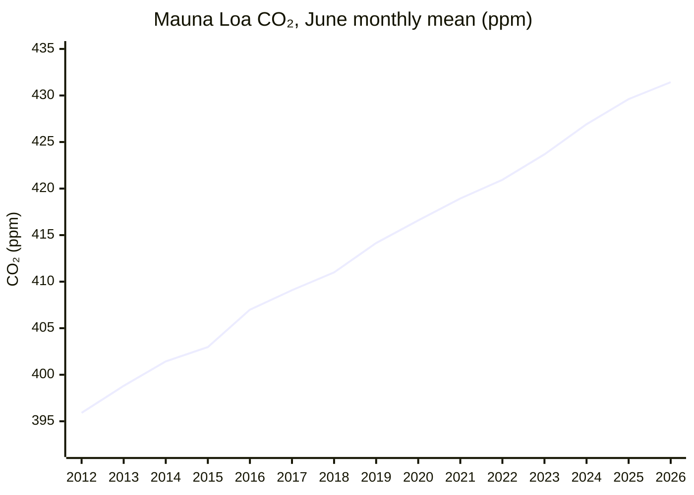
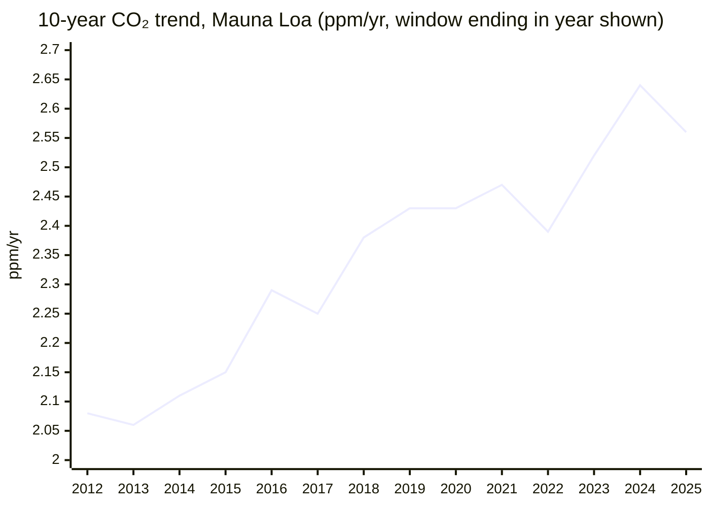

# Climate and Environment — 26H1 Bulletin

*Period: 26H1 (2026-01-01 to 2026-06-30), covering developments published up to 2026-07-14. Latest data: NOAA Mauna Loa and global marine-surface monthly means for June 2026 (published 2026-07-07, preliminary).*

> *This endeavor is unlike the other four: it is about fixing the past rather than improving the future. Many historic civilizations fell to climate change, and we now have to clean up our mess if we are to survive into a better future.*

## Executive Summary

**Bottom line: atmospheric CO₂ set new records in 26H1, and the KPI is now assessed 🔴 Worsening (previously 🟡). On emissions, every 2025 fossil/energy CO₂ estimate published this half-year is a record, although growth has slowed to a plateau. "The Bend" stays 🟡: approaching, not achieved.**

**The good news**
- **Global fossil power generation fell in 2025** by 0.2% (-38 TWh), the first time since 2020 and only the fifth time this century that it did not rise. Low-carbon generation (+887 TWh) outpaced electricity demand growth (+849 TWh). This is an outturn, not a projection[^ember-ger].
- **Renewables overtook coal** in global electricity generation in 2025: 33.8% (10,730 TWh) versus 33.0% (10,476 TWh)[^ember-ger].
- **Emissions growth is slowing.** IEA energy-related CO₂ rose by around 0.4% in 2025, "the slowest rate since 2021"[^iea-ger]; Carbon Monitor's fossil + industry CO₂ growth flattened to 0.7%[^carbon-monitor]. GCB total CO₂ (fossil + land-use change) grew 0.3% per year over 2015–2024, versus 1.9% per year over 2005–2014[^gcb-essd].
- **China and India were roughly flat in 2025.** IEA energy-related CO₂: China -0.5%, India -0.1% ("largely due to cyclical factors resulting from the strong monsoon")[^iea-ger]. Carbon Brief/CREA: China -0.3%[^cb-china-21m].
- **Year-on-year growth in CO₂ concentration slowed.** Mauna Loa (MLO) monthly gains for January–June 2026 were +1.48 to +2.26 ppm, below the May-over-May gains of 2023–2025 (+3.03, +2.90 and +3.61 ppm)[^noaa-mm-mlo]. Only the growth rate slowed; concentrations still set records.

**The bad news**
- **A new CO₂ concentration record.** The NOAA MLO monthly mean reached **432.34 ppm in May 2026**, the highest monthly value on record and +1.83 ppm on May 2025[^noaa-mm-mlo]. The MLO daily mean hit 433.95 ppm on 1 May 2026, the highest in NOAA's MLO daily record[^noaa-daily].
- **Record 2025 emissions on every fossil/energy CO₂ basis:** GCB fossil CO₂ 38.1 GtCO₂ (+1.0%)[^gcb-essd], IEA energy-related CO₂ 38,082 MtCO₂[^iea-ger] and Carbon Monitor fossil + industry CO₂ 37.2 GtCO₂[^carbon-monitor]. Only GCB total CO₂ (which includes land-use change) dipped slightly[^gcb-essd].
- **China's CO₂ rose 2% year on year in Q1 2026** (still below the March 2024 peak)[^cb-china-q1]. Advanced economies' energy-related CO₂ rose 0.5% in 2025, with the US up 2.2%[^iea-ger].
- **The 1.5°C budget is nearly gone:** for a 50% chance of limiting warming to 1.5°C, 170 GtCO₂ remained from the start of 2026, about 4 years at 2025 emission levels (GCB)[^gcb-essd].
- **Concentration growth is too fast for 1.5°C.** The Met Office says IPCC 1.5°C scenarios need 2020s growth of 1.33-1.79 ppm/yr, versus 2.61 ppm/yr observed for 2020-2025 (Scripps Mauna Loa basis)[^metoffice].
- **The oil-demand dip looks temporary.** The IEA *projects* global oil demand to fall by 1.1 mb/d in 2026 after the Hormuz shock, then to rise to 105.3 mb/d in 2027, above the implied 2025 level of about 104.4 mb/d[^iea-omr].

---

## KPI Dashboard

**KPI:** Atmospheric CO₂ concentration (ppm) and 10-year trend (ppm/year)

**Assessment: 🔴 Worsening** (as of 2026-07-14; previously 🟡 "⚠️ Accelerating in the wrong direction", 2026-01-03).

| Headline | Current | Previous | Change | Year ago |
|---|---|---|---|---|
| **MLO monthly mean CO₂** (NOAA series; latest published month) | **431.43 ppm** (June 2026; published 2026-07-07, preliminary)[^noaa-mm-mlo] | 427.49 ppm (December 2025; preliminary)[^noaa-mm-mlo] | +3.94 ppm. ⚠️ **Not comparable:** different calendar month, seasonal cycle not removed. This is **not a trend**. | 429.61 ppm (June 2025): **+1.82 ppm** |
| **10-year trend, MLO** (mean of NOAA Jan 1 → Dec 31 growth rates, 2016–2025) | **2.56 ppm/yr** (obs 2025; published 2026-01-10)[^noaa-gr-mlo] | 2.56 ppm/yr (obs 2025) | +0.00. ⚠️ **Not comparable:** same observation, unchanged, no new data. | not provided |

The two 10-year trend readings are the same observation (window 2016–2025). A new reading needs NOAA's annual growth rate for 2026.

**What changed since the previous assessment.** In January 2026 the KPI was 🟡, based on the 2025 report's figures (426.5 ppm in November 2025; the 2023–2024 increase of +3.5 ppm, the largest on record). It is now 🔴: MLO concentrations set new monthly and daily records in 26H1, and the 10-year trend of 2.56 ppm/yr shows no structural slowdown. Its dip from 2.64 ppm/yr (2015–2024) is mechanical: the El Niño year 2015 (+2.95 ppm) left the window and 2025 (+2.23 ppm) entered it. Half-decade MLO means still rose, from 2.51 ppm/yr (2016–2020) to 2.61 ppm/yr (2021–2025)[^noaa-gr-mlo]. The year-on-year slowdown in 26H1 matches in direction the Met Office forecast of a slower 2026 rise, which it attributes to La Niña-like conditions, but it remains far above the 1.33-1.79 ppm/yr that IPCC 1.5°C pathways require[^metoffice].

**Monthly readings in 26H1** (NOAA, preliminary; recent months are subject to recalibration):

| Month (2026) | MLO monthly mean | vs same month of 2025 | Global marine-surface monthly mean |
|---|---|---|---|
| January | 428.62 ppm | +1.97 ppm | 428.02 ppm |
| February | 429.35 ppm | +2.26 ppm | 428.44 ppm |
| March | 430.15 ppm | +2.00 ppm | 428.48 ppm |
| April | 431.12 ppm | +1.48 ppm | 428.67 ppm |
| May (seasonal peak) | **432.34 ppm** (record) | +1.83 ppm (May 2025: 430.51 ppm) | 428.59 ppm |
| June | 431.43 ppm | +1.82 ppm | 427.62 ppm (June 2025: 425.90 ppm) |

*Sources: MLO[^noaa-mm-mlo]; global marine-surface[^noaa-mm-gl].*

**Other concentration data**

| Metric | Value | Note |
|---|---|---|
| GCB global atmospheric CO₂ growth | 3.7 ppm in 2024 (record, mainly due to the 2023/2024 El Niño); 2.1 ppm in 2025 (preliminary); 2.6 ppm per year over 2015–2024[^gcb-essd] | new; GCB's own global basis, not NOAA Jan 1 → Dec 31 |
| Met Office forecast for 2026 (*projection*) | Annual mean 429.4 ± 0.6 ppm, a rise of 2.37 ± 0.55 ppm (2.56 ppm without La Niña); May 2026 monthly mean 432.2 ± 0.6 ppm[^metoffice] | new; Scripps Mauna Loa basis, not comparable to NOAA values |
| Met Office check of its 2025 forecast | Observed 2025 rise 2.68 ppm (annual mean 427.0 ppm), larger than the forecast 2.26 ± 0.56 ppm[^metoffice] | new; Scripps basis |
| MLO annual mean 2025 | 427.35 ppm, a record; global marine-surface 425.62 ppm[^noaa-ann-mlo] | earlier context (published 2026-01-10) |
| NOAA growth, Jan 1 → Dec 31 2025 | MLO +2.23 ppm, global +2.06 ppm (smallest global rate since 2014), down from the 2024 records of +3.33 ppm (MLO) and +3.76 ppm (global)[^noaa-gr-mlo] | earlier context (published 2026-01-10) |
| 10-year trend, NOAA global marine-surface (2016–2025) | 2.53 ppm/yr[^noaa-gr-gl] | earlier context (published 2026-01-10) |

### Mauna Loa CO₂ concentration (June monthly mean)

*Data: NOAA GML, co2_mm_mlo.txt (recent months preliminary)[^noaa-mm-mlo]. One month per year, so the seasonal cycle does not distort the comparison.*

### 10-year CO₂ trend at Mauna Loa

*Data: mean of NOAA GML MLO Jan 1 → Dec 31 annual growth rates, co2_gr_mlo.txt[^noaa-gr-mlo].*

---

## Milestone Status

### 🟡 "The Bend" — Peak Global Emissions

**Status: 🟡 Approaching, not achieved** (assessed as of 2026-07-14; previously 🟡 "Approaching, not yet achieved", 2026-01-03).

**Rationale.** Every 2025 estimate published in 26H1 is a new record. Growth has slowed to a plateau: global fossil power generation fell, and China and India were flat. But China's CO₂ rose 2% in Q1 2026, and the IEA expects the shock-driven 2026 fall in oil demand to rebound above the 2025 level in 2027. So the peak is not definitively behind us. *Caveat:* the milestone covers all greenhouse gases, but no global 2025 total-GHG estimate was published within 26H1, so CO₂ estimates serve as the proxy.

**What changed.** The status is unchanged. The January assessment rested on the GCB's November 2025 *projection* of a record 38.1 GtCO₂ (+1.1%) and on China being flat or falling for 18 months[^gcb-nov]. The final GCB paper (13 May 2026) keeps 38.1 GtCO₂ and gives +1.0%[^gcb-essd]; the IEA and Carbon Monitor now confirm 2025 records on their own bases; and China's Q1 2026 CO₂ rose 2% year on year[^cb-china-q1].

**Global 2025 CO₂ estimates published in 26H1** (all preliminary; scopes differ, so the levels are not comparable with one another):

| Estimate (scope) | 2025 | Change on 2024 |
|---|---|---|
| GCB fossil CO₂ (fossil fuels + cement, net of cement carbonation) | **38.1 GtCO₂**, "an historical record high" | +1.0% (range 0.2% to 1.7%); coal +1.0%, oil +1.1%, gas +1.3%[^gcb-essd] |
| IEA energy-related CO₂ (fuel combustion + industrial processes) | **38,082 MtCO₂**, a record (nearly 38.4 Gt including flaring) | around +0.4%, "the slowest rate since 2021"[^iea-ger] |
| Carbon Monitor fossil + industry CO₂ | **37.2 GtCO₂**, a record | +0.7%; power-sector emissions -0.9%[^carbon-monitor] |
| GCB total CO₂ (fossil + land-use change) | 42.2 GtCO₂ | slightly lower than 42.4 GtCO₂ in 2024, due to lower net land-use emissions (to about 4.1 GtCO₂) mainly attributable to the end of El Niño conditions; a land-use fluctuation, not a structural fossil decline[^gcb-essd] |

**China** (32% of global fossil CO₂ per the GCB in November 2025, earlier context[^gcb-nov]):

| Estimate | Finding |
|---|---|
| Carbon Brief/CREA (12 February 2026) | China's CO₂ fell 0.3% in 2025 (Q4 2025 down 1%), flat or falling for 21 months since March 2024; whether China has passed its peak is left open[^cb-china-21m] |
| IEA Global Energy Review 2026 | 2025 energy-related CO₂: 12,718 MtCO₂ (-0.5%)[^iea-ger] |
| GCB 2025 final paper (13 May 2026) | 2025 fossil CO₂ +0.4% (range -0.1% to +0.9%), a plateau rather than a confirmed decline[^gcb-essd] |
| Carbon Brief/CREA (4 June 2026) | **Q1 2026 CO₂ up 2% year on year**, with power-sector emissions up 4% because of "wasted" (curtailed) wind and solar; still below the March 2024 peak[^cb-china-q1] |
| Carbon Brief (26 May 2026) | China *appears* to have retrospectively changed the scope of its official carbon-intensity metric (not officially announced). Official figures now imply CO₂ rose about 7% over 2020–2025 instead of 14%, a gap of about 700-730 MtCO₂ per year[^cb-china-metric] |

**Other 26H1 developments**

| Date | Development | Type |
|---|---|---|
| 14 Apr 2026 | Carbon Monitor concluded that China and India "entered an emission plateau" in 2025 owing to massive renewable expansion, whereas the USA and EU saw fossil + industry CO₂ rebounds[^carbon-monitor] | analysis |
| 21 Apr 2026 | Ember: global fossil power generation fell 0.2% (-38 TWh) in 2025, including in China (-0.9%) and India (-3.3%)[^ember-ger] | achieved (outturn) |
| 28 Apr 2026 | Ember analysis reported by Carbon Brief: even in a worst case, global coal power generation would rise by no more than 1.8% in 2026 despite the Iran crisis; CREA data showed no return to coal as of March 2026[^cb-coal] | projection |
| Apr 2026 | IEA: India's energy-related CO₂ 3,114 MtCO₂ in 2025 (-0.1%), its first fall on record under normal economic conditions, "largely due to cyclical factors resulting from the strong monsoon"[^iea-ger] | data |
| Apr 2026 | IEA: advanced economies' energy-related CO₂ rose 0.5% in 2025, the first annual increase since 2018 (excluding the post-Covid rebound), and faster than emerging and developing economies (+0.3%) for the first time since the 1990s. US +2.2% to 4,606 MtCO₂; EU -0.8% to 2,372 MtCO₂[^iea-ger] (Carbon Monitor, on its fossil + industry basis, reports an EU rebound) | setback |
| 13 May 2026 | GCB: total CO₂ growth slowed to 0.3% per year over 2015–2024, from 1.9% per year over 2005–2014[^gcb-essd] | analysis |
| 17 Jun 2026 | IEA Oil Market Report: Q2 2026 oil deliveries plunged 5 mb/d year on year in the Hormuz shock. The IEA forecasts global oil demand to fall by 1.1 mb/d in 2026, then rise by 2 mb/d to 105.3 mb/d in 2027, above the implied 2025 level of about 104.4 mb/d[^iea-omr] | projection |

*Earlier context:* on 5 January 2026, Zeke Hausfather wrote that "global emissions have yet to decline (even if they have plateaued)"[^hausfather].

---

### 🔴 "The Balance" — Net Zero

**Status: 🔴 Distant — 53 GtCO2e/year to eliminate** (assessed 2026-01-03; not re-assessed this period, so there is no change).

**Rationale (January 2026).** Global GHG emissions were 53.2 GtCO2e in 2024[^edgar] and fossil CO₂ hit a record in 2025, far from net zero. Net-zero targets cover 77% of global GDP[^nzt-stocktake], but 2025 was a year of retreat (US Paris withdrawal, banks exiting the Net-Zero Banking Alliance, delayed corporate targets), and most IEA net-zero pathway benchmarks are off track.

No significant developments this period.

---

### 🟡 "The Ceiling" — Below +2°C

**Status: 🟡 Under pressure** (assessed 2026-01-03; not re-assessed this period, so there is no change).

**Rationale (January 2026).** 2024 was the first calendar year to exceed 1.5°C above pre-industrial (WMO 1.55°C)[^wmo-2024], though the long-term Paris metric remains ~1.3-1.4°C[^wmo-climate]. WMO gives 70% odds that the 2025-2029 average also exceeds 1.5°C[^wmo-2024], and the 1.5°C carbon budget is "virtually exhausted"[^gcb-nov].

**New in 26H1**
- **Remaining carbon budget quantified.** The GCB 2025 final paper (13 May 2026) put the remaining budget for a 50% chance of limiting warming to 1.5°C at 170 GtCO₂ (50 GtC) from the start of 2026, about 4 years at 2025 emission levels[^gcb-essd]. This updates the November 2025 "virtually exhausted" finding.
- **Concentration growth too fast for 1.5°C.** The Met Office said (4 February 2026) that even its forecast 2026 rise in Mauna Loa CO₂ is "too fast to track IPCC 1.5°C scenarios". Those scenarios require 2020s decadal average growth of 1.33-1.79 ppm/yr, versus 2.61 ppm/yr observed for 2020-2025, 1.91 ppm/yr in the 2000s and 2.41 in the 2010s (Scripps annual-mean basis)[^metoffice].

No new global temperature estimates were published in this period's ledger records.

---

## Open Challenges

### Net-Zero Transition

- **Fossil power fell for the first time since 2020** *(achieved)*. Global fossil power generation fell 0.2% (-38 TWh) in 2025, only the fifth time this century that it did not rise, as low-carbon generation (+887 TWh) outpaced electricity demand growth (+849 TWh)[^ember-ger].
- **Renewables overtook coal** *(achieved)*. Renewables supplied 33.8% of global electricity generation in 2025 (10,730 TWh), against 33.0% for coal (10,476 TWh)[^ember-ger]. This confirms the IEA's earlier *projection* that renewables would surpass coal as the world's largest source of electricity by the end of 2025[^iea-ren-2025].

### Permanent Removal

No significant developments this period.

*Earlier context (from the 2025 report; legacy records, not verified at ingest):* CDR.fyi put operating direct air capture capacity at about 0.01 MtCO2 per year, and total CCS capacity at 41 MtCO2 per year, versus roughly 10,000 MtCO2 per year needed[^cdr-fyi].

### Sunlight Management

No significant developments this period.

*Earlier context (from the 2025 report; legacy record):* Stardust raised $60 million in October 2025 and planned stratospheric tests for April 2026[^stardust]. This period's ledger records say nothing about whether those tests took place.

---

## Beyond the Framework

- **Renewables overtook coal in global power generation** in 2025: 33.8% (10,730 TWh) versus 33.0% (10,476 TWh), per Ember's Global Electricity Review 2026 (21 April 2026)[^ember-ger]. Coal demand had hit a record 8.8 billion tonnes in 2024 (IEA, earlier context)[^iea-coal].

---

## Reference Data

| Dataset | Link |
|---|---|
| NOAA GML Mauna Loa monthly mean CO₂ | [co2_mm_mlo.txt](https://gml.noaa.gov/webdata/ccgg/trends/co2/co2_mm_mlo.txt) |
| NOAA GML global marine-surface monthly mean CO₂ | [co2_mm_gl.txt](https://gml.noaa.gov/webdata/ccgg/trends/co2/co2_mm_gl.txt) |
| NOAA GML Mauna Loa daily mean CO₂ | [co2_daily_mlo.txt](https://gml.noaa.gov/webdata/ccgg/trends/co2/co2_daily_mlo.txt) |
| NOAA GML annual mean CO₂ (MLO, global) | [co2_annmean_mlo.txt](https://gml.noaa.gov/webdata/ccgg/trends/co2/co2_annmean_mlo.txt), [co2_annmean_gl.txt](https://gml.noaa.gov/webdata/ccgg/trends/co2/co2_annmean_gl.txt) |
| NOAA GML annual CO₂ growth rates (MLO, global) | [co2_gr_mlo.txt](https://gml.noaa.gov/webdata/ccgg/trends/co2/co2_gr_mlo.txt), [co2_gr_gl.txt](https://gml.noaa.gov/webdata/ccgg/trends/co2/co2_gr_gl.txt) |
| NOAA GML global CO₂ trends page | [gml.noaa.gov](https://gml.noaa.gov/ccgg/trends/global.html) |
| Global Carbon Budget 2025 (ESSD) | [essd.copernicus.org](https://essd.copernicus.org/articles/18/3211/2026/) |
| IEA Global Energy Review 2026 (PDF) | [iea.org](https://iea.blob.core.windows.net/assets/df903e1c-49c6-4757-8cbf-6fbcfe7611a0/GlobalEnergyReview2026.pdf) |
| Ember Global Electricity Review 2026 | [ember-energy.org](https://ember-energy.org/latest-insights/global-electricity-review-2026/) |
| Carbon Monitor (Nature Reviews Earth & Environment) | [nature.com](https://www.nature.com/articles/s43017-026-00780-4) |
| Met Office Mauna Loa CO₂ forecast | [metoffice.gov.uk](https://www.metoffice.gov.uk/research/climate/seasonal-to-decadal/seasonal-forecast/forecasts/co2-forecast) |

---

## Footnotes

[^noaa-mm-mlo]: [NOAA GML: Mauna Loa monthly mean CO2 (co2_mm_mlo.txt)](https://gml.noaa.gov/webdata/ccgg/trends/co2/co2_mm_mlo.txt)
[^noaa-mm-gl]: [NOAA GML: global marine-surface monthly mean CO2 (co2_mm_gl.txt)](https://gml.noaa.gov/webdata/ccgg/trends/co2/co2_mm_gl.txt)
[^noaa-daily]: [NOAA GML: Mauna Loa daily mean CO2 (co2_daily_mlo.txt)](https://gml.noaa.gov/webdata/ccgg/trends/co2/co2_daily_mlo.txt)
[^noaa-gr-mlo]: [NOAA GML: Mauna Loa annual CO2 growth rates (co2_gr_mlo.txt)](https://gml.noaa.gov/webdata/ccgg/trends/co2/co2_gr_mlo.txt)
[^noaa-gr-gl]: [NOAA GML: global annual CO2 growth rates (co2_gr_gl.txt)](https://gml.noaa.gov/webdata/ccgg/trends/co2/co2_gr_gl.txt)
[^noaa-ann-mlo]: [NOAA GML: Mauna Loa annual mean CO2 (co2_annmean_mlo.txt)](https://gml.noaa.gov/webdata/ccgg/trends/co2/co2_annmean_mlo.txt); [global annual mean (co2_annmean_gl.txt)](https://gml.noaa.gov/webdata/ccgg/trends/co2/co2_annmean_gl.txt)
[^metoffice]: [UK Met Office: Mauna Loa CO2 forecast for 2026 (published 4 Feb 2026)](https://www.metoffice.gov.uk/research/climate/seasonal-to-decadal/seasonal-forecast/forecasts/co2-forecast)
[^gcb-essd]: [Global Carbon Budget 2025, ESSD 18, 3211 (13 May 2026)](https://essd.copernicus.org/articles/18/3211/2026/)
[^gcb-nov]: [Global Carbon Budget 2025: fossil CO2 emissions hit record high in 2025 (13 Nov 2025)](https://globalcarbonbudget.org/fossil-fuel-co2-emissions-hit-record-high-in-2025/)
[^iea-ger]: [IEA Global Energy Review 2026 (PDF)](https://iea.blob.core.windows.net/assets/df903e1c-49c6-4757-8cbf-6fbcfe7611a0/GlobalEnergyReview2026.pdf)
[^carbon-monitor]: [Carbon Monitor, Nature Reviews Earth & Environment (14 Apr 2026)](https://www.nature.com/articles/s43017-026-00780-4)
[^ember-ger]: [Ember: Global Electricity Review 2026](https://ember-energy.org/latest-insights/global-electricity-review-2026/)
[^cb-coal]: [Carbon Brief: World will not see significant return to coal in 2026 despite Iran crisis](https://www.carbonbrief.org/world-will-not-see-significant-return-to-coal-in-2026-despite-iran-crisis/)
[^cb-china-21m]: [Carbon Brief/CREA: China's CO2 emissions have now been flat or falling for 21 months](https://www.carbonbrief.org/analysis-chinas-co2-emissions-have-now-been-flat-or-falling-for-21-months)
[^cb-china-q1]: [Carbon Brief/CREA: China's CO2 climbs 2% in early 2026 due to wasted wind and solar](https://www.carbonbrief.org/analysis-chinas-co2-climbs-2-in-early-2026-due-to-wasted-wind-and-solar)
[^cb-china-metric]: [Carbon Brief: China's new carbon metric leaves Germany-sized gap in its emissions](https://www.carbonbrief.org/analysis-chinas-new-carbon-metric-leaves-germany-sized-gap-in-its-emissions)
[^iea-omr]: [IEA Oil Market Report, June 2026](https://www.iea.org/reports/oil-market-report-june-2026)
[^hausfather]: [Z. Hausfather, The Climate Brink: Keep it in the ground](https://www.theclimatebrink.com/p/keep-it-in-the-ground)
[^edgar]: [EDGAR 2025 Report](https://edgar.jrc.ec.europa.eu/report_2025)
[^nzt-stocktake]: [Net Zero Stocktake 2025](https://zerotracker.net/analysis/net-zero-stocktake-2025)
[^wmo-2024]: [WMO confirms 2024 warmest year on record](https://wmo.int/news/media-centre/wmo-confirms-2024-warmest-year-record-about-155degc-above-pre-industrial-level)
[^wmo-climate]: [WMO State of the Global Climate 2024](https://wmo.int/publication-series/state-of-global-climate-2024)
[^iea-ren-2025]: [IEA Renewables 2025](https://www.iea.org/reports/renewables-2025)
[^iea-coal]: [IEA Coal 2024](https://www.iea.org/reports/coal-2024)
[^cdr-fyi]: [CDR.fyi DAC Market Snapshot 2025](https://www.cdr.fyi/blog/direct-air-capture-market-snapshot-2025)
[^stardust]: [POLITICO: global cooling startup raises $60M](https://www.politico.com/news/2025/10/24/global-cooling-startup-raises-60-million-dollars-to-test-sun-reflecting-technology-00620340)
