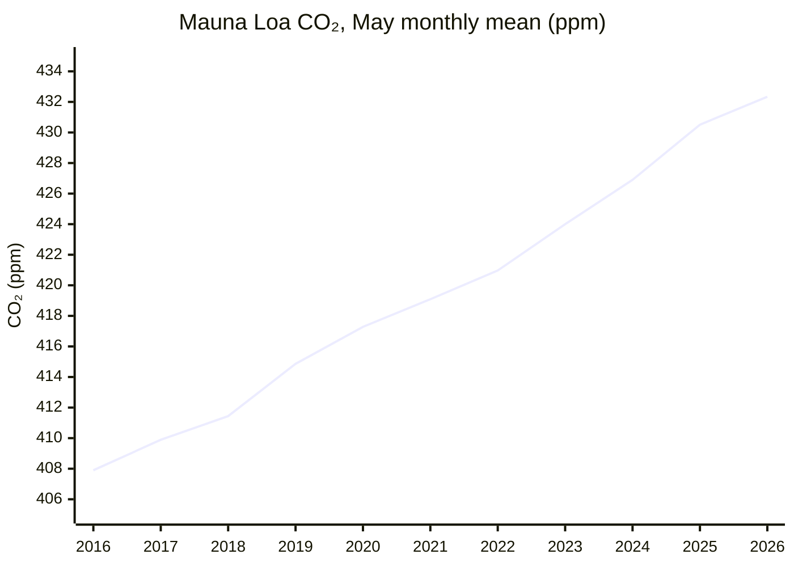
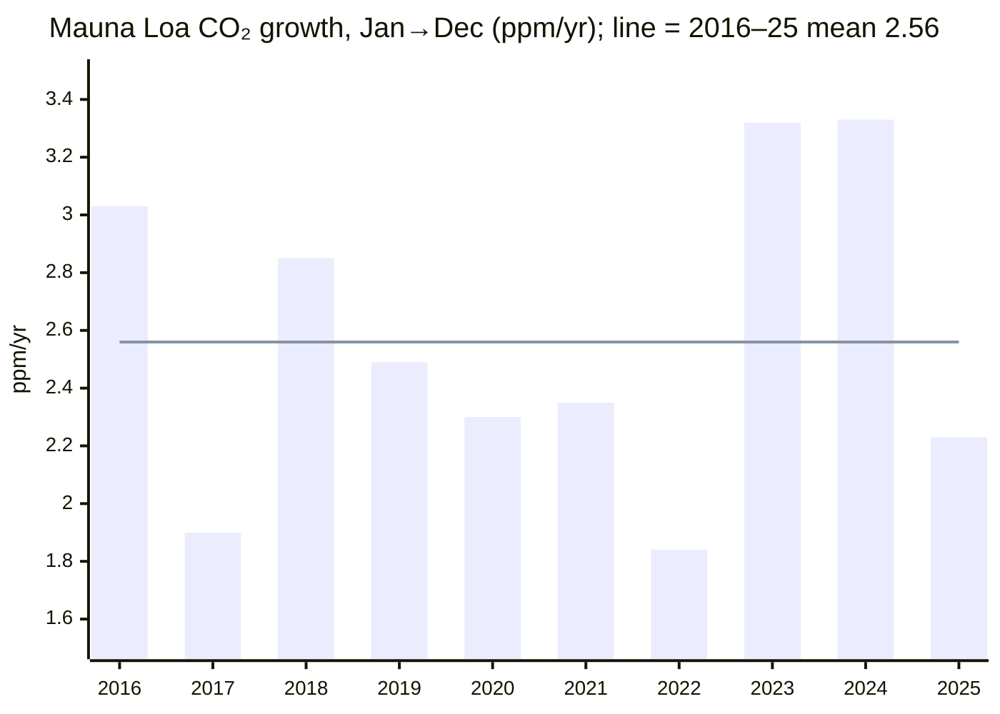

# Climate and Environment — 26H1 Report

> *This endeavor is unlike the other four: it is about fixing the past rather than improving the future.*

*Period: 26H1 (Jan–Jun 2026), written as of end of June 2026. **Narrowed scope:** this run covers only the KPI (atmospheric CO₂ concentration and its 10-year trend) and one milestone, "The Bend". "The Balance", "The Ceiling" and all Open Challenges are out of scope for this run.*

## Executive Summary

**The KPI is still getting worse.** Atmospheric CO₂ at Mauna Loa set another record at its May seasonal peak: **432.34 ppm** as a monthly mean[^noaa-mm-mlo]. The daily record was **433.95 ppm on 1 May 2026**[^noaa-daily-mlo]. The **10-year average growth rate is 2.56 ppm/yr** (2016–2025, Mauna Loa)[^noaa-gr-mlo]. That trend is not slowing structurally: 2021–25 averaged 2.61 ppm/yr, against 2.51 for 2016–20[^noaa-gr-mlo].

**Short-term growth has slowed, for largely natural reasons.** The 2025 increase (+2.23 ppm at Mauna Loa) was well below the record years 2023–24 (+3.3 ppm each)[^noaa-gr-mlo]. Year-on-year gains in 26H1 are ~1.5–2.3 ppm[^noaa-mm-mlo]. The UK Met Office expects La Niña-like conditions in late 2025 and early 2026 to temporarily strengthen natural carbon sinks and slow the 2026 rise. Even so, it forecasts the rise to stay "too fast to track IPCC 1.5°C scenarios"[^metoffice].

**The Bend is not confirmed.** Every fossil and energy CO₂ estimate published in 26H1 puts **2025 emissions at a new record**:
- fossil CO₂ +1.0% (GCB)[^gcb]
- energy CO₂ +0.4% (IEA)[^iea-ger]
- fossil+industry CO₂ +0.7% (Carbon Monitor)[^carbon-monitor]

Growth has slowed to a near-plateau, but China's CO₂ rose 2% in Q1 2026[^cb-china-q1]. A 2026 dip is possible because of the oil shock from the Strait of Hormuz disruption (Iran war). The IEA, however, expects oil demand to rebound in 2027[^iea-omr].

**Bottom line: emissions are on a near-plateau at a record level, and the peak is not yet definitively behind us. CO₂ concentration keeps setting records at ~2.6 ppm/yr.**

---

## KPI Dashboard

**KPI (per README):** Atmospheric CO₂ concentration (ppm) **and** its 10-year trend (ppm/year).

The table uses two separate series, which should not be mixed. **Mauna Loa (MLO)** is a single site in the subtropical Northern Hemisphere. It reads higher and has a larger seasonal cycle. The **NOAA global mean** comes from marine surface sites. Its annual mean runs ~1–2 ppm below MLO, and the gap is wider at the May peak. All 2026 values are preliminary and may be recalibrated. Values are as retrieved from NOAA's data files in September 2026.

| Metric | Value | Source |
|--------|-------|--------|
| **Concentration: May 2026 seasonal peak (MLO monthly mean)** | **432.34 ppm**, a new all-time monthly record, up +1.83 ppm on May 2025 (430.51) | NOAA GML[^noaa-mm-mlo] |
| Concentration: record daily value (MLO) | **433.95 ppm** (1 May 2026) | NOAA GML[^noaa-daily-mlo] |
| Concentration: May 2026 (NOAA global mean) | 428.59 ppm | NOAA GML[^noaa-mm-gl] |
| Concentration: 2025 annual average | **427.35 ppm (MLO) / 425.62 ppm (global)**, both records | NOAA GML[^noaa-ann-mlo][^noaa-ann-gl] |
| **Trend: 10-year average growth, 2016–2025** | **2.56 ppm/yr (MLO) / 2.53 ppm/yr (global)**. This is the mean of NOAA's annual Jan→Dec growth rates. | NOAA GML[^noaa-gr-mlo][^noaa-gr-gl] |
| Trend: split by half-decade (MLO) | 2016–20 average 2.51 → 2021–25 average **2.61 ppm/yr** | NOAA GML[^noaa-gr-mlo] |
| Trend: latest annual growth, 2025 (Jan→Dec) | **+2.23 ppm (MLO) / +2.06 ppm (global)**, down from 2024 (MLO +3.33, global +3.76; both records). Global 2025 is the smallest since 2014. | NOAA GML[^noaa-gr-mlo][^noaa-gr-gl] |
| Trend: 26H1 year-on-year gains (MLO monthly) | +1.48 to +2.26 ppm. The May peaks of 2023–25 rose +2.9 to +3.6 ppm. | NOAA GML[^noaa-mm-mlo] |
| Forecast (not an observation): 2026 MLO annual mean, Scripps annual-mean basis | 429.4 ± 0.6 ppm, a rise of **+2.37 ± 0.55 ppm** on 2025, compared with +2.68 observed for 2024→25 on the same basis. The forecast would be +2.56 without La Niña. | UK Met Office (4 Feb 2026)[^metoffice] |

The table uses two definitions of annual growth. NOAA's growth rate is the change from 1 January to 31 December. The Met Office and Scripps compare calendar-year averages instead. On that basis, NOAA's MLO record rose +2.74 ppm from 2024 to 2025, against +3.53 ppm the year before[^noaa-ann-mlo]; Scripps' own record gives +2.68[^metoffice]. The Met Office forecast starts from Scripps' 2025 annual mean, not NOAA's 427.35 ppm. It should therefore be compared with +2.68, not with NOAA's +2.23 or +2.74.

*Continuity with the 2025 report:* that report gave the 10-year trend as +2.4 ppm/yr, using WMO's figure for 2011–2020. This report uses NOAA's 2016–2025 window, so the two figures are not directly comparable.

### Concentration: May seasonal peak at Mauna Loa

*Data: NOAA GML MLO monthly means[^noaa-mm-mlo]. The 2026 value is preliminary. The chart plots May peaks so that 2026 can be included; annual means are given under Reference Data.*

### Trend: annual growth rate vs the 10-year average

*Data: NOAA GML MLO growth rates[^noaa-gr-mlo]*

**Assessment: 🔴 Worsening.**
- **Concentration set new records in 26H1.**
- **The rate of increase has fallen temporarily** from the 2023–24 record pace. The Met Office links the slower 2026 rise to La Niña-like conditions strengthening natural sinks[^metoffice].
- **The 10-year trend of ~2.6 ppm/yr shows no structural slowdown.**
- **The gap to 1.5°C is large.** IPCC C1 (1.5°C) scenarios require a 2020s decadal average of **1.33–1.79 ppm/yr**. The Met Office reports 2.61 ppm/yr observed for 2020–25 (Scripps annual-mean basis)[^metoffice].

*Note on scope:* concentration growth is **not** an emissions measure. Year-to-year changes in ppm/yr are dominated by fluctuations in natural sinks (ENSO). The 2025–26 slowdown is therefore not evidence of an emissions peak. The Bend is assessed separately below, from emissions inventories.

---

## Milestone Status

### 🟡 "The Bend": Peak Global Greenhouse-Gas Emissions

**Status: Approaching, not achieved. Emissions are on a near-plateau at a record level, but the peak year is not definitively behind us.**

*Metric caveat:* the milestone concerns all greenhouse gases. No global total-GHG (CO₂e) estimate for 2025 was published in 26H1, so this assessment uses CO₂ as a proxy. CO₂ is the dominant gas. Methane and N₂O trends are not assessed here.

The estimates below use different metric boundaries, and each figure applies only to its own boundary. All 2025 figures are preliminary.

| Estimate (published in 26H1) | Scope | 2025 value | Change vs 2024 | Source |
|---|---|---|---|---|
| Global Carbon Budget 2025, final paper (13 May 2026) | Fossil CO₂ (fossil fuels + cement) | **38.1 GtCO₂**, "an historical record high" | **+1.0%** (range +0.2% to +1.7%) | ESSD[^gcb] |
| IEA Global Energy Review 2026 (Apr 2026) | Energy CO₂ (combustion + industrial processes) | **38,082 Mt**, a record | **+0.4%**, the slowest growth since 2021 | IEA PDF[^iea-ger] |
| Carbon Monitor (14 Apr 2026) | Fossil + industry CO₂ | **37.2 Gt**, a record | **+0.7%** | Nature Rev. Earth Environ.[^carbon-monitor] |
| Global Carbon Budget 2025 | Total CO₂ (fossil + land-use change) | 42.2 GtCO₂ | Slightly below 2024 (42.4). GCB says lower land-use emissions were "mainly attributable to the end of the El Niño conditions", so this is not a fossil decline. | ESSD[^gcb] |

The 2025 report quoted GCB's November 2025 projection of +1.1% for fossil CO₂. The final paper gives +1.0%.

**Evidence for a plateau:**
- **Emissions growth has slowed sharply.** GCB puts growth in total CO₂ at 0.3%/yr over 2015–2024, down from 1.9%/yr over 2005–2014[^gcb].
- **Fossil power generation fell in 2025**, by 0.2% (−38 TWh).
  - This is the first year without a rise since 2020, and the first time a fall came from clean-power growth rather than a crisis.
  - Clean power (+887 TWh) grew faster than demand (+849 TWh), and fossil generation fell in China (−0.9%) and India (−3.3%)[^ember-ger].
  - Carbon Monitor finds power-sector emissions fell 0.9%[^carbon-monitor].
- **China and India flattened out.**
  - **IEA:** on energy CO₂, China fell 0.5% in 2025 and India 0.1%. India's fall is the first on record under normal economic conditions, although the IEA says it was largely due to a strong monsoon[^iea-ger].
  - **Carbon Monitor:** both countries "entered an emission plateau"[^carbon-monitor].
  - **CREA:** China's CO₂ fell 0.3% in 2025 and had been "flat or falling" for 21 months since March 2024[^cb-china-21m].

**Evidence against "definitively behind us":**
- **2025 set a new record in every fossil and energy CO₂ estimate above.** Only total CO₂, which includes land use, dipped. The fossil-fuel increase was broad: coal +1.0%, oil +1.1%, gas +1.3%[^gcb].
- **Advanced economies rebounded.** US energy CO₂ rose 2.2%. Advanced economies overall rose 0.5%, their first increase since 2018 excluding the post-Covid rebound[^iea-ger].
- **Estimates of China's 2025 direction disagree, and 2026 started with a setback.**
  - For 2025, GCB estimates +0.4% (range −0.1% to +0.9%) on fossil CO₂[^gcb]. The IEA estimates −0.5% on energy CO₂[^iea-ger], and CREA −0.3%[^cb-china-21m]. The boundaries differ, but together they point to a plateau, not a confirmed decline.
  - CREA finds China's CO₂ **rose 2% year on year in Q1 2026**. Power-sector emissions rose 4%, driven by a jump in "wasted" (curtailed) wind and solar output. Emissions still "remain below the peak in March 2024"[^cb-china-q1].
- **China's official data has become harder to use.** China appears to have retroactively changed the scope of its carbon-intensity metric.
  - Official figures now imply CO₂ rose 7% over 2020–25, compared with 14% under the previous statistics.
  - The gap is about 700–730 MtCO₂/yr[^cb-china-metric].
  - This makes official statistics less reliable for judging whether China has peaked.
- **A 2026 dip would be driven by a shock.** The IEA's June Oil Market Report forecasts 2026 oil demand **falling 1.1 mb/d** after the Hormuz disruption. It then forecasts a **rebound of 2 mb/d to 105.3 mb/d in 2027**, which is above the implied 2025 level[^iea-omr]. Any return to coal looks limited: in Ember's worst case, global coal power rises no more than 1.8% in 2026[^cb-coal].
- **Expert view at the start of the period:** "global emissions have yet to decline (even if they have plateaued)" (Z. Hausfather, 5 Jan 2026)[^hausfather].

#### Key 26H1 developments

| Date | Event | Source |
|------|-------|--------|
| **12 Feb 2026** | CREA: China's CO₂ fell 0.3% in 2025 and has been flat or falling for 21 months | [Carbon Brief][cb-china-21m] |
| **Apr 2026** | IEA Global Energy Review: energy CO₂ +0.4% to a record 38,082 Mt; China −0.5%, India −0.1%, US +2.2% | [IEA PDF][iea-ger] |
| **14 Apr 2026** | Carbon Monitor: record 37.2 Gt (+0.7%); power-sector emissions −0.9% | [Nature Rev. Earth Environ.][carbon-monitor] |
| **21 Apr 2026** | Ember: fossil power generation −0.2% in 2025, the first fall driven by clean power | [Ember][ember-ger] |
| **13 May 2026** | Global Carbon Budget 2025 final paper: fossil CO₂ 38.1 Gt (+1.0%), a record | [ESSD][gcb] |
| **26 May 2026** | Carbon Brief: China's new carbon metric leaves a gap of about 700–730 MtCO₂/yr | [Carbon Brief][cb-china-metric] |
| **4 Jun 2026** | CREA: China's CO₂ rose 2% in Q1 2026 | [Carbon Brief][cb-china-q1] |
| **17 Jun 2026** | IEA Oil Market Report: 2026 oil demand −1.1 mb/d, rebounding +2 mb/d in 2027 | [IEA][iea-omr] |

[cb-china-21m]: https://www.carbonbrief.org/analysis-chinas-co2-emissions-have-now-been-flat-or-falling-for-21-months
[iea-ger]: https://iea.blob.core.windows.net/assets/df903e1c-49c6-4757-8cbf-6fbcfe7611a0/GlobalEnergyReview2026.pdf
[carbon-monitor]: https://www.nature.com/articles/s43017-026-00780-4
[ember-ger]: https://ember-energy.org/latest-insights/global-electricity-review-2026/
[gcb]: https://essd.copernicus.org/articles/18/3211/2026/
[cb-china-metric]: https://www.carbonbrief.org/analysis-chinas-new-carbon-metric-leaves-germany-sized-gap-in-its-emissions
[cb-china-q1]: https://www.carbonbrief.org/analysis-chinas-co2-climbs-2-in-early-2026-due-to-wasted-wind-and-solar
[iea-omr]: https://www.iea.org/reports/oil-market-report-june-2026

**Why it matters:** GCB estimates the remaining 1.5°C (50%) carbon budget from the start of 2026 at **170 GtCO₂**. That is about **4 years** at 2025 emission levels[^gcb].

---

## Beyond the Framework: 26H1 Highlights

- **Renewables overtook coal in global electricity**, confirmed by full-year 2025 data: renewables had a 33.8% share against 33.0% for coal[^ember-ger].

---

## Reference Data

| Dataset | Link |
|---|---|
| NOAA MLO monthly means | https://gml.noaa.gov/webdata/ccgg/trends/co2/co2_mm_mlo.txt |
| NOAA MLO daily means | https://gml.noaa.gov/webdata/ccgg/trends/co2/co2_daily_mlo.txt |
| NOAA global monthly means | https://gml.noaa.gov/webdata/ccgg/trends/co2/co2_mm_gl.txt |
| NOAA MLO / global annual means | https://gml.noaa.gov/webdata/ccgg/trends/co2/co2_annmean_mlo.txt · https://gml.noaa.gov/webdata/ccgg/trends/co2/co2_annmean_gl.txt |
| NOAA MLO / global annual growth rates | https://gml.noaa.gov/webdata/ccgg/trends/co2/co2_gr_mlo.txt · https://gml.noaa.gov/webdata/ccgg/trends/co2/co2_gr_gl.txt |

**MLO monthly means for 2026 (preliminary):** Jan 428.62 · Feb 429.35 · Mar 430.15 · Apr 431.12 · **May 432.34** · Jun 431.43 ppm. Year-on-year changes: +1.97, +2.26, +2.00, +1.48, +1.83, +1.82[^noaa-mm-mlo]. NOAA publishes each monthly value in the following month, so the June figure was only published in early July, just after the period ended. It is shown for completeness.

**Historical series (MLO; NOAA global in brackets):**

| Year | Annual mean (ppm) | Jan→Dec growth (ppm/yr) |
|---|---|---|
| 2016 | 404.41 [403.07] | 3.03 [2.83] |
| 2017 | 406.76 [405.22] | 1.90 [2.14] |
| 2018 | 408.72 [407.61] | 2.85 [2.39] |
| 2019 | 411.65 [410.07] | 2.49 [2.50] |
| 2020 | 414.21 [412.44] | 2.30 [2.33] |
| 2021 | 416.41 [414.70] | 2.35 [2.38] |
| 2022 | 418.53 [417.08] | 1.84 [2.24] |
| 2023 | 421.08 [419.35] | 3.32 [2.70] |
| 2024 | 424.61 [422.79] | 3.33 [3.76] |
| 2025 | 427.35 [425.62] | 2.23 [2.06] |

*Data: NOAA GML annual means and growth rates[^noaa-ann-mlo][^noaa-ann-gl][^noaa-gr-mlo][^noaa-gr-gl].*

---

## Footnotes

[^noaa-mm-mlo]: [NOAA GML: Mauna Loa monthly mean CO₂ (co2_mm_mlo.txt)](https://gml.noaa.gov/webdata/ccgg/trends/co2/co2_mm_mlo.txt)
[^noaa-daily-mlo]: [NOAA GML: Mauna Loa daily mean CO₂ (co2_daily_mlo.txt)](https://gml.noaa.gov/webdata/ccgg/trends/co2/co2_daily_mlo.txt)
[^noaa-mm-gl]: [NOAA GML: global monthly mean CO₂ (co2_mm_gl.txt)](https://gml.noaa.gov/webdata/ccgg/trends/co2/co2_mm_gl.txt)
[^noaa-ann-mlo]: [NOAA GML: Mauna Loa annual mean CO₂ (co2_annmean_mlo.txt)](https://gml.noaa.gov/webdata/ccgg/trends/co2/co2_annmean_mlo.txt)
[^noaa-ann-gl]: [NOAA GML: global annual mean CO₂ (co2_annmean_gl.txt)](https://gml.noaa.gov/webdata/ccgg/trends/co2/co2_annmean_gl.txt)
[^noaa-gr-mlo]: [NOAA GML: Mauna Loa annual CO₂ growth rates (co2_gr_mlo.txt)](https://gml.noaa.gov/webdata/ccgg/trends/co2/co2_gr_mlo.txt). The 10-year and 5-year averages are computed from this file.
[^noaa-gr-gl]: [NOAA GML: global annual CO₂ growth rates (co2_gr_gl.txt)](https://gml.noaa.gov/webdata/ccgg/trends/co2/co2_gr_gl.txt)
[^metoffice]: [UK Met Office: Mauna Loa CO₂ forecast for 2026 (4 Feb 2026)](https://www.metoffice.gov.uk/research/climate/seasonal-to-decadal/seasonal-forecast/forecasts/co2-forecast). This is the Met Office's rolling "current forecast" page. Past years are archived as `co2-forecast-for-YYYY` once superseded; no 2026 permalink existed as of Sep 2026.
[^gcb]: [Global Carbon Budget 2025, ESSD 18, 3211 (13 May 2026)](https://essd.copernicus.org/articles/18/3211/2026/)
[^iea-ger]: [IEA Global Energy Review 2026 (PDF), pp. 13, 36, 45](https://iea.blob.core.windows.net/assets/df903e1c-49c6-4757-8cbf-6fbcfe7611a0/GlobalEnergyReview2026.pdf)
[^carbon-monitor]: [Carbon Monitor, Nature Reviews Earth & Environment (14 Apr 2026)](https://www.nature.com/articles/s43017-026-00780-4)
[^ember-ger]: [Ember Global Electricity Review 2026 (21 Apr 2026)](https://ember-energy.org/latest-insights/global-electricity-review-2026/)
[^cb-china-21m]: [Carbon Brief/CREA: China's CO₂ flat or falling for 21 months (12 Feb 2026)](https://www.carbonbrief.org/analysis-chinas-co2-emissions-have-now-been-flat-or-falling-for-21-months)
[^cb-china-q1]: [Carbon Brief/CREA: China's CO₂ climbs 2% in early 2026 (4 Jun 2026)](https://www.carbonbrief.org/analysis-chinas-co2-climbs-2-in-early-2026-due-to-wasted-wind-and-solar)
[^cb-china-metric]: [Carbon Brief: China's new carbon metric leaves Germany-sized gap (26 May 2026)](https://www.carbonbrief.org/analysis-chinas-new-carbon-metric-leaves-germany-sized-gap-in-its-emissions)
[^iea-omr]: [IEA Oil Market Report, June 2026 (17 Jun 2026)](https://www.iea.org/reports/oil-market-report-june-2026)
[^cb-coal]: [Carbon Brief/Ember: No significant return to coal in 2026 despite Iran crisis (28 Apr 2026)](https://www.carbonbrief.org/world-will-not-see-significant-return-to-coal-in-2026-despite-iran-crisis/)
[^hausfather]: [Z. Hausfather, The Climate Brink: "Keep it in the ground" (5 Jan 2026)](https://www.theclimatebrink.com/p/keep-it-in-the-ground)
