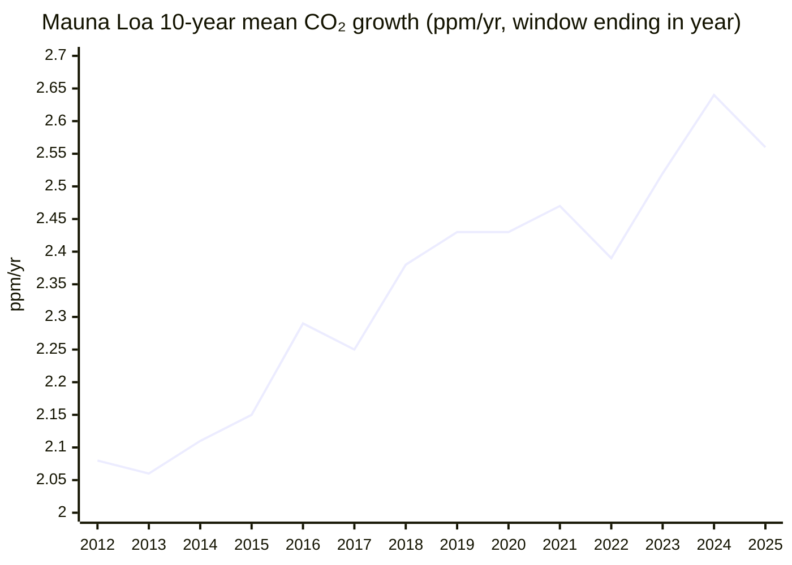

# Climate and Environment — 26H1 Bulletin

*Period: 26H1 (Jan–Jun 2026), covering developments published up to 2026-07-14. Latest data: NOAA Mauna Loa and global monthly means for June 2026 (published 2026-07-07, preliminary).*

> *This endeavor is unlike the other four: it is about fixing the past rather than improving the future. Many historic civilizations fell to climate change, and we now have to clean up our mess if we are to survive into a better future.*

## Executive Summary

**Bottom line: atmospheric CO₂ keeps setting records (KPI downgraded 🟡 → 🔴 "Worsening"), and every 2025 fossil/energy CO₂ emissions estimate published this half-year is a new record, even though growth has slowed to a near-plateau. "The Bend" is approaching but not behind us.**

**The good news**
- **Global fossil power generation fell in 2025** by 0.2% (-38 TWh), the first time since 2020 that it did not rise, as low-carbon generation (+887 TWh) outpaced demand growth (+849 TWh). This is achieved, not projected[^ember-ger].
- **Renewables overtook coal** in global electricity generation in 2025: 33.8% (10,730 TWh) versus 33.0% (10,476 TWh)[^ember-ger].
- **Emissions growth is slowing.** IEA energy-related CO₂ rose by around 0.4% in 2025, "the slowest rate since 2021"[^iea-ger], and Carbon Monitor puts fossil + industry CO₂ growth at 0.7%[^carbon-monitor]. China's CO₂ fell 0.3% in 2025 (Carbon Brief/CREA)[^cb-china-21m], and India's energy-related CO₂ changed by -0.1% (IEA; "largely due to cyclical factors")[^iea-ger].
- **Year-on-year CO₂ concentration growth slowed**: Mauna Loa (MLO) monthly gains for Jan–May 2026 were +1.48 to +2.26 ppm, below the May-over-May gains of 2023–2025 (+3.03, +2.90, +3.61 ppm)[^noaa-mm-mlo]. This is a slowdown in the growth rate only, and concentrations still set records.

**The bad news**
- **A new CO₂ concentration record.** The MLO monthly mean hit **432.34 ppm in May 2026**, the highest monthly value on record and +1.83 ppm on May 2025[^noaa-mm-mlo]. The daily mean reached 433.95 ppm on 1 May 2026, the highest in NOAA's MLO daily record[^noaa-daily].
- **Record 2025 emissions on every fossil/energy CO₂ basis** (only GCB total CO₂, which includes land-use change, dipped slightly). Global Carbon Budget (GCB) fossil CO₂ reached 38.1 GtCO₂ (+1.0%)[^gcb-essd], IEA energy-related CO₂ 38,082 MtCO₂[^iea-ger] and Carbon Monitor fossil + industry CO₂ 37.2 GtCO₂[^carbon-monitor].
- **China's CO₂ rose 2% year on year in Q1 2026**, although it stayed below the March 2024 peak[^cb-china-q1]. Advanced economies' energy CO₂ rose 0.5% in 2025, with the US up 2.2%[^iea-ger].
- **The 1.5°C budget is nearly gone:** 170 GtCO₂ from the start of 2026, about 4 years at 2025 emission levels (GCB)[^gcb-essd].
- **The oil-demand dip looks temporary.** The IEA *projects* global oil demand to fall by 1.1 mb/d in 2026 after the Hormuz shock, then to rise to 105.3 mb/d in 2027, above the implied 2025 level of about 104.4 mb/d[^iea-omr].

---

## KPI Dashboard

**KPI:** Atmospheric CO₂ concentration (ppm) and 10-year trend (ppm/year)

| Headline | Current | Previous | Change | Year ago |
|---|---|---|---|---|
| **MLO monthly mean CO₂** (NOAA series) | **431.43 ppm** (June 2026; published 2026-07-07, preliminary)[^noaa-mm-mlo] | 427.49 ppm (December 2025)[^noaa-mm-mlo] | +3.94 ppm, ⚠️ **not comparable**: different calendar month, seasonal cycle not removed. This is **not a trend**. | 429.61 ppm (June 2025): **+1.82 ppm** |
| **10-year trend, MLO** (mean of NOAA Jan→Dec growth rates, 2016–2025) | **2.56 ppm/yr** (obs 2025)[^noaa-gr-mlo] | 2.56 ppm/yr (obs 2025, the same observation) | +0.00: same observation, unchanged, no new data | not provided |

The two 10-year trend readings are the same observation (window 2016–2025, published 2026-01-10). A new value needs NOAA's 2026 annual growth rate.

**Supporting data**

| Metric | Value | Note |
|---|---|---|
| NOAA global marine-surface monthly mean, June 2026 | 427.62 ppm (425.90 ppm in June 2025)[^noaa-mm-gl] | preliminary |
| 10-year trend, NOAA global mean (2016–2025) | 2.53 ppm/yr[^noaa-gr-gl] | earlier context (published 2026-01-10) |
| MLO annual mean 2025 | 427.35 ppm, a record[^noaa-ann-mlo] | earlier context (published 2026-01-10) |
| MLO growth, Jan→Dec 2025 | +2.23 ppm (2024: record +3.33 ppm)[^noaa-gr-mlo] | earlier context (published 2026-01-10) |
| GCB atmospheric CO₂ growth (GCB global basis) | 3.7 ppm in 2024 (record); 2.1 ppm in 2025 (preliminary); 2.6 ppm/yr over 2015–2024[^gcb-essd] | new; different basis from NOAA Jan→Dec |

**Monthly readings in 26H1** (NOAA, preliminary, as in the file created 5 Sep 2026):

| Month (2026) | MLO monthly mean | vs same month of 2025 | Global marine-surface mean |
|---|---|---|---|
| January | 428.62 ppm | +1.97 ppm | 428.02 ppm |
| February | 429.35 ppm | +2.26 ppm | 428.44 ppm |
| March | 430.15 ppm | +2.00 ppm | 428.48 ppm |
| April | 431.12 ppm | +1.48 ppm | 428.67 ppm |
| May | **432.34 ppm** (record) | +1.83 ppm | 428.59 ppm |
| June | 431.43 ppm | +1.82 ppm | 427.62 ppm |

*Data: [^noaa-mm-mlo][^noaa-mm-gl]*

### Mauna Loa CO₂: May (seasonal peak) monthly mean

*Data: NOAA GML co2_mm_mlo.txt[^noaa-mm-mlo]*

### 10-year CO₂ growth trend (Mauna Loa)

*Data: NOAA GML co2_gr_mlo.txt[^noaa-gr-mlo]*

The dip from 2.64 ppm/yr (2015–2024) to 2.56 ppm/yr (2016–2025) is mechanical: the El Niño year 2015 (+2.95 ppm) left the window and 2025 (+2.23 ppm) entered it. Half-decade means still rose, from 2.51 to 2.61 ppm/yr at MLO between 2016–2020 and 2021–2025[^noaa-gr-mlo].

**Forecasts and benchmarks (UK Met Office; Scripps Mauna Loa series, not comparable with the NOAA values above):**
- *Projection:* the 2026 annual mean is forecast at 429.4 ± 0.6 ppm, a rise of 2.37 ± 0.55 ppm that is slightly slowed by moderate La Niña-like conditions (2.56 ppm without La Niña). The May 2026 monthly mean was forecast at 432.2 ± 0.6 ppm[^metoffice].
- *Verification:* the observed 2025 annual-mean rise of 2.68 ppm (annual mean 427.0 ppm) was larger than the Met Office forecast of 2.26 ± 0.56 ppm[^metoffice].
- *Benchmark:* even the forecast 2026 rise is "too fast to track IPCC 1.5°C scenarios", which require a 2020s decadal average growth of 1.33-1.79 ppm/yr. The observed average for 2020–2025 is 2.61 ppm/yr (1.91 in the 2000s, 2.41 in the 2010s)[^metoffice].

### KPI assessment: 🔴 Worsening (previously 🟡 "⚠️ Accelerating in the wrong direction", 2026-01-03)

**Rationale (as of 2026-07-14):** The Mauna Loa CO₂ concentration hit new records in 26H1: a 432.34 ppm monthly mean in May 2026 (+1.83 ppm on May 2025) and a 433.95 ppm daily mean on 1 May. The 10-year trend is 2.56 ppm/yr at MLO (2.53 global). Its dip from 2.64 is mechanical, and half-decade means still rose (2.51 → 2.61 ppm/yr), so there is no structural slowdown. Year-on-year growth temporarily slowed (+1.48 to +2.26 ppm in Jan–Jun 2026). In direction, this matches the Met Office forecast of a slower 2026 annual-mean rise, which it attributes to La Niña-like conditions. Growth nonetheless remains far above the 1.33-1.79 ppm/yr that IPCC 1.5°C pathways require[^noaa-mm-mlo][^noaa-daily][^noaa-gr-mlo][^metoffice].

**What changed:** the status moved from 🟡 to 🔴. The previous assessment rested on 2025 data (Nov 2025 concentration, the first annual peak above 430 ppm, and the record 2023–2024 jump). The current one adds the May 2026 records and the new NOAA 10-year and half-decade trends.

---

## Milestone Status

### 🟡 "The Bend": Peak Global Emissions

**Status: Approaching, not achieved** (assessed 2026-07-14; previously 🟡 "Approaching, not yet achieved", 2026-01-03)

**Rationale:** Every 2025 estimate published in 26H1 is a new record. Only GCB total CO₂ dipped slightly, due to lower land-use emissions as El Niño ended. Growth has slowed to a plateau (global fossil power generation fell 0.2%, China and India flat). However, China's CO₂ rose 2% in Q1 2026, and the IEA expects the shock-driven 2026 oil-demand fall to rebound above the 2025 level in 2027, so the peak is not definitively behind us. *Caveat:* the milestone covers all greenhouse gases, but no global 2025 total-GHG estimate was published within 26H1, so CO₂ estimates serve as the proxy.

**What changed:** the status is unchanged. The GCB's November 2025 *projection* (38.1 GtCO₂, +1.1%) was replaced by its final paper (38.1 GtCO₂, +1.0%), and two further estimates (IEA, Carbon Monitor) confirm a 2025 record. The China picture moved from "flat or falling for 18 months" (Nov 2025) to 21 months (Feb 2026), then to a 2% rise in Q1 2026.

#### 2025 global emissions estimates (all preliminary; scopes differ, so the figures are not interchangeable)

| Estimate (scope) | 2025 | Change vs 2024 | Source |
|---|---|---|---|
| GCB fossil CO₂ (fossil fuels + cement, net of cement carbonation) | **38.1 GtCO₂**, "an historical record high" | +1.0% (range 0.2% to 1.7%); coal +1.0%, oil +1.1%, gas +1.3% | [^gcb-essd] |
| IEA energy-related CO₂ (fuel combustion + industrial processes, excl. flaring) | **38,082 MtCO₂**, a record (nearly 38.4 Gt incl. flaring) | around +0.4% | [^iea-ger] |
| Carbon Monitor fossil + industry CO₂ | **37.2 GtCO₂**, a record | +0.7% (power sector: -0.9%) | [^carbon-monitor] |
| GCB total CO₂ (fossil + land-use change) | 42.2 GtCO₂ | slightly lower than 42.4 GtCO₂ in 2024, as net land-use emissions fell to about 4.1 GtCO₂ (end of El Niño). This is a land-use fluctuation, not a structural fossil decline. | [^gcb-essd] |

Over the longer run, GCB total CO₂ emissions grew 0.3% per year over 2015–2024, compared with 1.9% per year over 2005–2014[^gcb-essd].

#### Key 26H1 developments

| Date | Event | Kind | Source |
|---|---|---|---|
| **Feb 12** | Carbon Brief/CREA: China's CO₂ fell 0.3% in 2025 (Q4 down 1%) and had been flat or falling for 21 months since March 2024. Whether China has peaked remains open. | analysis | [^cb-china-21m] |
| **Apr 14** | Carbon Monitor: China and India "entered an emission plateau" in 2025 owing to massive renewable expansion, while the USA and EU saw fossil + industry CO₂ rebounds | analysis | [^carbon-monitor] |
| **Apr 21** | Ember: global fossil power generation fell 0.2% in 2025, including China (-0.9%) and India (-3.3%) | achievement | [^ember-ger] |
| **Apr 28** | Ember via Carbon Brief: even in a worst case, global coal power would rise by no more than 1.8% in 2026 despite the Iran crisis. CREA data showed no return to coal as of March 2026. | projection | [^cb-coal] |
| **Apr 2026** | IEA Global Energy Review 2026: China 12,718 MtCO₂ (-0.5%); India 3,114 MtCO₂ (-0.1%, its first fall on record under normal economic conditions, "largely due to cyclical factors resulting from the strong monsoon") | data | [^iea-ger] |
| **Apr 2026** | 🔴 IEA: advanced economies' energy CO₂ rose 0.5% in 2025, faster than emerging and developing economies (+0.3%) for the first time since the 1990s. The US rose 2.2% to 4,606 MtCO₂, and the EU fell 0.8% to 2,372 MtCO₂. | setback | [^iea-ger] |
| **May 13** | GCB 2025 final paper: China's 2025 fossil CO₂ was +0.4% (range -0.1% to +0.9%), a plateau rather than a confirmed decline | data | [^gcb-essd] |
| **May 26** | Carbon Brief: China appears to have retrospectively changed the scope of its official carbon-intensity metric. Official figures now imply that CO₂ rose about 7% over 2020–2025 instead of 14%, a gap of about 700-730 MtCO₂ per year. China has not officially announced the change. | analysis | [^cb-china-metric] |
| **Jun 4** | 🔴 Carbon Brief/CREA: China's CO₂ rose 2% year on year in Q1 2026, with power-sector emissions up 4% because of "wasted" (curtailed) wind and solar. Emissions remained below the March 2024 peak. | setback | [^cb-china-q1] |
| **Jun 17** | IEA Oil Market Report: Q2 2026 oil deliveries plunged 5 mb/d year on year in the Hormuz shock. The IEA *forecasts* a 1.1 mb/d fall in demand in 2026, then a 2 mb/d rise to 105.3 mb/d in 2027, above the implied 2025 level of about 104.4 mb/d. | projection | [^iea-omr] |

China's 2025 estimates differ by source and scope: CREA CO₂ -0.3%, IEA energy CO₂ -0.5%, and GCB fossil CO₂ +0.4%.

---

### 🔴 "The Balance": Net Zero

**Status: Distant — 53 GtCO2e/year to eliminate** (assessed 2026-01-03; not re-assessed this period)

**Rationale (from the 2026-01-03 assessment, based on earlier records):** Global GHG emissions were 53.2 GtCO₂e in 2024[^edgar], and fossil CO₂ hit a record in 2025, far from net zero. Net-zero targets cover 77% of global GDP[^nzt-stocktake], but 2025 was a year of retreat (US Paris withdrawal, banks exiting the NZBA, delayed corporate targets), and most IEA net-zero pathway benchmarks are off track.

**What changed:** nothing. The status and label are unchanged, and the ledger has no new events for this milestone in 26H1. The 2025 record-emissions estimates under "The Bend" above also mean that net emissions are not yet falling.

---

### 🟡 "The Ceiling": Below +2°C

**Status: Under pressure** (assessed 2026-01-03; not re-assessed this period)

**Rationale (from the 2026-01-03 assessment, based on earlier records):** 2024 was the first calendar year to exceed 1.5°C above pre-industrial (WMO 1.55°C)[^wmo-2024], although the long-term Paris metric remains ~1.3-1.4°C[^wmo-soc]. WMO gives 70% odds that the 2025–2029 average also exceeds 1.5°C, and the 1.5°C carbon budget is virtually exhausted[^gcb-2025-release].

**What changed:** the status is unchanged. The ledger has no new global temperature data for 26H1. New events:
- **May 13:** the GCB 2025 final paper put the remaining carbon budget for a 50% chance of limiting warming to 1.5°C at **170 GtCO₂ (50 GtC) from the start of 2026**, about 4 years at 2025 emission levels. This updates the November 2025 "virtually exhausted" statement[^gcb-essd].
- **Feb 4:** the UK Met Office said even its forecast 2026 rise in Mauna Loa CO₂ is "too fast to track IPCC 1.5°C scenarios" (see KPI Dashboard)[^metoffice].

---

## Open Challenges

### Net-Zero Transition

- **Power-sector milestone (achieved):** global fossil power generation fell 0.2% (-38 TWh) in 2025, only the fifth time this century that it did not rise. Low-carbon generation (+887 TWh) outpaced electricity demand growth (+849 TWh)[^ember-ger].
- **Renewables overtook coal (achieved):** renewables supplied 33.8% (10,730 TWh) of global electricity generation in 2025, against 33.0% (10,476 TWh) for coal[^ember-ger]. This confirms the IEA's earlier *projection* (IEA Renewables 2025) that renewables would surpass coal by the end of 2025[^iea-ren-2025].

The ledger holds no 26H1 records on the biological/geological uptake side of this challenge.

### Permanent Removal

No significant developments this period.

*Gap:* the ledger has no 26H1 record on whether Occidental/1PointFive's STRATOS DAC plant, announced in 2025 to launch by the end of that year, is operating[^stratos].

### Sunlight Management

No significant developments this period.

*Gap:* in October 2025, Stardust announced plans for stratospheric tests in April 2026. The ledger has no 26H1 record on whether they took place[^stardust].

---

## Beyond the Framework

- **Renewables became the largest source of global electricity in 2025**, overtaking coal: 33.8% versus 33.0% of generation (Ember Global Electricity Review 2026, 21 April 2026)[^ember-ger]. This happened after IEA Coal 2024 reported record coal demand in 2024 (earlier context)[^iea-coal].

---

## Reference Data

| Dataset | Link |
|---|---|
| NOAA GML Mauna Loa monthly mean CO₂ | [co2_mm_mlo.txt](https://gml.noaa.gov/webdata/ccgg/trends/co2/co2_mm_mlo.txt) |
| NOAA GML global marine-surface monthly mean CO₂ | [co2_mm_gl.txt](https://gml.noaa.gov/webdata/ccgg/trends/co2/co2_mm_gl.txt) |
| NOAA GML Mauna Loa daily mean CO₂ | [co2_daily_mlo.txt](https://gml.noaa.gov/webdata/ccgg/trends/co2/co2_daily_mlo.txt) |
| NOAA GML annual growth rates (MLO / global) | [co2_gr_mlo.txt](https://gml.noaa.gov/webdata/ccgg/trends/co2/co2_gr_mlo.txt) / [co2_gr_gl.txt](https://gml.noaa.gov/webdata/ccgg/trends/co2/co2_gr_gl.txt) |
| NOAA GML annual means (MLO / global) | [co2_annmean_mlo.txt](https://gml.noaa.gov/webdata/ccgg/trends/co2/co2_annmean_mlo.txt) / [co2_annmean_gl.txt](https://gml.noaa.gov/webdata/ccgg/trends/co2/co2_annmean_gl.txt) |
| NOAA GML global CO₂ trends page | [global.html](https://gml.noaa.gov/ccgg/trends/global.html) |
| Global Carbon Budget 2025 (ESSD) | [essd.copernicus.org](https://essd.copernicus.org/articles/18/3211/2026/) |
| IEA Global Energy Review 2026 | [PDF](https://iea.blob.core.windows.net/assets/df903e1c-49c6-4757-8cbf-6fbcfe7611a0/GlobalEnergyReview2026.pdf) |
| Ember Global Electricity Review 2026 | [ember-energy.org](https://ember-energy.org/latest-insights/global-electricity-review-2026/) |
| UK Met Office Mauna Loa CO₂ forecast | [metoffice.gov.uk](https://www.metoffice.gov.uk/research/climate/seasonal-to-decadal/seasonal-forecast/forecasts/co2-forecast) |

---

## Footnotes

[^noaa-mm-mlo]: [NOAA GML: Mauna Loa monthly mean CO2 (co2_mm_mlo.txt)](https://gml.noaa.gov/webdata/ccgg/trends/co2/co2_mm_mlo.txt)
[^noaa-mm-gl]: [NOAA GML: global marine-surface monthly mean CO2 (co2_mm_gl.txt)](https://gml.noaa.gov/webdata/ccgg/trends/co2/co2_mm_gl.txt)
[^noaa-daily]: [NOAA GML: Mauna Loa daily mean CO2 (co2_daily_mlo.txt)](https://gml.noaa.gov/webdata/ccgg/trends/co2/co2_daily_mlo.txt)
[^noaa-gr-mlo]: [NOAA GML: Mauna Loa annual growth rates (co2_gr_mlo.txt)](https://gml.noaa.gov/webdata/ccgg/trends/co2/co2_gr_mlo.txt)
[^noaa-gr-gl]: [NOAA GML: global annual growth rates (co2_gr_gl.txt)](https://gml.noaa.gov/webdata/ccgg/trends/co2/co2_gr_gl.txt)
[^noaa-ann-mlo]: [NOAA GML: Mauna Loa annual mean CO2 (co2_annmean_mlo.txt)](https://gml.noaa.gov/webdata/ccgg/trends/co2/co2_annmean_mlo.txt)
[^metoffice]: [UK Met Office: Mauna Loa CO2 forecast for 2026 (published 4 Feb 2026)](https://www.metoffice.gov.uk/research/climate/seasonal-to-decadal/seasonal-forecast/forecasts/co2-forecast)
[^gcb-essd]: [Global Carbon Budget 2025, ESSD (13 May 2026)](https://essd.copernicus.org/articles/18/3211/2026/)
[^iea-ger]: [IEA Global Energy Review 2026 (PDF)](https://iea.blob.core.windows.net/assets/df903e1c-49c6-4757-8cbf-6fbcfe7611a0/GlobalEnergyReview2026.pdf)
[^carbon-monitor]: [Carbon Monitor, Nature Reviews Earth & Environment (14 Apr 2026)](https://www.nature.com/articles/s43017-026-00780-4)
[^ember-ger]: [Ember: Global Electricity Review 2026](https://ember-energy.org/latest-insights/global-electricity-review-2026/)
[^cb-china-21m]: [Carbon Brief/CREA: China's CO2 emissions have now been flat or falling for 21 months](https://www.carbonbrief.org/analysis-chinas-co2-emissions-have-now-been-flat-or-falling-for-21-months)
[^cb-china-q1]: [Carbon Brief/CREA: China's CO2 climbs 2% in early 2026 due to wasted wind and solar](https://www.carbonbrief.org/analysis-chinas-co2-climbs-2-in-early-2026-due-to-wasted-wind-and-solar)
[^cb-china-metric]: [Carbon Brief: China's new carbon metric leaves Germany-sized gap in its emissions](https://www.carbonbrief.org/analysis-chinas-new-carbon-metric-leaves-germany-sized-gap-in-its-emissions)
[^cb-coal]: [Carbon Brief: World will not see significant return to coal in 2026 despite Iran crisis](https://www.carbonbrief.org/world-will-not-see-significant-return-to-coal-in-2026-despite-iran-crisis/)
[^iea-omr]: [IEA Oil Market Report, June 2026](https://www.iea.org/reports/oil-market-report-june-2026)
[^edgar]: [EDGAR 2025 Report](https://edgar.jrc.ec.europa.eu/report_2025) (earlier record, not re-verified at ingest)
[^nzt-stocktake]: [Net Zero Stocktake 2025](https://zerotracker.net/analysis/net-zero-stocktake-2025) (earlier record, not re-verified at ingest)
[^wmo-2024]: [WMO confirms 2024 as warmest year on record](https://wmo.int/news/media-centre/wmo-confirms-2024-warmest-year-record-about-155degc-above-pre-industrial-level) (earlier record, not re-verified at ingest)
[^wmo-soc]: [WMO State of the Global Climate 2024](https://wmo.int/publication-series/state-of-global-climate-2024) (earlier record, not re-verified at ingest)
[^gcb-2025-release]: [Global Carbon Budget 2025 release (13 Nov 2025)](https://globalcarbonbudget.org/fossil-fuel-co2-emissions-hit-record-high-in-2025/)
[^iea-ren-2025]: [IEA Renewables 2025](https://www.iea.org/reports/renewables-2025) (earlier record, not re-verified at ingest)
[^iea-coal]: [IEA Coal 2024](https://www.iea.org/reports/coal-2024) (earlier record, not re-verified at ingest)
[^stratos]: [Carbon Herald: Occidental's STRATOS DAC hub to launch operations by the end of 2025](https://carbonherald.com/occidentals-stratos-dac-hub-to-launch-operations-by-the-end-of-2025/) (earlier record, not re-verified at ingest)
[^stardust]: [POLITICO: Global cooling startup raises $60 million](https://www.politico.com/news/2025/10/24/global-cooling-startup-raises-60-million-dollars-to-test-sun-reflecting-technology-00620340) (earlier record, not re-verified at ingest)
