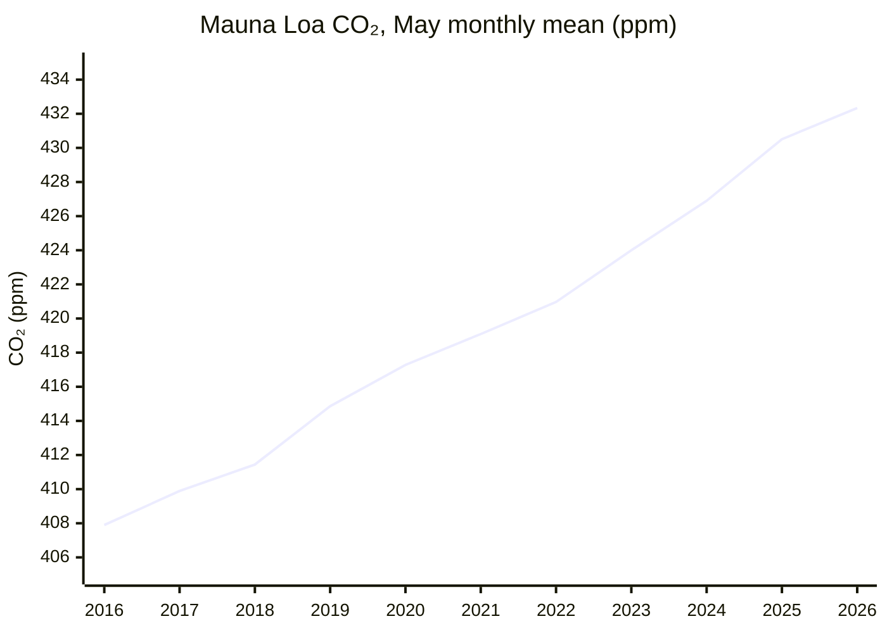
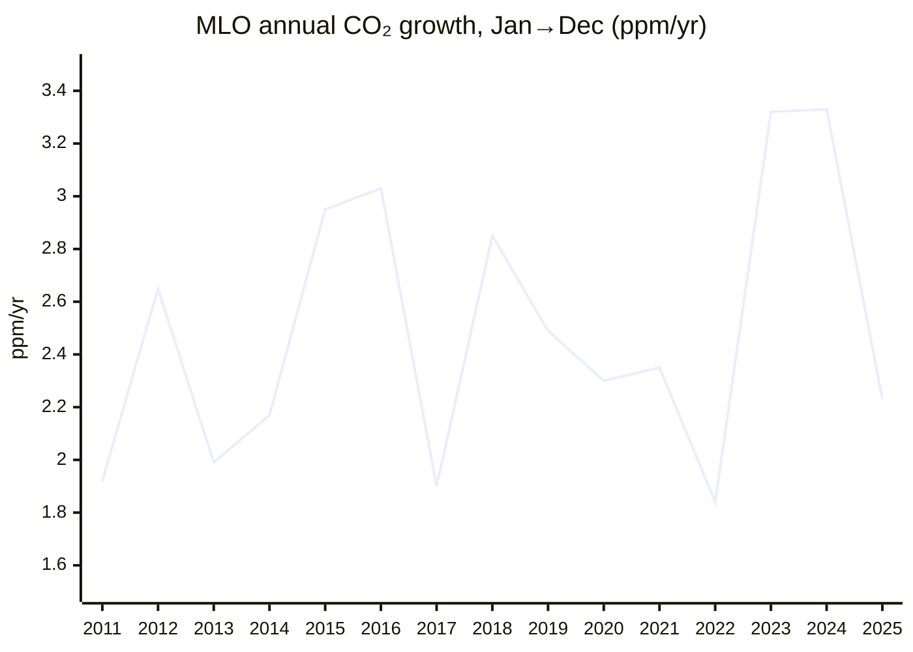
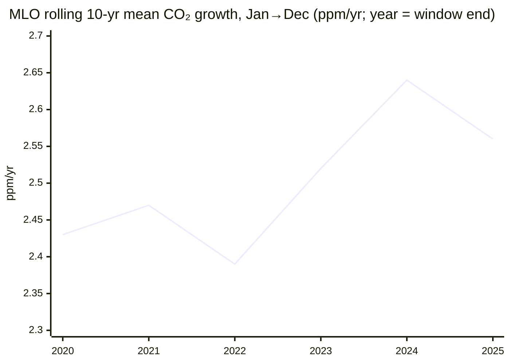

# Climate and Environment — 26H1 Report

*Period: 26H1 (Jan–Jun 2026), written as of end of June 2026. **Narrowed scope:** this run covers only the KPI (atmospheric CO₂ concentration and its 10-year trend) and the milestone "The Bend". "The Balance", "The Ceiling" and all Open Challenges are skipped. Data vintage: NOAA files were retrieved in Sep 2026. The June 2026 monthly values were published in early July, just after the period ended, and items published after 30 June are marked as such.*

> *This endeavor is unlike the other four: it is about fixing the past rather than improving the future. Many historic civilizations fell to climate change, and we now have to clean up our mess if we are to survive into a better future.*

## Executive Summary

**KPI: CO₂ concentration set a new record, and its 10-year growth trend remains about 2.5 ppm/yr.** The Mauna Loa (MLO) monthly mean peaked at **432.34 ppm in May 2026**, the highest monthly value on record[^noaa-mm-mlo]. The **10-year average growth rate for 2016–2025 is 2.56 ppm/yr at MLO and 2.53 ppm/yr for the NOAA global mean**[^noaa-gr-mlo][^noaa-gr-gl].
- The 10-year rolling mean at MLO fell slightly from 2.64 ppm/yr (2015–24) because the El Niño year 2015 (+2.95) left the window and the slower 2025 (+2.23) entered it.
- Half-decade averages still rose, from 2.51 ppm/yr (2016–20) to 2.61 ppm/yr (2021–25)[^noaa-gr-mlo].

**Short-term growth slowed.** The 2025 rise was +2.23 ppm at MLO (Jan→Dec), down from +3.33 in 2024[^noaa-gr-mlo]. In 26H1, monthly year-on-year gains were +1.48 to +2.26 ppm[^noaa-mm-mlo]. The UK Met Office attributes the slowdown to La Niña-like conditions that temporarily strengthened natural carbon sinks. It says the rise is still "too fast to track IPCC 1.5°C scenarios"[^metoffice].

**The Bend: 🟡 Approaching, not yet achieved.** Concentration growth is not an emissions measure, so this milestone is judged from emissions inventories only.
- Every fossil or energy CO₂ estimate published in 26H1 puts 2025 at a record. GCB has fossil CO₂ at 38.1 GtCO₂, +1.0%[^gcb].
- Emissions growth has slowed towards a plateau, but China's CO₂ rose 2% in Q1 2026[^cb-china-q1].
- The IEA expects the 2026 oil-demand fall, caused by the Strait of Hormuz supply shock, to reverse in 2027[^iea-omr].

**Bottom line: CO₂ concentration is at a record and still rising at about 2.5 ppm/yr over the past decade, with no structural slowdown. Fossil CO₂ emissions reached a record in 2025 while their growth slowed. The emissions peak is not yet definitively behind us.**

---

## KPI Dashboard

**KPI (per README):** Atmospheric CO₂ concentration (ppm) **and** 10-year trend (ppm/year).

The report uses two NOAA records, which should not be mixed:
- **MLO** is a single Northern Hemisphere site. It reads higher and has a larger seasonal cycle.
- The **NOAA global mean** is based on marine surface sites.

NOAA's "growth rate" is the change from 1 January to 31 December ("Jan→Dec" below). The Met Office and Scripps instead compare calendar-year averages ("annual-mean basis" below). All 2026 values, and the 2025 growth and emissions values, are preliminary.

| Metric | Value | Source |
|--------|-------|--------|
| **Concentration: latest seasonal peak (MLO monthly mean, May 2026)** | **432.34 ppm**, an all-time monthly record. This is +1.83 ppm on May 2025 (430.51 ppm). | NOAA GML[^noaa-mm-mlo] |
| Concentration: record daily value (MLO) | 433.95 ppm (1 May 2026) | NOAA GML[^noaa-daily-mlo] |
| Concentration: NOAA global mean, May / Jun 2026 | 428.59 / 427.62 ppm. The June value was published in early July 2026. | NOAA GML[^noaa-mm-gl] |
| Concentration: 2025 annual mean | 427.35 ppm (MLO) / 425.62 ppm (global). Both are records, and both are the first annual means above 425 ppm. | NOAA GML[^noaa-ann-mlo][^noaa-ann-gl] |
| **10-year trend, 2016–2025, MLO** | **2.56 ppm/yr**, the mean of NOAA's annual Jan→Dec growth rates | NOAA GML[^noaa-gr-mlo] |
| **10-year trend, 2016–2025, global** | **2.53 ppm/yr**, calculated the same way | NOAA GML[^noaa-gr-gl] |
| 10-year trend over time (rolling means, Jan→Dec) | MLO: 2.43 (2011–20), 2.64 (2015–24), 2.56 (2016–25). Global: 2.38 (2011–20), 2.62 (2015–24), 2.53 (2016–25). | NOAA GML[^noaa-gr-mlo][^noaa-gr-gl] |
| Trend by half-decade (Jan→Dec) | MLO: 2.51 ppm/yr (2016–20), 2.61 ppm/yr (2021–25). Global: 2.44 ppm/yr (2016–20), 2.63 ppm/yr (2021–25). | NOAA GML[^noaa-gr-mlo][^noaa-gr-gl] |
| Latest annual growth, 2025 (Jan→Dec) | +2.23 ppm (MLO) / +2.06 ppm (global). The previous years were MLO +3.32 (2023) and +3.33 (2024), and global +3.76 (2024, a record). | NOAA GML[^noaa-gr-mlo][^noaa-gr-gl] |
| *Forecast, not observed:* 2026 MLO annual mean (Scripps basis) | 429.4 ± 0.6 ppm, a rise of +2.37 ± 0.55 ppm on the annual-mean basis. Without La Niña, the forecast rise would be 2.56 ppm. This is on Scripps data, so it cannot be added to NOAA's 427.35. The May forecast was 432.2 ppm; 432.34 was observed. | UK Met Office (4 Feb 2026)[^metoffice] |
| *The Bend tracker (emissions, not the KPI):* fossil CO₂, 2025 | **38.1 GtCO₂**, +1.0% (range 0.2% to 1.7%) on 2024; a record high | GCB 2025, ESSD[^gcb] |

**Change since the previous report (pilot-2025):**
- **Concentration.** The previous headline was 426.5 ppm for November 2025. This report's 432.34 ppm is for May 2026, **5.84 ppm higher**. The two months differ, so the seasonal cycle has not been removed, and this is not a growth rate. The like-for-like change is +1.83 ppm (May 2025 to May 2026).
- **10-year trend.** Pilot-2025 cited WMO's global rate of +2.4 ppm/yr for 2011–2020. That figure uses a different basis (annual means). On NOAA's global Jan→Dec basis, the same window gives 2.38 ppm/yr. The 2016–2025 figure is **2.53 ppm/yr**, so the decadal trend is higher than it was for 2011–2020.
- **Fossil CO₂.** Pilot-2025 reported the GCB projection of 38.1 GtCO₂ (+1.1%) for 2025. The final paper keeps 38.1 GtCO₂ and gives growth of +1.0%[^gcb].

### Concentration: May seasonal peak at Mauna Loa

*Data: NOAA GML MLO monthly means[^noaa-mm-mlo]. The chart shows May, the annual peak, so that 2026 can be included. The 2026 value is preliminary.*

### Trend: annual growth and the rolling 10-year average

*Data: NOAA GML MLO growth rates[^noaa-gr-mlo]. GCB attributes the record 2024 growth mainly to the 2023/24 El Niño[^gcb]. The Met Office links the slower rise since late 2025 to La Niña-like conditions[^metoffice].*

*Data: derived from NOAA GML MLO growth rates[^noaa-gr-mlo]. Each point is the mean of the 10 years ending that year.*

**Assessment: 🔴 Worsening.**
- **Concentration set new records in 26H1**, both monthly and daily.
- **The rate of rise dipped** from the record pace of 2023–24. The Met Office links this to natural carbon sinks strengthened by La Niña[^metoffice].
- **The 10-year trend shows no structural slowdown.**
  - The rolling mean eased from 2.64 to 2.56 ppm/yr. That happened because the El Niño year 2015 left the window and the La Niña-affected 2025 entered it.
  - Half-decade means are still rising, and the rolling mean is well above its 2011–20 level of 2.43 ppm/yr.
- **The rate is far above a 1.5°C pathway.**
  - IPCC C1 (1.5°C) scenarios need a 2020s decadal average of 1.33–1.79 ppm/yr.
  - The Met Office reports an observed 2.61 ppm/yr for 2020–2025, on the Scripps annual-mean basis[^metoffice]. That is a different series from NOAA's Jan→Dec 2021–25 mean, although the value is the same.

*Scope note:* year-to-year changes in concentration are strongly affected by natural sinks and ENSO, so no conclusion about emissions is drawn from them here. The Bend is assessed below from emissions inventories only.

---

## Milestone Status

### 🟡 "The Bend": Peak Global Greenhouse-Gas Emissions

**Status: Approaching, not yet achieved.** Fossil CO₂ emissions set a record in 2025 while their growth slowed. The peak year is not definitively behind us.

*Metric caveat:* the milestone refers to all greenhouse gases. No global total-GHG (CO₂e) estimate for 2025 was published within 26H1, so CO₂ estimates are used as the evidence here. Each figure below applies only to its own measure, and all are preliminary.

| Estimate (published in 26H1) | Measure | 2025 | Change vs 2024 | Source |
|---|---|---|---|---|
| Global Carbon Budget 2025, final paper (13 May 2026) | Fossil CO₂ (fossil fuels + cement, net of carbonation) | **38.1 GtCO₂**, "an historical record high" | **+1.0%** (range 0.2% to 1.7%). Coal +1.0%, oil +1.1%, gas +1.3%. | ESSD[^gcb] |
| IEA Global Energy Review 2026 (Apr 2026) | Energy CO₂ (combustion + industrial processes) | **38,082 Mt**, a record | **About +0.4%**, the slowest growth since 2021 | IEA PDF[^iea-ger] |
| Carbon Monitor (14 Apr 2026) | Fossil + industry CO₂ | **37.2 Gt**, a record | **+0.7%** | Nature Rev. Earth Environ.[^carbon-monitor] |
| Global Carbon Budget 2025 | Total CO₂ (fossil + land-use change) | 42.2 GtCO₂ | **Slightly lower** than 2024 (42.4). Land-use emissions fell, a decrease GCB calls "mainly attributable to the end of the El Niño conditions". | ESSD[^gcb] |

**Evidence for a plateau:**
- **Growth in total CO₂ has slowed.** GCB total CO₂, which includes land-use change, grew 0.3%/yr over 2015–2024, compared with 1.9%/yr over 2005–2014[^gcb].
- **Fossil power generation fell 0.2% (−38 TWh) in 2025.** This was the first time since 2020, and only the fifth time this century, that it did not rise. Clean power grew by 887 TWh, more than the 849 TWh growth in demand[^ember-ger]. Carbon Monitor finds power-sector CO₂ fell 0.9%[^carbon-monitor].
- **China and India have flattened.**
  - IEA energy CO₂: China −0.5% and India −0.1% in 2025. The IEA says India's fall was "largely due to cyclical factors resulting from the strong monsoon"[^iea-ger].
  - CREA: China's CO₂ fell 0.3% in 2025 and has been "flat or falling" for 21 months[^cb-china-21m].

**Evidence against "definitively behind us":**
- **2025 set a record on every fossil and energy CO₂ measure above.** US energy CO₂ rose 2.2%, and advanced economies rose 0.5%[^iea-ger].
- **China is on a plateau, not in a confirmed decline.**
  - GCB projects China's 2025 fossil CO₂ at +0.4% (range −0.1% to +0.9%)[^gcb], against −0.5% from the IEA and −0.3% from CREA.
  - China's CO₂ **rose 2% year on year in Q1 2026**, although it remains below its March 2024 peak[^cb-china-q1].
  - China's official statistics may understate emissions. A retroactive change to its carbon-intensity metric means official data now imply a 7% CO₂ rise over 2020–25, compared with 14% before. That leaves a gap of about 700–730 MtCO₂/yr[^cb-china-metric].
- **Any 2026 dip would be driven by a shock.**
  - After the Strait of Hormuz (Iran-war) supply disruption, the IEA forecasts 2026 oil demand to fall by 1.1 mb/d. It then expects a rebound of 2 mb/d, to 105.3 mb/d, in 2027[^iea-omr].
  - Any "return to coal" is limited. In the worst case, global coal power rises no more than 1.8% in 2026[^cb-coal].
- **Expert view (5 Jan 2026):** "global emissions have yet to decline (even if they have plateaued)"[^hausfather].

**Why it matters:** GCB puts the remaining 1.5°C (50%) carbon budget from the start of 2026 at **170 GtCO₂**. That is about **4 years** at 2025 emission levels[^gcb].

*Published after 30 June 2026 (context only; not used for the status):*
- EDGAR: 2025 total GHG (excluding LULUCF) was 54.1 GtCO₂e, +0.7%, a record[^edgar].
- Climate TRACE: total GHG in H1 2026 was +0.2% on H1 2025[^climate-trace].
- CREA: China's CO₂ fell 1% in Q2 2026, leaving H1 2026 "up marginally"[^cb-china-q2].
- Carbon Brief: fossil CO₂ is set to fall about 0.5% in 2026 because of the Hormuz crisis[^cb-2026-fall]. This would be the shock-driven dip described above, not yet a confirmed peak.

---

## Beyond the Framework

- **Renewables overtook coal in global electricity in 2025**: a 33.8% share, against 33.0% for coal[^ember-ger].

---

## Reference Data

| Dataset | Link |
|---|---|
| NOAA MLO monthly / daily means | [co2_mm_mlo.txt](https://gml.noaa.gov/webdata/ccgg/trends/co2/co2_mm_mlo.txt) · [co2_daily_mlo.txt](https://gml.noaa.gov/webdata/ccgg/trends/co2/co2_daily_mlo.txt) |
| NOAA global monthly means | [co2_mm_gl.txt](https://gml.noaa.gov/webdata/ccgg/trends/co2/co2_mm_gl.txt) |
| NOAA annual means (MLO / global) | [co2_annmean_mlo.txt](https://gml.noaa.gov/webdata/ccgg/trends/co2/co2_annmean_mlo.txt) · [co2_annmean_gl.txt](https://gml.noaa.gov/webdata/ccgg/trends/co2/co2_annmean_gl.txt) |
| NOAA annual growth rates (MLO / global) | [co2_gr_mlo.txt](https://gml.noaa.gov/webdata/ccgg/trends/co2/co2_gr_mlo.txt) · [co2_gr_gl.txt](https://gml.noaa.gov/webdata/ccgg/trends/co2/co2_gr_gl.txt) |

**MLO monthly means, 2026 (preliminary):**

| | Jan | Feb | Mar | Apr | May | Jun |
|---|---|---|---|---|---|---|
| Monthly mean (ppm) | 428.62 | 429.35 | 430.15 | 431.12 | **432.34** | 431.43 |
| Change on same month of 2025 (ppm) | +1.97 | +2.26 | +2.00 | +1.48 | +1.83 | +1.82 |

Source: NOAA GML[^noaa-mm-mlo]. The June value was published in early July. Recent months may be recalibrated.

**Growth on the annual-mean basis:** the MLO rise from 2024 to 2025 was +2.74 ppm on NOAA data[^noaa-ann-mlo] and +2.68 ppm on Scripps data[^metoffice].

---

## Footnotes

[^noaa-mm-mlo]: [NOAA GML: Mauna Loa monthly mean CO₂ (co2_mm_mlo.txt)](https://gml.noaa.gov/webdata/ccgg/trends/co2/co2_mm_mlo.txt)
[^noaa-daily-mlo]: [NOAA GML: Mauna Loa daily mean CO₂ (co2_daily_mlo.txt)](https://gml.noaa.gov/webdata/ccgg/trends/co2/co2_daily_mlo.txt)
[^noaa-mm-gl]: [NOAA GML: global monthly mean CO₂ (co2_mm_gl.txt)](https://gml.noaa.gov/webdata/ccgg/trends/co2/co2_mm_gl.txt)
[^noaa-ann-mlo]: [NOAA GML: Mauna Loa annual mean CO₂ (co2_annmean_mlo.txt)](https://gml.noaa.gov/webdata/ccgg/trends/co2/co2_annmean_mlo.txt)
[^noaa-ann-gl]: [NOAA GML: global annual mean CO₂ (co2_annmean_gl.txt)](https://gml.noaa.gov/webdata/ccgg/trends/co2/co2_annmean_gl.txt)
[^noaa-gr-mlo]: [NOAA GML: Mauna Loa annual CO₂ growth rates (co2_gr_mlo.txt)](https://gml.noaa.gov/webdata/ccgg/trends/co2/co2_gr_mlo.txt). The 10-year, rolling and 5-year averages are computed from this file.
[^noaa-gr-gl]: [NOAA GML: global annual CO₂ growth rates (co2_gr_gl.txt)](https://gml.noaa.gov/webdata/ccgg/trends/co2/co2_gr_gl.txt). The 10-year, rolling and 5-year averages are computed from this file.
[^metoffice]: [UK Met Office: Mauna Loa CO₂ forecast for 2026 (4 Feb 2026; rolling page, accessed Sep 2026)](https://www.metoffice.gov.uk/research/climate/seasonal-to-decadal/seasonal-forecast/forecasts/co2-forecast)
[^gcb]: [Global Carbon Budget 2025, ESSD 18, 3211 (13 May 2026)](https://essd.copernicus.org/articles/18/3211/2026/)
[^iea-ger]: [IEA Global Energy Review 2026 (PDF), pp. 13, 36, 45](https://iea.blob.core.windows.net/assets/df903e1c-49c6-4757-8cbf-6fbcfe7611a0/GlobalEnergyReview2026.pdf)
[^carbon-monitor]: [Carbon Monitor, Nature Reviews Earth & Environment (14 Apr 2026)](https://www.nature.com/articles/s43017-026-00780-4)
[^ember-ger]: [Ember Global Electricity Review 2026 (21 Apr 2026)](https://ember-energy.org/latest-insights/global-electricity-review-2026/)
[^cb-china-21m]: [Carbon Brief/CREA: China's CO₂ flat or falling for 21 months (12 Feb 2026)](https://www.carbonbrief.org/analysis-chinas-co2-emissions-have-now-been-flat-or-falling-for-21-months)
[^cb-china-q1]: [Carbon Brief/CREA: China's CO₂ climbs 2% in early 2026 (4 Jun 2026)](https://www.carbonbrief.org/analysis-chinas-co2-climbs-2-in-early-2026-due-to-wasted-wind-and-solar)
[^cb-china-metric]: [Carbon Brief: China's new carbon metric leaves Germany-sized gap (26 May 2026)](https://www.carbonbrief.org/analysis-chinas-new-carbon-metric-leaves-germany-sized-gap-in-its-emissions)
[^iea-omr]: [IEA Oil Market Report, June 2026 (17 Jun 2026)](https://www.iea.org/reports/oil-market-report-june-2026)
[^cb-coal]: [Carbon Brief/Ember: No significant return to coal in 2026 despite Iran crisis (28 Apr 2026)](https://www.carbonbrief.org/world-will-not-see-significant-return-to-coal-in-2026-despite-iran-crisis/)
[^hausfather]: [Z. Hausfather, The Climate Brink: "Keep it in the ground" (5 Jan 2026)](https://www.theclimatebrink.com/p/keep-it-in-the-ground)
[^edgar]: [EDGAR, GHG emissions of all world countries, 2026 report (PDF, Sep 2026)](https://edgar.jrc.ec.europa.eu/booklet/GHG_emissions_of_all_world_countries_booklet_2026report.pdf)
[^climate-trace]: [Climate TRACE: marginal increase in global emissions in H1 2026 (27 Aug 2026)](https://climatetrace.org/news/climate-trace-data-show-marginal-increase-in-global-emissions-in-the-first-half-of-2026)
[^cb-china-q2]: [Carbon Brief/CREA: China's CO₂ falls in Q2 2026 due to plummeting oil use (3 Sep 2026)](https://www.carbonbrief.org/analysis-chinas-co2-emissions-fall-in-q2-2026-due-to-plummeting-oil-use)
[^cb-2026-fall]: [Carbon Brief: global fossil-fuel emissions set to fall in 2026 amid Hormuz crisis (16 Sep 2026)](https://www.carbonbrief.org/analysis-global-fossil-fuel-emissions-set-to-fall-in-2026-amid-hormuz-crisis)
