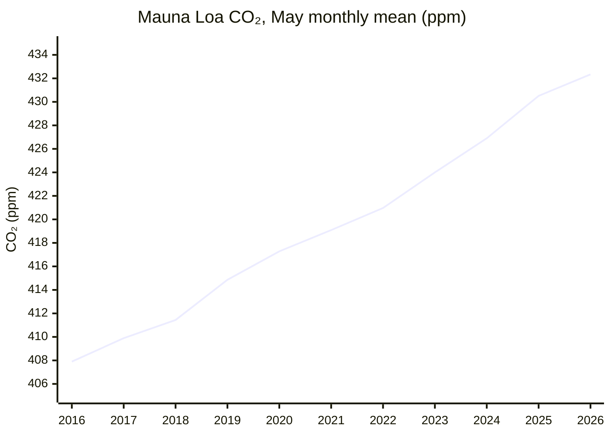
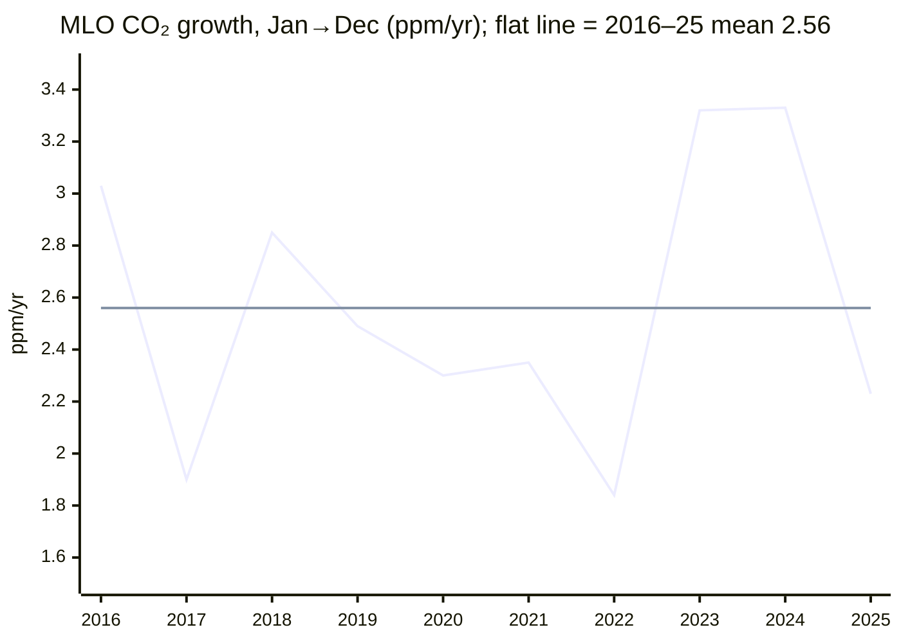

# Climate and Environment — 26H1 Report

*Period: 26H1 (Jan–Jun 2026), written as of end of June 2026. **Narrowed scope:** covers only the KPI (atmospheric CO₂ concentration and its 10-year trend) and the milestone "The Bend". "The Balance", "The Ceiling" and all Open Challenges are skipped in this run.*

> *This endeavor is unlike the other four: it is about fixing the past rather than improving the future.*

## Executive Summary

**KPI: CO₂ concentration hit a new record, and its 10-year growth trend is not slowing.** The Mauna Loa (MLO) monthly mean peaked at **432.34 ppm in May 2026**, the highest monthly value on record[^noaa-mm-mlo]. The highest daily value was **433.95 ppm on 1 May 2026**[^noaa-daily-mlo]. The **10-year average growth rate (2016–2025) is 2.56 ppm/yr at MLO and 2.53 ppm/yr for the NOAA global mean**[^noaa-gr-mlo][^noaa-gr-gl]. At MLO, the 2021–25 half-decade averaged 2.61 ppm/yr, compared with 2.51 for 2016–20[^noaa-gr-mlo].

**Short-term concentration growth has slowed.** The 2025 rise was +2.23 ppm at MLO (NOAA Jan→Dec basis), down from +3.32 in 2023 and +3.33 in 2024[^noaa-gr-mlo]. Year-on-year gains in 26H1 were +1.48 to +2.26 ppm[^noaa-mm-mlo]. The UK Met Office attributes the slower rise to La Niña-like conditions that temporarily strengthened natural carbon sinks. It still expects the rise to be "too fast to track IPCC 1.5°C scenarios"[^metoffice].

**The Bend: 🟡 not confirmed.** Emissions evidence is reported separately below, because concentration growth is not an emissions measure. All three fossil/energy CO₂ estimates published in 26H1 put 2025 at a record:
- GCB fossil CO₂: 38.1 GtCO₂, +1.0%[^gcb]
- IEA energy CO₂: +0.4%[^iea-ger]
- Carbon Monitor fossil+industry CO₂: +0.7%[^carbon-monitor]

Only GCB's *total* CO₂, which includes land-use change, dipped slightly (42.2 vs 42.4 GtCO₂). GCB attributes that dip to the end of El Niño, not to a fossil decline[^gcb]. Fossil CO₂ growth has slowed to a near-plateau, but China's CO₂ rose 2% in Q1 2026[^cb-china-q1]. The IEA expects the 2026 oil-demand dip caused by the Hormuz shock to reverse in 2027[^iea-omr].

**Bottom line: CO₂ concentration is at a record, and its 10-year trend is about 2.5 ppm/yr and not slowing. Fossil CO₂ emissions reached a record in 2025 on a slowing trajectory. The emissions peak is not yet definitively behind us.**

---

## KPI Dashboard

**KPI (per README):** Atmospheric CO₂ concentration (ppm) **and** 10-year trend (ppm/year).

MLO is a single Northern Hemisphere site, so it reads higher and has a larger seasonal cycle. The NOAA global mean is based on marine surface sites and should not be mixed with MLO. All 2026 values, and the 2025 growth and emissions values, are preliminary.

| Metric | Value | Source |
|--------|-------|--------|
| **Concentration: latest seasonal peak (MLO monthly mean, May 2026)** | **432.34 ppm**, an all-time monthly record. This is +1.83 ppm on May 2025 (430.51 ppm), a like-for-like same-month comparison. | NOAA GML[^noaa-mm-mlo] |
| Concentration: record daily value (MLO) | 433.95 ppm (1 May 2026) | NOAA GML[^noaa-daily-mlo] |
| Concentration: NOAA global mean, May / Jun 2026 | 428.59 / 427.62 ppm | NOAA GML[^noaa-mm-gl] |
| Concentration: 2025 annual mean | 427.35 ppm (MLO) / 425.62 ppm (global), both records | NOAA GML[^noaa-ann-mlo][^noaa-ann-gl] |
| **10-year trend: average growth 2016–2025, MLO** | **2.56 ppm/yr**, the mean of NOAA's annual Jan→Dec growth rates | NOAA GML[^noaa-gr-mlo] |
| **10-year trend: average growth 2016–2025, global** | **2.53 ppm/yr**, calculated on the same basis | NOAA GML[^noaa-gr-gl] |
| Trend by half-decade (MLO) | 2016–20: 2.51 ppm/yr. 2021–25: 2.61 ppm/yr. | NOAA GML[^noaa-gr-mlo] |
| Latest annual growth, 2025 (Jan→Dec) | +2.23 ppm (MLO) / +2.06 ppm (global). The previous years were MLO +3.32 (2023) and +3.33 (2024), and global +3.76 (2024, a record). | NOAA GML[^noaa-gr-mlo][^noaa-gr-gl] |
| *The Bend tracker (emissions, not the KPI):* fossil CO₂, 2025 | **38.1 GtCO₂**, +1.0% (range 0.2% to 1.7%) on 2024; a record high | GCB 2025, ESSD[^gcb] |
| *Forecast, not observed:* 2026 MLO annual mean | 429.4 ± 0.6 ppm, a rise of +2.37 ± 0.55 ppm on an annual-mean basis. The forecast would be 2.56 without La Niña. | UK Met Office (4 Feb 2026)[^metoffice] |

**Change since the previous report (pilot-2025):**
- **Concentration.** The 2025 report's headline was 426.5 ppm for Nov 2025. The comparison with 432.34 ppm for May 2026 gives **+5.84 ppm**, but the two readings are from **different calendar months**. May is the seasonal peak and November is near the trough, so the seasonal cycle is not removed. This difference is **not** a growth rate or a trend. The comparable same-month change is +1.83 ppm (May 2025 → May 2026, above).
- **10-year trend.** Not comparable. The 2025 report used WMO's global figure of +2.4 ppm/yr for 2011–2020, which is a different window and source.
- **Fossil CO₂.** No previous headline exists for this metric in the store.

### Concentration: May seasonal peak at Mauna Loa

*Data: NOAA GML MLO monthly means[^noaa-mm-mlo]. The chart plots May values, the annual peak, so that 2026 can be included. The 2026 value is preliminary.*

### Trend: annual growth vs the 10-year average

*Data: NOAA GML MLO growth rates[^noaa-gr-mlo]. The flat line is the derived 10-year mean.*

**Assessment: 🔴 Worsening.**
- **Concentration set new records in 26H1**, both monthly and daily.
- **The rate of rise dipped** from the 2023–24 record pace. The Met Office links this to La Niña-strengthened sinks[^metoffice].
- **The 10-year trend is not decelerating structurally** (2.51 → 2.61 ppm/yr by half-decade).
- **The trend is far above a 1.5°C pathway.** IPCC C1 (1.5°C) scenarios need a 2020s decadal average of 1.33–1.79 ppm/yr. The Met Office reports 2.61 ppm/yr observed for the first five years of the 2020s[^metoffice].

*Scope note:* year-to-year changes in concentration are strongly affected by natural sinks and ENSO. This section therefore draws no conclusion about emissions from them. The Bend is assessed below from emissions inventories only.

---

## Milestone Status

### 🟡 "The Bend": Peak Global Greenhouse-Gas Emissions

**Status: Approaching, not achieved.** Fossil CO₂ emissions set a record in 2025 on a slowing trajectory. The peak year is not definitively behind us.

*Metric caveat:* the milestone refers to all greenhouse gases. No global total-GHG (CO₂e) estimate for 2025 was published within 26H1, so CO₂ estimates are used as the evidence here. Each figure below applies only to its own measure. All figures are preliminary.

| Estimate (published in 26H1) | Measure | 2025 | Change vs 2024 | Source |
|---|---|---|---|---|
| Global Carbon Budget 2025, final paper (13 May 2026) | Fossil CO₂ (fossil fuels + cement, net of carbonation) | **38.1 GtCO₂**, "an historical record high" | **+1.0%** (range 0.2% to 1.7%). Coal +1.0%, oil +1.1%, gas +1.3%. | ESSD[^gcb] |
| IEA Global Energy Review 2026 (Apr 2026) | Energy CO₂ (combustion + industrial processes) | **38,082 Mt**, a record | **About +0.4%**, the slowest growth since 2021 | IEA PDF[^iea-ger] |
| Carbon Monitor (14 Apr 2026) | Fossil + industry CO₂ | **37.2 Gt**, a record | **+0.7%** | Nature Rev. Earth Environ.[^carbon-monitor] |
| Global Carbon Budget 2025 | Total CO₂ (fossil + land-use change) | 42.2 GtCO₂ | **Slightly lower** than 2024 (42.4), because of lower land-use emissions "mainly attributable to the end of the El Niño conditions" | ESSD[^gcb] |

**Evidence for a plateau:**
- **Emissions growth has slowed.** GCB total CO₂ grew 0.3%/yr over 2015–2024, compared with 1.9%/yr over 2005–2014[^gcb].
- **Fossil power generation fell 0.2% (−38 TWh) in 2025.** This was the first fall driven by clean-power growth rather than a crisis. Clean power grew by +887 TWh, more than demand growth (+849 TWh)[^ember-ger]. Carbon Monitor finds power-sector emissions fell 0.9%[^carbon-monitor].
- **China and India flattened out.**
  - IEA energy CO₂: China −0.5% and India −0.1% in 2025. The IEA says India's fall was "largely due to cyclical factors resulting from the strong monsoon"[^iea-ger].
  - CREA: China's CO₂ fell 0.3% in 2025 and has been "flat or falling" for 21 months[^cb-china-21m].

**Evidence against "definitively behind us":**
- **2025 set a record on every fossil/energy CO₂ measure above.** US energy CO₂ rose 2.2%, and advanced economies rose 0.5%[^iea-ger].
- **China is on a plateau, not in a confirmed decline.**
  - GCB projects China's 2025 fossil CO₂ at +0.4% (range −0.1% to +0.9%)[^gcb], which differs from the IEA and CREA figures above.
  - China's CO₂ **rose 2% year on year in Q1 2026**, although it remains below its March 2024 peak[^cb-china-q1].
  - A retroactive change to China's carbon-intensity metric leaves a gap of about 700–730 MtCO₂/yr in official figures[^cb-china-metric].
- **A 2026 dip would be driven by a shock.** The IEA forecasts 2026 oil demand falling by 1.1 mb/d after the Hormuz disruption. It then forecasts a rebound of 2 mb/d to 105.3 mb/d in 2027[^iea-omr]. Any "return to coal" is limited: in the worst case, global coal power rises no more than 1.8% in 2026[^cb-coal].
- **Expert view (5 Jan 2026):** "global emissions have yet to decline (even if they have plateaued)"[^hausfather].

**Why it matters:** GCB puts the remaining 1.5°C (50%) carbon budget from the start of 2026 at **170 GtCO₂**, about **4 years** at 2025 emission levels[^gcb].

*Published after 30 June 2026 (context only; not used for the status):*
- EDGAR puts 2025 total GHG (excluding LULUCF) at 54.1 GtCO₂e, +0.7%[^edgar].
- Climate TRACE puts H1 2026 total GHG at +0.2% on H1 2025[^climate-trace].

---

## Beyond the Framework

- **Renewables overtook coal in global electricity in 2025**, with a 33.8% share against 33.0% for coal[^ember-ger].

---

## Reference Data

| Dataset | Link |
|---|---|
| NOAA MLO monthly / daily means | [co2_mm_mlo.txt](https://gml.noaa.gov/webdata/ccgg/trends/co2/co2_mm_mlo.txt) · [co2_daily_mlo.txt](https://gml.noaa.gov/webdata/ccgg/trends/co2/co2_daily_mlo.txt) |
| NOAA global monthly means | [co2_mm_gl.txt](https://gml.noaa.gov/webdata/ccgg/trends/co2/co2_mm_gl.txt) |
| NOAA annual means (MLO / global) | [co2_annmean_mlo.txt](https://gml.noaa.gov/webdata/ccgg/trends/co2/co2_annmean_mlo.txt) · [co2_annmean_gl.txt](https://gml.noaa.gov/webdata/ccgg/trends/co2/co2_annmean_gl.txt) |
| NOAA annual growth rates (MLO / global) | [co2_gr_mlo.txt](https://gml.noaa.gov/webdata/ccgg/trends/co2/co2_gr_mlo.txt) · [co2_gr_gl.txt](https://gml.noaa.gov/webdata/ccgg/trends/co2/co2_gr_gl.txt) |

**MLO monthly means, 2026 (preliminary):** Jan 428.62 · Feb 429.35 · Mar 430.15 · Apr 431.12 · **May 432.34** · Jun 431.43 ppm. The year-on-year changes were +1.97, +2.26, +2.00, +1.48, +1.83 and +1.82 ppm[^noaa-mm-mlo]. The June value was published in early July, just after the period ended. NOAA files were retrieved in Sep 2026, and recent months may be recalibrated.

**Growth-rate definitions:** NOAA's "growth rate" is the change from 1 January to 31 December. The Met Office and Scripps compare calendar-year averages instead. On that annual-mean basis, the MLO rise from 2024 to 2025 was +2.74 ppm on NOAA data[^noaa-ann-mlo] and +2.68 ppm on Scripps data[^metoffice].

---

## Footnotes

[^noaa-mm-mlo]: [NOAA GML: Mauna Loa monthly mean CO₂ (co2_mm_mlo.txt)](https://gml.noaa.gov/webdata/ccgg/trends/co2/co2_mm_mlo.txt)
[^noaa-daily-mlo]: [NOAA GML: Mauna Loa daily mean CO₂ (co2_daily_mlo.txt)](https://gml.noaa.gov/webdata/ccgg/trends/co2/co2_daily_mlo.txt)
[^noaa-mm-gl]: [NOAA GML: global monthly mean CO₂ (co2_mm_gl.txt)](https://gml.noaa.gov/webdata/ccgg/trends/co2/co2_mm_gl.txt)
[^noaa-ann-mlo]: [NOAA GML: Mauna Loa annual mean CO₂ (co2_annmean_mlo.txt)](https://gml.noaa.gov/webdata/ccgg/trends/co2/co2_annmean_mlo.txt)
[^noaa-ann-gl]: [NOAA GML: global annual mean CO₂ (co2_annmean_gl.txt)](https://gml.noaa.gov/webdata/ccgg/trends/co2/co2_annmean_gl.txt)
[^noaa-gr-mlo]: [NOAA GML: Mauna Loa annual CO₂ growth rates (co2_gr_mlo.txt)](https://gml.noaa.gov/webdata/ccgg/trends/co2/co2_gr_mlo.txt). The 10-year and 5-year averages are computed from this file.
[^noaa-gr-gl]: [NOAA GML: global annual CO₂ growth rates (co2_gr_gl.txt)](https://gml.noaa.gov/webdata/ccgg/trends/co2/co2_gr_gl.txt)
[^metoffice]: [UK Met Office: Mauna Loa CO₂ forecast for 2026 (4 Feb 2026)](https://www.metoffice.gov.uk/research/climate/seasonal-to-decadal/seasonal-forecast/forecasts/co2-forecast)
[^gcb]: [Global Carbon Budget 2025, ESSD 18, 3211 (13 May 2026)](https://essd.copernicus.org/articles/18/3211/2026/)
[^iea-ger]: [IEA Global Energy Review 2026 (PDF), pp. 13, 36, 45](https://iea.blob.core.windows.net/assets/df903e1c-49c6-4757-8cbf-6fbcfe7611a0/GlobalEnergyReview2026.pdf)
[^carbon-monitor]: [Carbon Monitor, Nature Reviews Earth & Environment (14 Apr 2026)](https://www.nature.com/articles/s43017-026-00780-4)
[^ember-ger]: [Ember Global Electricity Review 2026 (21 Apr 2026)](https://ember-energy.org/latest-insights/global-electricity-review-2026/)
[^cb-china-21m]: [Carbon Brief/CREA: China's CO₂ flat or falling for 21 months (12 Feb 2026)](https://www.carbonbrief.org/analysis-chinas-co2-emissions-have-now-been-flat-or-falling-for-21-months)
[^cb-china-q1]: [Carbon Brief/CREA: China's CO₂ climbs 2% in early 2026 (4 Jun 2026)](https://www.carbonbrief.org/analysis-chinas-co2-climbs-2-in-early-2026-due-to-wasted-wind-and-solar)
[^cb-china-metric]: [Carbon Brief: China's new carbon metric leaves Germany-sized gap (26 May 2026)](https://www.carbonbrief.org/analysis-chinas-new-carbon-metric-leaves-germany-sized-gap-in-its-emissions)
[^iea-omr]: [IEA Oil Market Report, June 2026 (17 Jun 2026)](https://www.iea.org/reports/oil-market-report-june-2026)
[^cb-coal]: [Carbon Brief/Ember: No significant return to coal in 2026 despite Iran crisis (28 Apr 2026)](https://www.carbonbrief.org/world-will-not-see-significant-return-to-coal-in-2026-despite-iran-crisis/)
[^hausfather]: [Z. Hausfather, The Climate Brink: "Keep it in the ground" (5 Jan 2026)](https://www.theclimatebrink.com/p/keep-it-in-the-ground)
[^edgar]: [EDGAR 2026 report (Sep 2026)](https://edgar.jrc.ec.europa.eu/report_2026)
[^climate-trace]: [Climate TRACE: marginal increase in global emissions in H1 2026 (27 Aug 2026)](https://climatetrace.org/news/climate-trace-data-show-marginal-increase-in-global-emissions-in-the-first-half-of-2026)
