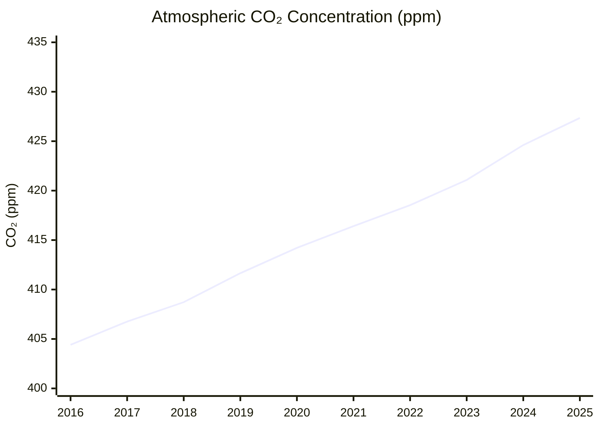
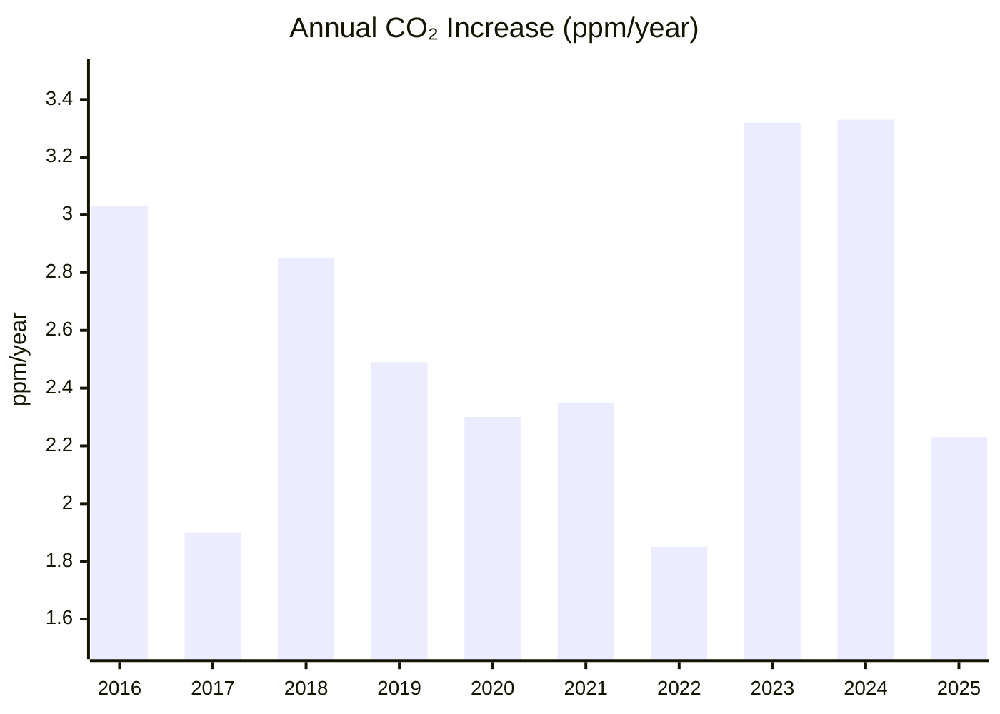

# Climate and Environment — 26H1 Update

> *Reporting period: first half of 2026 (Jan–Jun 2026), as of end of June 2026. **Narrowed scope:** this is a toy/narrow run covering only the KPI (atmospheric CO₂ concentration and its recent ppm/year trend) and the single milestone "The Bend" (peak global greenhouse-gas emissions). All other milestones and open challenges are out of scope for this run.*

## Executive Summary

**Bottom line: CO₂ is still climbing to record highs, but the emissions growth driving it is finally slowing — albeit with a 2026 wobble.** Atmospheric CO₂ set a fresh record in 26H1 — May 2026 hit **432.34 ppm**, the highest in the modern instrumental record[^noaa-trends]. Yet the 2025 growth rate eased to **+2.23 ppm/yr**, a clear step down from the back-to-back record spikes of 2023–2024 (~3.3 ppm/yr each)[^noaa-gr].

On emissions, **"The Bend" has not been crossed.** Global energy-related CO₂ rose ~0.4% in 2025 to a new record of more than 38 Gt[^iea-ger]. But growth has decelerated to its slowest rate since 2021, China (the top emitter) has plateaued for ~21 months[^cb-china-21], and coal-fired generation fell globally for the first time since 2019 (ex-Covid)[^iea-ger]. A wobble in early 2026 — China's CO₂ ticked up ~2% in Q1 — shows the peak is balanced on a knife-edge[^cb-china-q1].

**The bend is plausibly imminent, but unconfirmed. We have not yet crossed it.**

---

## KPI Dashboard

| Metric | Value | Source |
|--------|-------|--------|
| **CO₂ seasonal peak (May 2026)** | **432.34 ppm** — highest monthly value on record | [NOAA GML][noaa-trends] |
| May 2026 vs May 2025 | +1.83 ppm YoY (430.51 → 432.34) | [NOAA GML][noaa-trends] |
| Latest weekly value (week of Jun 14, 2026) | 431.17 ppm | [NOAA GML][noaa-weekly] |
| 2025 annual mean (latest full year) | 427.35 ppm | [NOAA GML][noaa-ann] |
| **2025 growth rate** | **+2.23 ppm/yr** (±0.11) | [NOAA GML][noaa-gr] |

[noaa-trends]: https://gml.noaa.gov/ccgg/trends/
[noaa-weekly]: https://gml.noaa.gov/webdata/ccgg/trends/co2/co2_weekly_mlo.txt
[noaa-ann]: https://gml.noaa.gov/webdata/ccgg/trends/co2/co2_annmean_mlo.txt
[noaa-gr]: https://gml.noaa.gov/webdata/ccgg/trends/co2/co2_gr_mlo.txt

### Atmospheric CO₂ Concentration (Mauna Loa annual mean)

*Data: [NOAA Global Monitoring Laboratory][noaa-ann]*

### Annual CO₂ Growth Rate (ppm/year)

*Data: [NOAA Growth Rates][noaa-gr]*

**Assessment: 🔴 Worsening.** Atmospheric CO₂ continues its uninterrupted rise — May 2026 set a fresh record monthly peak (432.34 ppm) and every recent year sets a new annual high[^noaa-trends]. The 2025 growth rate (+2.23 ppm/yr) eased from the 2023–2024 record spikes (~3.3 ppm/yr, driven by El Niño plus high emissions) but remains well above the ~1.6 ppm/yr typical of the 2000s. The concentration curve shows no flattening[^noaa-gr].

---

## Milestone Status

### 🟡 "The Bend" — Peak Global Emissions

**Status: Not achieved — approaching (improving trend).**

The year of peak global GHG emissions is **not yet definitively behind us.** 2025 set new record highs, but growth has decelerated sharply and the largest emitter is on a plateau.

> **A note on scope:** two authoritative datasets use different boundaries and should not be conflated. The **IEA** tracks energy-related CO₂ (>38 Gt, +0.4% in 2025)[^iea-ger]. The **Global Carbon Budget** tracks fossil + cement CO₂ (38.1 Gt, +1.1% in 2025)[^gcb-2025]. Both are record highs; the growth rates differ because of scope, not contradiction.

#### Key developments (26H1 and supporting context)

| Date | Event | Source |
|------|-------|--------|
| **Apr 20, 2026** | IEA Global Energy Review 2026: energy-related CO₂ rose ~0.4% in 2025 to a record **>38 Gt** — still rising, but the slowest growth since 2021 | [IEA][iea-ger] |
| **Jun 4, 2026** | Carbon Brief/CREA: China's CO₂ **grew ~2% in Q1 2026** (driven by curtailed/wasted wind & solar) — but still below the March-2024 peak | [Carbon Brief][cb-china-q1] |
| **Feb 12, 2026** | Carbon Brief/CREA: China's CO₂ fell ~1% in Q4 2025, likely −0.3% for full-year 2025; emissions "flat or falling" for **21 months** | [Carbon Brief][cb-china-21] |
| **Nov 13, 2025** | Global Carbon Budget 2025: fossil CO₂ +1.1% to record **38.1 Gt**; 1.5°C carbon budget "virtually exhausted" | [Global Carbon Project][gcb-2025] |

[iea-ger]: https://www.iea.org/reports/global-energy-review-2026
[cb-china-q1]: https://www.carbonbrief.org/analysis-chinas-co2-climbs-2-in-early-2026-due-to-wasted-wind-and-solar/
[cb-china-21]: https://www.carbonbrief.org/analysis-chinas-co2-emissions-have-now-been-flat-or-falling-for-21-months/
[gcb-2025]: https://globalcarbonbudget.org/fossil-fuel-co2-emissions-hit-record-high-in-2025/

#### Why the bend is nearing

- **Growth is decelerating:** The IEA's +0.4% for 2025 is a further slowdown from +0.8% in 2024, reflecting record clean-energy deployment — solar PV met >25% of all energy-demand growth (first time a modern renewable led), renewable additions hit a record 800 GW, and clean tech deployed since 2019 now avoids ~3 Gt CO₂/yr (~8% of global emissions)[^iea-ger].
- **Coal turned a corner:** Global coal-fired generation fell for the first time since 2019 (ex-Covid)[^iea-ger].
- **China plateaued:** Its emissions fell ~0.3% in 2025 and have been flat or falling for ~21 months — the first such streak[^cb-china-21]. India's energy CO₂ went flat for the first time since the 1970s[^iea-ger].

#### Why it's not confirmed

The plateau wobbled in early 2026: China's CO₂ grew ~2% year-on-year in Q1 2026, driven by a surge in curtailed ("wasted") wind and solar — power-sector CO₂ "would have been flat without the rise in wasted wind and solar." Crucially, Q1 2026 emissions remained **below** the March-2024 peak, so the structural-peak case is intact but unconfirmed[^cb-china-q1]. Meanwhile global totals are still inching to fresh records[^iea-ger][^gcb-2025].

**Verdict for 26H1:** Not crossed — global emissions are still setting fresh records, even as a structural peak moves within sight.

---

## Reference Data

### External Visualizations

| Chart | Source |
|-------|--------|
| Mauna Loa CO₂ (full record) | [NOAA GML PNG](https://gml.noaa.gov/webdata/ccgg/trends/co2_data_mlo.png) |
| Mauna Loa monthly means (data) | [NOAA GML](https://gml.noaa.gov/webdata/ccgg/trends/co2/co2_mm_mlo.txt) |

---

## Footnotes

[^noaa-trends]: [NOAA GML — Trends in Atmospheric Carbon Dioxide (Mauna Loa)](https://gml.noaa.gov/ccgg/trends/). May 2026 monthly mean 432.34 ppm; May 2025 430.51 ppm (page last updated Jun 05, 2026).
[^noaa-gr]: [NOAA GML — Annual CO₂ growth rate (Mauna Loa)](https://gml.noaa.gov/webdata/ccgg/trends/co2/co2_gr_mlo.txt). 2025: +2.23 ppm/yr (±0.11); 2024: +3.33; 2023: +3.32.
[^iea-ger]: [IEA — Global Energy Review 2026](https://www.iea.org/reports/global-energy-review-2026) (published 20 Apr 2026). Energy-related CO₂ +0.4% in 2025 (slowest rate since 2021) to >38 Gt; solar PV met >25% of energy-demand growth; 800 GW renewables added; coal generation fell for first time since 2019 (ex-Covid); China fell, India flat.
[^cb-china-21]: [Carbon Brief / CREA — China's CO₂ emissions have now been flat or falling for 21 months](https://www.carbonbrief.org/analysis-chinas-co2-emissions-have-now-been-flat-or-falling-for-21-months/) (12 Feb 2026).
[^cb-china-q1]: [Carbon Brief / CREA — China's CO₂ climbs 2% in early 2026 due to wasted wind and solar](https://www.carbonbrief.org/analysis-chinas-co2-climbs-2-in-early-2026-due-to-wasted-wind-and-solar/) (4 Jun 2026).
[^gcb-2025]: [Global Carbon Budget 2025](https://globalcarbonbudget.org/fossil-fuel-co2-emissions-hit-record-high-in-2025/) (13 Nov 2025). Fossil CO₂ +1.1% to record 38.1 Gt; remaining 1.5°C budget virtually exhausted.
