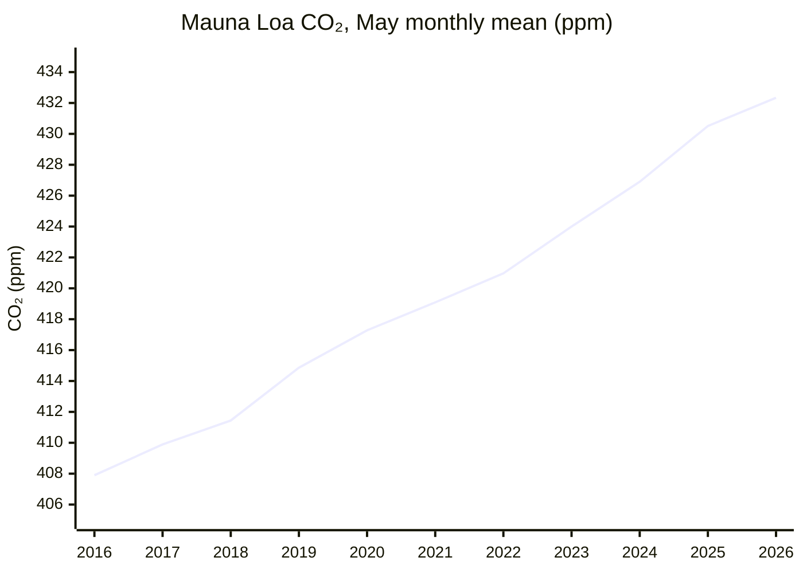
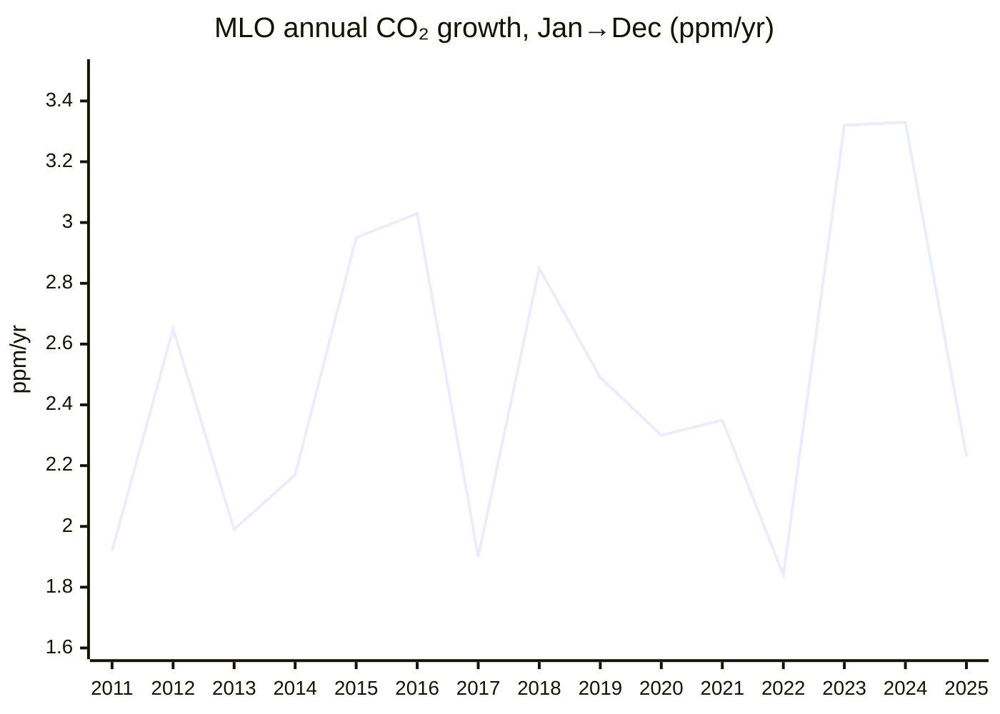
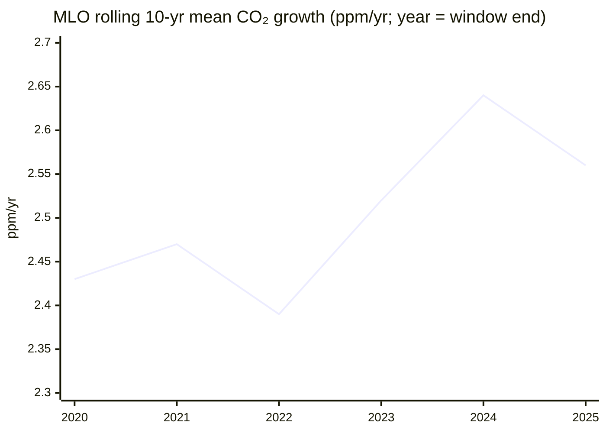

# Climate and Environment — 26H1 Report

*Period: 26H1 (Jan–Jun 2026), as of 30 June 2026. **Narrowed scope:** covers only the KPI (atmospheric CO₂ concentration and its 10-year ppm/yr trend) and the milestone "The Bend"; "The Balance", "The Ceiling" and all Open Challenges are skipped. NOAA files were retrieved in Sep 2026, and recent values are preliminary. Items published after 30 June are labelled as such.*

> *This endeavor is unlike the other four: it is about fixing the past rather than improving the future. Many historic civilizations fell to climate change, and we now have to clean up our mess if we are to survive into a better future.*

## Executive Summary

**KPI: 🔴 Worsening. The Mauna Loa CO₂ concentration hit a record, and the 10-year growth trend is 2.56 ppm/yr.**
- The Mauna Loa (MLO) monthly mean reached **432.34 ppm in May 2026**, the seasonal peak and the highest monthly value on record[^noaa-mm-mlo].
- The **10-year average growth rate (2016–2025) is 2.56 ppm/yr** at MLO and 2.53 ppm/yr for the NOAA global mean[^noaa-gr-mlo][^noaa-gr-gl].
- **Year-to-year growth slowed, but there is no structural slowdown.** At MLO, growth was +2.23 ppm in 2025 (Jan→Dec), down from a record +3.33 ppm in 2024[^noaa-gr-mlo]. Monthly values for Jan–May 2026 were +1.48 to +2.26 ppm above the same months of 2025 (June, published in July: +1.82)[^noaa-mm-mlo]. The 10-year mean slipped from 2.64 (2015–24) to 2.56 ppm/yr because the El Niño year 2015 (+2.95) left the window and the slower 2025 (+2.23) entered it. The MLO half-decade mean rose from 2.51 ppm/yr (2016–20) to 2.61 ppm/yr (2021–25)[^noaa-gr-mlo].

**The Bend: 🟡 Approaching, not yet achieved.**
- **Fossil CO₂ emissions set a record of 38.1 GtCO₂ in 2025** (+1.0%, GCB)[^gcb]. IEA energy CO₂[^iea-ger] and Carbon Monitor fossil+industry CO₂[^carbon-monitor] also set 2025 records. On a different measure, **GCB total CO₂** (fossil + land-use change) was slightly *lower* than in 2024. GCB attributes this to lower land-use emissions as El Niño ended[^gcb].
- **Growth of energy CO₂ slowed to about +0.4%**, "the slowest rate since 2021" (IEA)[^iea-ger]. China's CO₂ still rose 2% year on year in Q1 2026[^cb-china-q1]. After the 2026 Strait of Hormuz (Iran-war) oil-supply shock, the IEA forecasts that oil demand will fall in 2026 but rebound above its 2025 level in 2027[^iea-omr].

**Bottom line: The MLO CO₂ concentration is at a record and has risen by about 2.5 ppm/yr over the past decade. Fossil CO₂ emissions hit a record in 2025, though their growth is slowing. The emissions peak is not yet definitively behind us.**

---

## KPI Dashboard

**KPI (per README):** Atmospheric CO₂ concentration (ppm) **and** 10-year trend (ppm/year). *Basis:* MLO is a single Northern Hemisphere site, so it reads higher and has a larger seasonal cycle than the NOAA global marine-surface mean, and the two series are not mixed. "Growth" means NOAA's Jan 1→Dec 31 change, and the 10-year trend is the mean of the last 10 such annual rates.

| Metric | Value | Source |
|--------|-------|--------|
| **Concentration: MLO monthly mean, May 2026** (latest month published by 30 June) | **432.34 ppm**, an all-time monthly record; +1.83 ppm on May 2025 (430.51) | NOAA GML[^noaa-mm-mlo] |
| **10-year trend: MLO, 2016–2025** | **2.56 ppm/yr** (Jan→Dec) | NOAA GML[^noaa-gr-mlo] |
| 10-year trend: global, 2016–2025 | 2.53 ppm/yr (Jan→Dec). As a cross-check, GCB reports 2.6 ppm/yr of global growth for 2015–2024 | NOAA GML[^noaa-gr-gl]; GCB[^gcb] |
| Latest annual growth, 2025 (Jan→Dec) | +2.23 ppm (MLO) / +2.06 ppm (global, the smallest since 2014). The 2024 rates were +3.33 (MLO) and +3.76 (global), both records. On the annual-mean basis, MLO rose +2.74 ppm in 2025 after +3.53 in 2024 | NOAA GML[^noaa-gr-mlo][^noaa-gr-gl][^noaa-ann-mlo] |
| Concentration: other readings | MLO June 2026: 431.43 ppm (published early July). Record MLO daily mean: 433.95 ppm (1 May 2026). Global monthly mean, May 2026: 428.59 ppm. 2025 annual means: 427.35 (MLO) / 425.62 (global), both records | NOAA GML[^noaa-mm-mlo][^noaa-daily-mlo][^noaa-mm-gl][^noaa-ann-mlo][^noaa-ann-gl] |
| *Forecast, not observed:* 2026 MLO annual mean | 429.4 ± 0.6 ppm, a rise of +2.37 ± 0.55 ppm on the annual-mean basis. The Met Office says this rise is "slightly slowed by a temporary strengthening of natural carbon sinks associated with moderate La Niña-like conditions". It uses the Scripps basis, so it is not comparable to NOAA's figures | UK Met Office (4 Feb 2026)[^metoffice] |
| **The Bend tracker (an emissions figure, not the KPI): GCB fossil CO₂, 2025** | **38.1 GtCO₂**, +1.0% (range 0.2% to 1.7%) on 2024; a record; preliminary | GCB 2025, ESSD[^gcb] |

**Change since the previous report (pilot-2025):**
- **Concentration:** the like-for-like change is May 2025 → May 2026: **+1.83 ppm** (430.51 → 432.34)[^noaa-mm-mlo]. Pilot-2025's headline was Nov 2025 (426.5 ppm; the current NOAA file gives 426.46). The +5.84 ppm from Nov 2025 to May 2026 compares different points of the seasonal cycle, so it is not growth.
- **10-year trend:** pilot-2025 headlined WMO's 2.4 ppm/yr (2011–2020, global annual means), a different basis. On NOAA's global Jan→Dec basis, the 10-year mean went from 2.38 (2011–20) to 2.53 ppm/yr (2016–25)[^noaa-gr-gl]. There is no previous headline for the MLO metric.
- **Fossil CO₂:** 38.1 GtCO₂, +1.1% (GCB's November 2025 *projection*, cited in pilot-2025) → 38.1 GtCO₂, +1.0% (final ESSD paper)[^gcb].

### Concentration: May seasonal peak at Mauna Loa

*Data: NOAA GML MLO monthly means[^noaa-mm-mlo]. May is used, being the annual peak, so that 2026 can be shown. The 2026 value is preliminary.*

### Trend: annual growth and the rolling 10-year mean

*Data: NOAA GML MLO growth rates[^noaa-gr-mlo]. GCB attributes the record 2024 global growth rate (3.7 ppm on its own basis) mainly to the 2023/24 El Niño[^gcb].*

*Data: calculated from NOAA GML MLO growth rates[^noaa-gr-mlo]. Each point is the mean of the 10 years ending in that year.*

**Assessment: 🔴 Worsening. The concentration is at a record and is still rising at about 2.5 ppm/yr.**
- **The rolling mean dipped for a mechanical reason.** It fell from 2.64 to 2.56 ppm/yr because 2015 (+2.95) left the window and the slower 2025 (+2.23) entered it. Half-decade means still rose, and the rolling mean stays above its 2011–20 level of 2.43[^noaa-gr-mlo].
- **Growth in 26H1 is slower.** The May 2026 gain (+1.83 ppm) is well below the May-over-May gains of 2023–2025 (+2.9 to +3.6 ppm)[^noaa-mm-mlo]. The direction matches the Met Office forecast of a slower 2026 annual-mean rise (+2.37 ± 0.55 ppm, Scripps basis), which it attributes to La Niña-like conditions[^metoffice].
- **Far above 1.5°C pathways.** IPCC C1 scenarios need a 2020s decadal average of 1.33–1.79 ppm/yr. The Met Office reports 2.61 ppm/yr observed for 2020–2025 on the Scripps annual-mean basis (a different calculation from NOAA's 2021–25 figure above, despite the same value). It says even the forecast 2026 rise is "too fast to track IPCC 1.5°C scenarios"[^metoffice].
- *Scope note:* natural sinks and ENSO confound year-to-year concentration growth, so no conclusion about emissions is drawn from it. The Bend is judged below from emissions inventories only.

---

## Milestone Status

### 🟡 "The Bend" — Peak Global Greenhouse-Gas Emissions

**Status: Approaching, not yet achieved.** Fossil and energy CO₂ set records in 2025, although their growth slowed. The peak year is not definitively behind us.

*Metric caveat:* the milestone covers all greenhouse gases. No global total-GHG (CO₂e) estimate for 2025 was published within 26H1, so CO₂ estimates are the evidence. Each figure applies only to its own measure, and all are preliminary.

| Estimate (published in 26H1) | Measure | 2025 | Change vs 2024 | Source |
|---|---|---|---|---|
| GCB 2025 final paper (13 May 2026) | Fossil CO₂ (fossil fuels + cement, net of carbonation) | **38.1 GtCO₂**, "an historical record high" | **+1.0%** (0.2% to 1.7%) | ESSD[^gcb] |
| IEA Global Energy Review 2026 (Apr 2026) | Energy CO₂ (combustion + industrial processes) | **38,082 MtCO₂**, a record | About **+0.4%**, "the slowest rate since 2021" | IEA PDF[^iea-ger] |
| Carbon Monitor (14 Apr 2026) | Fossil + industry CO₂ | **37.2 GtCO₂**, a record | **+0.7%** | Nat. Rev. Earth Environ.[^carbon-monitor] |
| GCB 2025 final paper | Total CO₂ (fossil + land-use change) | 42.2 GtCO₂ | **Slightly lower** than 42.4 GtCO₂ in 2024, because land-use emissions fell as El Niño ended | ESSD[^gcb] |

**Signs of a plateau:**
- **GCB total CO₂ growth slowed** to 0.3%/yr over 2015–2024, from 1.9%/yr over 2005–2014[^gcb].
- **Global fossil power generation fell 0.2% in 2025**, the first time since 2020 that it did not rise. Clean power (+887 TWh) grew by more than demand (+849 TWh)[^ember-ger].
- **China and India flattened on IEA energy CO₂:** China −0.5% and India −0.1%. The IEA says India's fall was "largely due to cyclical factors resulting from the strong monsoon"[^iea-ger]. CREA finds China's CO₂ "flat or falling" for 21 months, with −0.3% in 2025[^cb-china-21m].
- **Carbon Monitor** finds that global power-sector CO₂ fell 0.9% in 2025, and that China and India "entered an emission plateau" while the US and EU rebounded[^carbon-monitor].

**Why the peak is not definitively behind us:**
- **All three fossil and energy CO₂ estimates in the table set a record in 2025.** GCB expects coal, oil and gas emissions each to have risen (+1.0%, +1.1% and +1.3%)[^gcb]. US energy CO₂ rose 2.2%. Advanced-economy energy CO₂ rose 0.5%, its first annual increase since 2018 (excluding the post-Covid rebound)[^iea-ger].
- **China is on a plateau, not in a confirmed decline.**
  - GCB puts China's 2025 fossil CO₂ at +0.4% (range −0.1% to +0.9%)[^gcb].
  - China's CO₂ **rose 2% year on year in Q1 2026**, though it stayed below its March 2024 peak[^cb-china-q1].
  - China appears to have retroactively changed its official carbon-intensity metric. Carbon Brief puts the resulting gap against the previous statistics at about 700–730 MtCO₂/yr[^cb-china-metric].
- **Any 2026 dip looks shock-driven.** After the Hormuz shock, the IEA forecasts that 2026 oil demand will fall by 1.1 mb/d. It then expects a rebound of 2 mb/d, to 105.3 mb/d, in 2027, which would be above the implied 2025 level of about 104.4 mb/d[^iea-omr].
- **No significant return to coal so far:** Ember's worst case sees global coal power rise by no more than 1.8% in 2026[^cb-coal].
- **Expert view:** Z. Hausfather wrote on 5 Jan 2026, before most 26H1 data, that "global emissions have yet to decline (even if they have plateaued)"[^hausfather].

**Why it matters:** GCB puts the remaining 1.5°C (50%) budget from the start of 2026 at **170 GtCO₂**, about **4 years** at 2025 emission levels[^gcb].

*Published after 30 June 2026 (context only; not used for the status):*
- **EDGAR:** total GHG excluding LULUCF was 54.1 GtCO₂e in 2025, +0.7%[^edgar].
- **Climate TRACE:** total GHG in H1 2026 was 29.7 GtCO₂e, +0.2% on H1 2025[^climate-trace].
- **Carbon Brief/CREA:** China's CO₂ fell 1% in Q2 2026 as oil use dropped 9%. H1 2026 was "up marginally", still below the 2023–24 peak[^cb-china-q2].
- **Carbon Brief:** fossil CO₂ is set to fall about 0.5% in 2026, driven by the Hormuz crisis[^cb-2026-fall].

---

## Beyond the Framework: 26H1 Highlights

- **Renewables overtook coal in global electricity generation in 2025**, with a 33.8% share against 33.0% for coal[^ember-ger].

---

## Reference Data

### MLO monthly means, 2026 (preliminary)[^noaa-mm-mlo]

| | Jan | Feb | Mar | Apr | May | Jun* |
|---|---|---|---|---|---|---|
| Monthly mean (ppm) | 428.62 | 429.35 | 430.15 | 431.12 | **432.34** | 431.43 |
| Change on same month of 2025 (ppm) | +1.97 | +2.26 | +2.00 | +1.48 | +1.83 | +1.82 |

\*The June value was published in early July 2026.

### Data files

| Dataset | Link |
|---|---|
| NOAA MLO monthly / daily means | [co2_mm_mlo.txt](https://gml.noaa.gov/webdata/ccgg/trends/co2/co2_mm_mlo.txt) · [co2_daily_mlo.txt](https://gml.noaa.gov/webdata/ccgg/trends/co2/co2_daily_mlo.txt) |
| NOAA global monthly means | [co2_mm_gl.txt](https://gml.noaa.gov/webdata/ccgg/trends/co2/co2_mm_gl.txt) |
| NOAA annual growth rates (MLO / global) | [co2_gr_mlo.txt](https://gml.noaa.gov/webdata/ccgg/trends/co2/co2_gr_mlo.txt) · [co2_gr_gl.txt](https://gml.noaa.gov/webdata/ccgg/trends/co2/co2_gr_gl.txt) |

---

## Footnotes

[^noaa-mm-mlo]: [NOAA GML: Mauna Loa monthly mean CO₂ (co2_mm_mlo.txt)](https://gml.noaa.gov/webdata/ccgg/trends/co2/co2_mm_mlo.txt)
[^noaa-daily-mlo]: [NOAA GML: Mauna Loa daily mean CO₂ (co2_daily_mlo.txt)](https://gml.noaa.gov/webdata/ccgg/trends/co2/co2_daily_mlo.txt)
[^noaa-mm-gl]: [NOAA GML: global monthly mean CO₂ (co2_mm_gl.txt)](https://gml.noaa.gov/webdata/ccgg/trends/co2/co2_mm_gl.txt)
[^noaa-ann-mlo]: [NOAA GML: Mauna Loa annual mean CO₂ (co2_annmean_mlo.txt)](https://gml.noaa.gov/webdata/ccgg/trends/co2/co2_annmean_mlo.txt)
[^noaa-ann-gl]: [NOAA GML: global annual mean CO₂ (co2_annmean_gl.txt)](https://gml.noaa.gov/webdata/ccgg/trends/co2/co2_annmean_gl.txt)
[^noaa-gr-mlo]: [NOAA GML: Mauna Loa annual CO₂ growth rates (co2_gr_mlo.txt)](https://gml.noaa.gov/webdata/ccgg/trends/co2/co2_gr_mlo.txt). The 10-year, rolling and half-decade means are calculated from this file.
[^noaa-gr-gl]: [NOAA GML: global annual CO₂ growth rates (co2_gr_gl.txt)](https://gml.noaa.gov/webdata/ccgg/trends/co2/co2_gr_gl.txt). The 10-year mean is calculated from this file.
[^metoffice]: [UK Met Office: Mauna Loa CO₂ forecast for 2026 (published 4 Feb 2026; the URL is reused for each year's forecast; content as accessed 28 Sep 2026)](https://www.metoffice.gov.uk/research/climate/seasonal-to-decadal/seasonal-forecast/forecasts/co2-forecast)
[^gcb]: [Global Carbon Budget 2025, ESSD 18, 3211 (13 May 2026)](https://essd.copernicus.org/articles/18/3211/2026/)
[^iea-ger]: [IEA Global Energy Review 2026 (PDF), PDF pp. 13–14, 36, 45](https://iea.blob.core.windows.net/assets/df903e1c-49c6-4757-8cbf-6fbcfe7611a0/GlobalEnergyReview2026.pdf)
[^carbon-monitor]: [Carbon Monitor, Nature Reviews Earth & Environment (14 Apr 2026)](https://www.nature.com/articles/s43017-026-00780-4)
[^ember-ger]: [Ember Global Electricity Review 2026 (21 Apr 2026)](https://ember-energy.org/latest-insights/global-electricity-review-2026/)
[^cb-china-21m]: [Carbon Brief/CREA: China's CO₂ flat or falling for 21 months (12 Feb 2026)](https://www.carbonbrief.org/analysis-chinas-co2-emissions-have-now-been-flat-or-falling-for-21-months)
[^cb-china-q1]: [Carbon Brief/CREA: China's CO₂ climbs 2% in early 2026 (4 Jun 2026)](https://www.carbonbrief.org/analysis-chinas-co2-climbs-2-in-early-2026-due-to-wasted-wind-and-solar)
[^cb-china-metric]: [Carbon Brief: China's new carbon metric leaves Germany-sized gap (26 May 2026)](https://www.carbonbrief.org/analysis-chinas-new-carbon-metric-leaves-germany-sized-gap-in-its-emissions)
[^iea-omr]: [IEA Oil Market Report, June 2026 (17 Jun 2026)](https://www.iea.org/reports/oil-market-report-june-2026)
[^cb-coal]: [Carbon Brief/Ember: No significant return to coal in 2026 despite Iran crisis (28 Apr 2026)](https://www.carbonbrief.org/world-will-not-see-significant-return-to-coal-in-2026-despite-iran-crisis/)
[^hausfather]: [Z. Hausfather, The Climate Brink: "Keep it in the ground" (5 Jan 2026)](https://www.theclimatebrink.com/p/keep-it-in-the-ground)
[^edgar]: [EDGAR 2026 report: GHG emissions of all world countries (PDF, Sep 2026)](https://edgar.jrc.ec.europa.eu/booklet/GHG_emissions_of_all_world_countries_booklet_2026report.pdf)
[^climate-trace]: [Climate TRACE: marginal increase in global emissions in H1 2026 (27 Aug 2026)](https://climatetrace.org/news/climate-trace-data-show-marginal-increase-in-global-emissions-in-the-first-half-of-2026)
[^cb-china-q2]: [Carbon Brief/CREA: China's CO₂ emissions fall in Q2 2026 due to plummeting oil use (3 Sep 2026)](https://www.carbonbrief.org/analysis-chinas-co2-emissions-fall-in-q2-2026-due-to-plummeting-oil-use)
[^cb-2026-fall]: [Carbon Brief: global fossil-fuel emissions set to fall in 2026 amid Hormuz crisis (16 Sep 2026)](https://www.carbonbrief.org/analysis-global-fossil-fuel-emissions-set-to-fall-in-2026-amid-hormuz-crisis)
