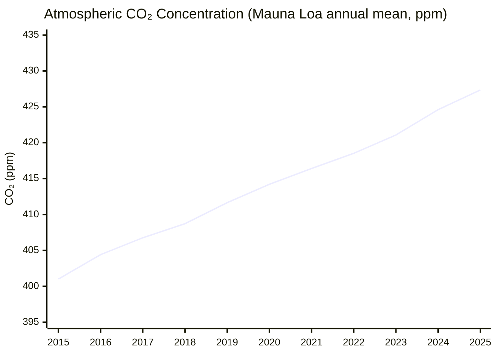
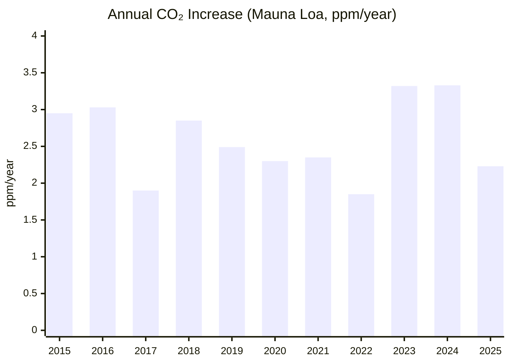
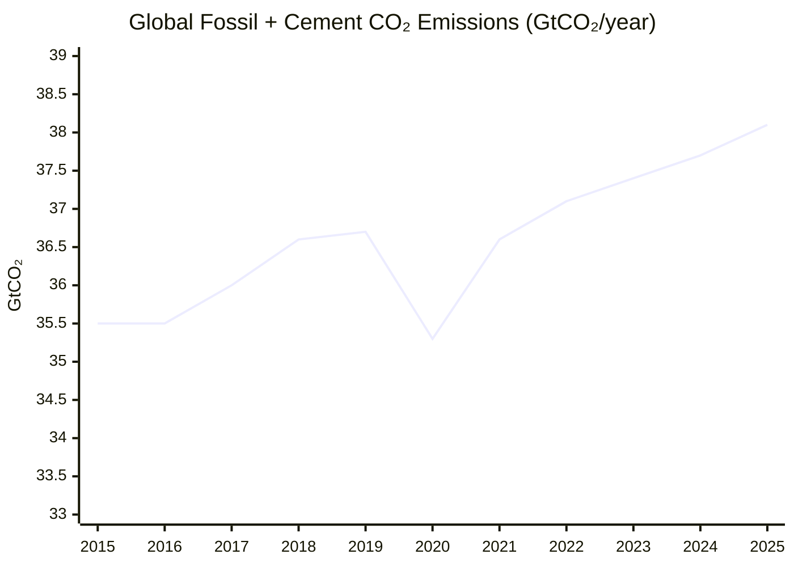

# Climate and Environment — 26H1 (Jan–Jun 2026)

> *Reporting period: first half of 2026 (Jan–Jun 2026), as of end of June 2026. **Scope note: this is a narrowed/toy run** — it covers only the KPI (atmospheric CO₂ concentration + 10-year trend) and the single milestone "The Bend" (peak global emissions). All other milestones ("The Balance", "The Ceiling") and all Open Challenges are intentionally omitted from this run.*

## Executive Summary

**Bottom line: the atmosphere keeps worsening, while the emissions that drive it may be bending — but the bend is not yet behind us.**

- **The KPI is at a new record and still climbing.** Atmospheric CO₂ reached a 26H1 peak monthly mean of **432.34 ppm** at Mauna Loa in May 2026[^ml-monthly], up +1.83 ppm year-on-year. The latest weekly reading is **430.91 ppm** (week of 21 Jun 2026)[^ml-weekly], already in seasonal decline. The **10-year average growth rate is ~2.6 ppm/yr** (2016–2025)[^ml-gr] — the steepest decade on record and roughly triple the 1960s pace.
- **"The Bend" has NOT been crossed.** Global emissions set a fresh record in 2025 (the latest full year): IEA puts energy-related CO₂ at a new high of nearly **38.4 Gt** (+~0.4%)[^iea-ger], and the Global Carbon Budget projects fossil + cement CO₂ at a record **38.1 Gt** (+1.1%)[^gcb]. The peak is therefore not yet in the rear-view mirror.
- **But the emissions trend is genuinely improving.** Emissions growth is the slowest since 2021[^iea-ger], decade-over-decade total-CO₂ growth has collapsed from 1.9%/yr to 0.3%/yr[^gcb-decade], China was flat-to-falling for ~21 months through end-2025[^cb-21mo], and India's energy-CO₂ went flat for the first time on record[^iea-clean]. A 2026 wobble (China +2% in Q1) shows the peak is balanced on a knife-edge — plausibly imminent, but unconfirmed.

These two findings are kept deliberately separate: rising concentrations and an emissions plateau are *not* contradictory. Concentrations keep setting records as long as emissions remain net-positive, regardless of whether the emissions *flow* has peaked.

---

## KPI Dashboard

**KPI (per README): Atmospheric CO₂ concentration (ppm) AND its 10-year trend (ppm/year).** Both components are reported below. Measure = atmospheric CO₂ dry-air mole fraction (NOT emissions).

| Metric | Value | Source |
|--------|-------|--------|
| **Latest weekly mean (Mauna Loa, wk of 21 Jun 2026)** | **430.91 ppm** (1 yr ago 429.61; 10 yr ago 406.73) | [NOAA GML weekly][noaa-weekly] |
| **Latest monthly mean (Mauna Loa, May 2026)** | **432.34 ppm** (+1.83 ppm vs May 2025) | [NOAA GML][noaa-trends] |
| **26H1 annual peak (May 2026, seasonal maximum)** | **432.34 ppm** | [NOAA co2_mm_mlo][noaa-mm] |
| **Latest global marine-surface monthly mean (Mar 2026)** | **428.60 ppm** (global lags ML ~2 months) | [NOAA global][noaa-global] |
| **10-year average trend (2016–2025), Mauna Loa** | **~2.57 ppm/yr** (global network ~2.54 ppm/yr) | [NOAA growth rate][noaa-gr] |

[noaa-weekly]: https://gml.noaa.gov/ccgg/trends/weekly.html
[noaa-trends]: https://gml.noaa.gov/ccgg/trends/
[noaa-mm]: https://gml.noaa.gov/webdata/ccgg/trends/co2/co2_mm_mlo.txt
[noaa-global]: https://gml.noaa.gov/ccgg/trends/global.html
[noaa-gr]: https://gml.noaa.gov/webdata/ccgg/trends/co2/co2_gr_mlo.txt

### Atmospheric CO₂ Concentration (Mauna Loa annual mean, ppm)

*Data: [NOAA Global Monitoring Laboratory][noaa-annmean]. (2026 not yet a full year; May 2026 monthly peak = 432.34 ppm.)*

[noaa-annmean]: https://gml.noaa.gov/webdata/ccgg/trends/co2/co2_annmean_mlo.txt

### 10-Year Trend — Annual CO₂ Growth Rate (Mauna Loa, ppm/year)

*Data: [NOAA Growth Rates][noaa-gr]. 10-year mean (2016–2025) ≈ 2.57 ppm/yr.*

**Assessment: 🔴 Worsening.** Atmospheric CO₂ climbs to a new record every year, hitting 432.34 ppm in May 2026 (the 26H1 peak). The ~2.6 ppm/yr 10-year trend is the steepest decade on record, well above the 1960s (~0.8 ppm/yr) and 2000s (~2.0 ppm/yr) decadal averages. The single-year spikes are noisy — 2024 set a record annual jump (Mauna Loa +3.33 ppm; global +3.74 ppm) driven by El Niño and wildfire emissions weakening land/ocean uptake, and 2025 fell back to +2.23 ppm (still positive)[^ml-gr-record]. This year-to-year variability reflects sink/ENSO dynamics, not the emissions trajectory directly. The KPI will keep worsening until emissions fall to near net-zero.

---

## Milestone Status

### 🟡 "The Bend" — Peak Global Emissions

**Status: Not achieved — approaching (improving trend).** The README milestone is the peak of global **greenhouse-gas** emissions; this run assesses it through global **CO₂** emissions — the dominant driver (~three-quarters of GHGs) — which have **not yet definitively peaked** (non-CO₂ gases such as methane and N₂O are not separately adjudicated here). Global CO₂ totals set fresh records in 2025, so the peak is not in the rear-view mirror — but growth is decelerating sharply and a structural peak is plausibly imminent.

> *Measure note: this milestone concerns **emissions** (flow, Gt CO₂/yr), distinct from the atmospheric-concentration KPI above. "Peak emissions" is tracked here via **CO₂** only (non-CO₂ GHGs are not separately assessed). The three authoritative datasets below use **different boundaries** and must not be conflated: IEA = energy-related CO₂; Global Carbon Budget = fossil + cement CO₂; Carbon Monitor = near-real-time fossil CO₂ (different method/coverage).*

#### 2025 — a new record, by every dataset (but slowing)

| Dataset (scope) | 2025 emissions | Change vs 2024 | Label | Source |
|-----------------|----------------|----------------|-------|--------|
| **IEA** — energy-related CO₂ | **~38.4 Gt** | **+~0.4%** (+~145 Mt); slowest since 2021 | Estimated full-year, record high | [IEA GER 2026 (PDF)][iea-ger-pdf] |
| **Global Carbon Budget** — fossil + cement CO₂ | **38.1 Gt** | **+1.1%** | Projection (Nov 2025) | [GCP 2025][gcb-page] |
| **Carbon Monitor** — near-real-time fossil CO₂ | **37.3 Gt**[^cm-news] | **+0.7%** | Year-in-Review (Apr 2026) | [Carbon Monitor][cm-news] |

All three agree: **2025 was a new record and still rising** — the peak is not behind us. The three different headline numbers reflect different scope/method, not a disagreement on direction. (By fuel, GCB projects coal +0.8%, oil +1%, gas +1.3%; total CO₂ *including* land-use change was projected slightly *below* 2024 as land-use-change emissions fell to 4.1 Gt[^gcb-fuel].)

#### The "bend" signal — why a peak is plausibly imminent

*Data: Global Carbon Budget 2025 — fossil + cement CO₂ (GtCO₂, to nearest 0.1 Gt; 2025 projected at 38.1 Gt, +1.1% over 2024's ~37.7 Gt)[^gcb-series]. Fossil CO₂ grew only ~0.2 Gt/yr over the past decade — the visual "bend."*

- **Growth is collapsing on a decadal basis.** Total CO₂ growth has slowed to **0.3%/yr over the past decade**, versus **1.9%/yr the previous decade**[^gcb-decade] — the clearest structural "bend" signal, though still positive (no peak yet).
- **Clean-energy structural drivers (IEA, 2025).** Solar PV met **>one-quarter of global primary energy demand growth** (a first); annual renewable capacity additions hit a record **800 GW**; clean tech deployed since 2019 now avoids ~8% of global emissions[^iea-clean].
- **China and India — the two largest developing-country emitters — both flashed turning-point signals.** China's coal-fired generation fell ~1.5% and **India's energy-CO₂ went flat for the first time on record**[^iea-clean]. China's CO₂ was **"flat or falling" for 21 months** through end-2025 (since March 2024), likely securing a full-year 2025 decline of −0.3% (a 7% drop in cement CO₂ offsetting a +0.1% fossil component)[^cb-21mo].

> *Dataset reconciliation worth flagging: GCB (Nov 2025) projected China fossil CO₂ at **+0.4%** for 2025, while CREA/Carbon Brief (Feb 2026, fuller data) estimates **total China CO₂ at −0.3%**. The gap is largely scope/timing: GCB = fossil-only Nov projection; CREA = fossil + cement (cement −7% drags the total down) with a post-year update[^cb-21mo].*

#### The 26H1 wobble — peak on a knife-edge

No full global H1-2026 emissions tally had been published by end-June 2026, so China's quarterly data is the freshest within-period signal — and it complicates the picture: **China's CO₂ grew ~2% year-on-year in Q1 2026** (Jan–Mar), reversing nearly two years of flat/falling output — **but emissions remain below the March-2024 peak**[^cb-2026]. The driver was a surge in **"wasted"/curtailed wind and solar** (inflexible coal contracts and grid-management friction): coal+gas power generation rose +4% in Q1, while cement fell −7% and crude steel −5% amid an −11% drop in real-estate investment. Carbon Brief's read is that "power-sector CO₂ would have been flat without the rise in wasted wind and solar" — i.e. grid-integration friction, not a structural reversal. The peak case is intact but **unconfirmed as of end-June 2026**.

> **Context (from "The Bend" emissions data, not the KPI):** IEA notes the 2025 ~0.4% rise "coincided with record atmospheric CO₂ concentrations of about 427 ppm"[^iea-ppm] (the 2025 *annual-mean* level — the KPI's May-2026 monthly peak is higher, 432 ppm). This is a *co-occurrence*, not a causal bridge — atmospheric concentration and the emissions flow are distinct metrics tracked separately in this report.

[iea-ger-pdf]: https://iea.blob.core.windows.net/assets/df903e1c-49c6-4757-8cbf-6fbcfe7611a0/GlobalEnergyReview2026.pdf
[gcb-page]: https://globalcarbonbudget.org/fossil-fuel-co2-emissions-hit-record-high-in-2025/
[cm-news]: https://doi.org/10.1038/s43017-026-00780-4

---

## Beyond the Framework

- **The 1.5°C budget is nearly gone.** The Global Carbon Budget 2025 finds the remaining 1.5°C carbon budget "virtually exhausted": **~170 Gt CO₂ ≈ 4 years** at the 2025 *total*-CO₂ emission rate (fossil + land-use ≈ 42 Gt/yr), with lead author Pierre Friedlingstein stating that "keeping global warming below 1.5°C is no longer plausible"[^gcb-budget].
- **Why the KPI and the milestone can move in opposite directions.** This run makes the structural point concrete: emissions growth can decelerate toward a peak ("The Bend" improving) even as atmospheric concentration sets fresh records ("the KPI" worsening). Concentration only stops rising once emissions reach *near net-zero*, not merely when they stop growing.

---

## Reference Data

### Primary datasets (deep links)

| Series | Source file |
|--------|-------------|
| Mauna Loa annual mean CO₂ (ppm) | [co2_annmean_mlo.txt](https://gml.noaa.gov/webdata/ccgg/trends/co2/co2_annmean_mlo.txt) |
| Mauna Loa monthly mean CO₂ (ppm) | [co2_mm_mlo.txt](https://gml.noaa.gov/webdata/ccgg/trends/co2/co2_mm_mlo.txt) |
| Mauna Loa annual growth rate (ppm/yr) | [co2_gr_mlo.txt](https://gml.noaa.gov/webdata/ccgg/trends/co2/co2_gr_mlo.txt) |
| Global annual mean CO₂ (ppm) | [co2_annmean_gl.txt](https://gml.noaa.gov/webdata/ccgg/trends/co2/co2_annmean_gl.txt) |
| Global annual growth rate (ppm/yr) | [co2_gr_gl.txt](https://gml.noaa.gov/webdata/ccgg/trends/co2/co2_gr_gl.txt) |
| Growth-rate methodology | [NOAA gr.html](https://gml.noaa.gov/ccgg/trends/gr.html) |

### Reference table — CO₂ concentration & growth (2015–2025)

| Year | ML annual mean (ppm) | ML growth (ppm/yr) | Global annual mean (ppm) | Global growth (ppm/yr) |
|------|----------------------|--------------------|--------------------------|------------------------|
| 2015 | 401.01 | 2.95 | 399.65 | 2.96 |
| 2016 | 404.41 | 3.03 | 403.09 | 2.83 |
| 2017 | 406.76 | 1.90 | 405.22 | 2.15 |
| 2018 | 408.72 | 2.85 | 407.61 | 2.37 |
| 2019 | 411.65 | 2.49 | 410.07 | 2.50 |
| 2020 | 414.21 | 2.30 | 412.44 | 2.33 |
| 2021 | 416.41 | 2.35 | 414.70 | 2.38 |
| 2022 | 418.53 | 1.85 | 417.08 | 2.25 |
| 2023 | 421.08 | 3.32 | 419.36 | 2.72 |
| 2024 | 424.61 | 3.33 | 422.79 | 3.74 |
| 2025 | 427.35 | 2.23 | 425.65 | 2.13 |

*Data: NOAA GML — Mauna Loa [annual mean][noaa-annmean] & [growth rate][noaa-gr]; global [annual mean](https://gml.noaa.gov/webdata/ccgg/trends/co2/co2_annmean_gl.txt) & [growth rate](https://gml.noaa.gov/webdata/ccgg/trends/co2/co2_gr_gl.txt).*

---

## Footnotes

[^ml-monthly]: NOAA GML — Trends in Atmospheric CO₂, May 2026 monthly mean = 432.34 ppm (vs May 2025 = 430.51 ppm). Raw file: [co2_mm_mlo.txt](https://gml.noaa.gov/webdata/ccgg/trends/co2/co2_mm_mlo.txt); page: [gml.noaa.gov/ccgg/trends](https://gml.noaa.gov/ccgg/trends/)
[^ml-weekly]: NOAA GML — [Weekly mean CO₂ at Mauna Loa](https://gml.noaa.gov/ccgg/trends/weekly.html): 430.91 ppm for the week beginning 21 Jun 2026 (one year ago 429.61; ten years ago 406.73).
[^ml-gr]: NOAA GML — [Mauna Loa annual growth rate](https://gml.noaa.gov/webdata/ccgg/trends/co2/co2_gr_mlo.txt): 10-yr average 2016–2025 = 2.57 ppm/yr (global network 2.54 ppm/yr via [co2_gr_gl.txt](https://gml.noaa.gov/webdata/ccgg/trends/co2/co2_gr_gl.txt)).
[^ml-gr-record]: NOAA GML growth-rate files: 2024 record annual jump (Mauna Loa +3.33 ppm/yr; global +3.74 ppm/yr), driven by El Niño + wildfire emissions reducing land/ocean uptake; 2025 fell back to +2.23 (ML) / +2.13 (global) ppm/yr. [co2_gr_mlo.txt](https://gml.noaa.gov/webdata/ccgg/trends/co2/co2_gr_mlo.txt), [co2_gr_gl.txt](https://gml.noaa.gov/webdata/ccgg/trends/co2/co2_gr_gl.txt)
[^iea-ger]: IEA Global Energy Review 2026 (~Apr 2026): global energy-related CO₂ rose ~0.4% in 2025 (slowest since 2021), +~145 Mt, to a new high of nearly 38.4 Gt (~5% above 2019). [IEA GER 2026 (PDF)](https://iea.blob.core.windows.net/assets/df903e1c-49c6-4757-8cbf-6fbcfe7611a0/GlobalEnergyReview2026.pdf)
[^gcb]: Global Carbon Budget 2025 (published 13 Nov 2025): fossil CO₂ projected +1.1% in 2025 to a record 38.1 Gt CO₂. [globalcarbonbudget.org](https://globalcarbonbudget.org/fossil-fuel-co2-emissions-hit-record-high-in-2025/)
[^gcb-fuel]: Global Carbon Budget 2025: by fuel, coal +0.8%, oil +1%, gas +1.3%; land-use-change CO₂ projected down to 4.1 Gt, making total CO₂ (fossil + land-use) projected slightly lower than 2024. [globalcarbonbudget.org](https://globalcarbonbudget.org/fossil-fuel-co2-emissions-hit-record-high-in-2025/)
[^gcb-decade]: Global Carbon Budget 2025: total CO₂ growth has slowed to 0.3%/yr over the past decade vs 1.9%/yr the previous decade. [globalcarbonbudget.org](https://globalcarbonbudget.org/fossil-fuel-co2-emissions-hit-record-high-in-2025/)
[^gcb-series]: Global Carbon Budget 2025 fossil + cement CO₂ series (GtCO₂); 2025 projected at a record 38.1 Gt (+1.1%), surpassing 2024 (~37.7 Gt); fossil CO₂ grew ~0.2 Gt/yr over the past decade. Carbon Brief: [Fossil-fuel CO₂ emissions to set new record in 2025, as land sink 'recovers'](https://www.carbonbrief.org/analysis-fossil-fuel-co2-emissions-to-set-new-record-in-2025-as-land-sink-recovers/); [globalcarbonbudget.org](https://globalcarbonbudget.org/fossil-fuel-co2-emissions-hit-record-high-in-2025/).
[^gcb-budget]: Global Carbon Budget 2025: remaining 1.5°C carbon budget "virtually exhausted" — 170 Gt CO₂ ≈ 4 years at the 2025 *total*-CO₂ emission rate (fossil + land-use ≈ 42 Gt/yr); Friedlingstein (who led the study): "keeping global warming below 1.5°C is no longer plausible." [globalcarbonbudget.org](https://globalcarbonbudget.org/fossil-fuel-co2-emissions-hit-record-high-in-2025/)
[^iea-clean]: IEA Global Energy Review 2026: solar PV met >one-quarter of global primary energy demand growth (first time on record for a modern renewable); record 800 GW of annual renewable additions; clean tech since 2019 avoids ~8% of global emissions (incl. ~800 Mt avoided coal demand); China coal-fired generation −1.5%; India energy-CO₂ flat for the first time on record. [IEA GER 2026 (PDF)](https://iea.blob.core.windows.net/assets/df903e1c-49c6-4757-8cbf-6fbcfe7611a0/GlobalEnergyReview2026.pdf)
[^iea-ppm]: IEA Global Energy Review 2026 (p.41): the 2025 ~0.4% rise "coincided with record atmospheric CO₂ concentrations of about 427 ppm." (Co-occurrence statement; concentration and emissions are distinct metrics.) [IEA GER 2026 (PDF)](https://iea.blob.core.windows.net/assets/df903e1c-49c6-4757-8cbf-6fbcfe7611a0/GlobalEnergyReview2026.pdf)
[^cb-21mo]: Carbon Brief / CREA (Lauri Myllyvirta, 12 Feb 2026): China's CO₂ "flat or falling" for 21 months since March 2024; Q4 2025 −1%, likely securing FY2025 −0.3% (fossil +0.1% offset by cement −7%); carbon intensity −4.7%. Notes GCB-vs-CREA reconciliation (scope/timing). [carbonbrief.org](https://www.carbonbrief.org/analysis-chinas-co2-emissions-have-now-been-flat-or-falling-for-21-months/)
[^cb-2026]: Carbon Brief / CREA (3–4 Jun 2026): China's CO₂ grew ~2% year-on-year in Q1 2026 but remained below the March-2024 peak; driven by curtailed/"wasted" wind & solar; coal+gas power generation +4%, cement −7%, crude steel −5% (real-estate investment −11%). [carbonbrief.org](https://www.carbonbrief.org/analysis-chinas-co2-climbs-2-in-early-2026-due-to-wasted-wind-and-solar/)
[^cm-news]: Carbon Monitor "Year in Review: Global carbon emissions and decarbonization in 2025": global fossil CO₂ in 2025 +0.7% vs 2024, reaching 37.3 Gt (a third distinct figure reflecting different scope/method; all three datasets agree 2025 was a record and still rising). Peer-reviewed write-up: [Nature Reviews Earth & Environment, doi:10.1038/s43017-026-00780-4](https://doi.org/10.1038/s43017-026-00780-4); summary on [carbonmonitor.org/news](https://carbonmonitor.org/news).
